**Aplikasi E-Procurement**

Functional Specification Document (FSD)

**PT. Victoria Investama, Tbk (VICO)**

Ver 2.0.0

# Document Information

## 1\. Ringkasan Revisi

| **Version** | **Tanggal Terbit** | **Deskripsi**                                                                                                                                                                                                                           | **Author(s)** |
| ----------- | ------------------ | --------------------------------------------------------------------------------------------------------------------------------------------------------------------------------------------------------------------------------------- | ------------- |
| 1.0.0       | 28/03/2026         | Initial Document                                                                                                                                                                                                                        | Divisi IT     |
| ---         | ---                | ---                                                                                                                                                                                                                                     | ---           |
| 2.0.0       | 28/03/2026         | Penambahan: Login/Logout, Reset Password, Vendor Blacklist, Reference Price, Cancel/Void, Delegate Approver, Ganti Password, Field Validation, Notification Rules, Error Handling, Search/Filter, Print/Export, Pre/Post System Process | Divisi IT     |
| ---         | ---                | ---                                                                                                                                                                                                                                     | ---           |

## 2\. Daftar Distribusi

| **Perusahaan**              | **Personil/Kelompok** | **Komentar**      |
| --------------------------- | --------------------- | ----------------- |
| PT. Victoria Investama, Tbk | Direksi               | Review            |
| ---                         | ---                   | ---               |
| PT. Victoria Investama, Tbk | Divisi IT             | Development       |
| ---                         | ---                   | ---               |
| PT. Victoria Investama, Tbk | Internal Audit        | Compliance Review |
| ---                         | ---                   | ---               |

## 3\. Prosedur Pembaharuan

Pemilik dokumen ini adalah PT. Victoria Investama, Tbk. Project Manager bertanggung jawab atas dokumen ini. Setiap perubahan harus melalui proses change request dan persetujuan manajemen sesuai standar pengembangan sistem perusahaan.

# Introduction

## 1\. Tujuan

Functional Specification Document (FSD) E-Procurement merupakan dokumen yang berisi spesifikasi fungsional sistem E-Procurement yang akan digunakan untuk mengelola proses pengadaan barang dan jasa di lingkungan PT. Victoria Investama, Tbk dan seluruh anak perusahaan (Victoria Financial Group).

Dokumen ini bertujuan untuk:

- Menjabarkan kebutuhan fungsional sistem E-Procurement secara detail sebagai acuan pengembangan oleh Divisi IT.
- Mendefinisikan alur proses bisnis (business process flow), use case, dan aturan validasi sistem secara komprehensif.
- Menjadi acuan tim QA dalam menyusun test case dan user acceptance testing (UAT).
- Memberikan landasan dokumentasi untuk kebutuhan audit internal dan eksternal serta kepatuhan regulasi tata kelola perusahaan (GCG).
- Mendefinisikan mekanisme dynamic approval workflow, audit trail permanen, dan segregation of duties (SoD) yang harus diimplementasikan.
- Menjadi referensi utama bagi seluruh pemangku kepentingan (Direksi, Divisi IT, Internal Audit, Entity Admin, dan Procurement) dalam proses implementasi sistem.

## 1\.1 Catatan Konsistensi Dokumen

Untuk menjaga konsistensi end-to-end antar dokumen:

- BRD menjadi acuan kebutuhan bisnis dan target proses bisnis.
- FSD menjadi acuan kebutuhan fungsional, use case, lifecycle, validasi, dan aturan operasional sistem.
- TSD menjadi acuan rancangan teknis implementasi, termasuk model autentikasi, arsitektur layanan, integrasi, dan kontrol keamanan.
- Istilah "session" pada FSD harus dipahami sebagai sesi autentikasi pengguna yang pada implementasi teknis dapat direalisasikan menggunakan access token, refresh token, timeout inaktivitas, dan mekanisme revoke sesuai keputusan teknis pada TSD.
- Bagian "Sequence Diagram Implementasi Phase 1" pada FSD berfungsi sebagai lampiran alignment terhadap implementasi backend saat ini dan tidak menggantikan kebutuhan fungsional target-state yang tetap mengacu pada BRD dan FSD utama.

## 1\.2 Referensi dan Traceability Ringkas

| **Area Bisnis / Fungsional** | **Acuan BRD** | **Cakupan FSD** | **Acuan TSD** | **Status Ringkas** |
| ---------------------------- | ------------- | --------------- | ------------- | ------------------ |
| Purchase Request dan Approval | Modul PR, Governance Multi-Entity | Use case `e`, `f`, `g`, state diagram PR, validation rules | `Purchase Request Flow`, `Approval Engine Clarification` | Target-state FSD + sebagian sudah aligned ke backend Phase 1 |
| Budget Management | Modul Budget Management | Use case `x`, lampiran approval matrix, dashboard budget | `Budget Service`, `Budget validation`, `Reporting & Dashboard` | Target-state FSD |
| Dynamic Procurement Policy | Modul Kebijakan Pengadaan Dinamis | Use case `i`, `y`, `z` | `Penentuan Metode Pengadaan`, `Workflow Service` | Target-state FSD |
| RFQ dan Bidding | Modul RFQ dan Bidding | Use case `j`, `k`, `l`, state diagram RFQ / Bidding | `RFQ / Bidding Flow` | Sebagian aligned ke backend Phase 1, sisanya target-state |
| Evaluasi Vendor, BAFO, Vendor Selection | Modul Perbandingan dan Evaluasi Vendor | Use case `m`, `n`, `o` | `Vendor Evaluation & BAFO` | Target-state FSD |
| Direct Appointment | Modul Penunjukan Langsung | Use case `p`, sequence diagram Direct Appointment | `Direct Appointment Flow` | Target-state FSD |
| Purchase Order dan Vendor Confirmation | Modul PO | Use case `q`, `r`, `s`, state diagram PO | `Purchase Order Flow` | Sebagian aligned ke backend Phase 1, sisanya target-state |
| Entity, User, Reset Password, Delegate Approver | Modul Entity Management dan User Management | Use case `b`, `c`, `d`, `t`, `u` | `Auth Service`, `User & Entity Service`, `Delegation` | Sebagian aligned ke backend Phase 1 |
| Vendor Blacklist dan Reference Price | Modul Vendor Blacklist dan Vendor Eligibility Control | Use case `v`, `w` | `Vendor Service`, `Evaluation Service`, data table terkait | Sebagian aligned ke backend Phase 1 |
| Dashboard, Notification, Audit Trail, Export | Reporting dan Dashboard | Use case `aa`, `bb`, notification rules, export specification | `Notification Design`, `Logging, Audit Trail, and Monitoring`, `Reporting & Dashboard Technical Design` | Target-state FSD |

_Catatan: tabel ini disediakan sebagai panduan traceability cepat. Detail normative tetap mengacu pada narasi lengkap BRD, FSD, dan TSD masing-masing._

## 2\. Ruang Lingkup Service

| **No** | **Ruang Lingkup Service**       | **Deskripsi**                                                                                   |
| ------ | ------------------------------- | ----------------------------------------------------------------------------------------------- |
| 1      | Pembuatan Web Service (Backend) | Service untuk mengelola PR, RFQ, PO, approval workflow, budget management, reporting, dan integrasi pendukung |
| ---    | ---                             | ---                                                                                             |
| 2      | Pembuatan Web Application       | Digunakan oleh internal user (Holding Admin, Entity Admin, Requestor, Entity Approver, Holding Approver, Procurement, Finance, Management, dan Internal Audit) untuk proses procurement |
| ---    | ---                             | ---                                                                                             |
| 3      | Pembuatan Vendor Portal         | Portal eksternal untuk vendor berpartisipasi dalam tender, submit quotation, dan konfirmasi PO  |
| ---    | ---                             | ---                                                                                             |
| 4      | Pembuatan Dashboard Monitoring  | Digunakan oleh manajemen dan direksi untuk monitoring pengadaan per entitas dan grup            |
| ---    | ---                             | ---                                                                                             |

## 3\. Peranan User dan Akronim

**Peranan User**

| **User**               | **Peranan**                                                                                                                                                                                                              |
| ---------------------- | ------------------------------------------------------------------------------------------------------------------------------------------------------------------------------------------------------------------------ |
| **Holding Admin**      | Membuat entitas, mengelola seluruh user di semua entitas, menentukan governance rule, model approval per entitas, escalation lintas entitas, mengelola vendor blacklist, dan melihat seluruh aktivitas procurement grup. |
| ---                    | ---                                                                                                                                                                                                                      |
| **Entity Admin**       | Membuat user dalam entitasnya, mengelola workflow procurement (sesuai governance rule), mengatur budget entitas, reset password user, dan monitoring procurement di entitasnya.                                          |
| ---                    | ---                                                                                                                                                                                                                      |
| **Requestor**          | Membuat Purchase Request (PR), melengkapi dokumen pendukung, dan melakukan revisi PR jika ditolak.                                                                                                                       |
| ---                    | ---                                                                                                                                                                                                                      |
| **Entity Approver**    | Menyetujui atau menolak PR/PO sesuai limit dan governance entitas.                                                                                                                                                       |
| ---                    | ---                                                                                                                                                                                                                      |
| **Holding Approver**   | Approver di level Holding (direktur/pejabat berwenang), terlibat jika governance rule mewajibkan eskalasi ke holding.                                                                                                    |
| ---                    | ---                                                                                                                                                                                                                      |
| **Procurement**        | Mengelola RFQ, bidding, vendor comparison, evaluasi vendor, BAFO, pembuatan PO, dan mengelola Reference Price / eCatalog.                                                                                                 |
| ---                    | ---                                                                                                                                                                                                                      |
| **Finance**            | Approval khusus untuk kondisi Over Budget dan Non Budget. Proses pembayaran di luar sistem.                                                                                                                              |
| ---                    | ---                                                                                                                                                                                                                      |
| **Management**         | Monitoring dan evaluasi kinerja pengadaan melalui dashboard.                                                                                                                                                             |
| ---                    | ---                                                                                                                                                                                                                      |
| **Internal Audit**     | Review dan pengujian kepatuhan sistem dan proses lintas entitas.                                                                                                                                                         |
| ---                    | ---                                                                                                                                                                                                                      |
| **Vendor (Eksternal)** | Pihak eksternal yang berpartisipasi dalam tender melalui Vendor Portal. Dapat mengirim quotation, upload dokumen, dan konfirmasi PO.                                                                                     |
| ---                    | ---                                                                                                                                                                                                                      |

**Akronim**

| **Istilah** | **Penjelasan**                           |
| ----------- | ---------------------------------------- |
| PR          | Purchase Request                         |
| ---         | ---                                      |
| RFQ         | Request for Quotation                    |
| ---         | ---                                      |
| PO          | Purchase Order                           |
| ---         | ---                                      |
| BAFO        | Best and Final Offer                     |
| ---         | ---                                      |
| DA          | Direct Appointment (Penunjukan Langsung) |
| ---         | ---                                      |
| SLA         | Service Level Agreement                  |
| ---         | ---                                      |
| SoD         | Segregation of Duties                    |
| ---         | ---                                      |
| RCM         | Risk Control Matrix                      |
| ---         | ---                                      |
| GCG         | Good Corporate Governance                |
| ---         | ---                                      |
| OJK         | Otoritas Jasa Keuangan                   |
| ---         | ---                                      |

# System Overview

Sistem E-Procurement dibangun untuk mengotomatisasi proses procurement dari tahap permintaan barang/jasa (Purchase Request) hingga konfirmasi vendor (Vendor Confirmation) di seluruh entitas Victoria Financial Group.

Sistem ini merupakan Group Procurement Platform dengan arsitektur multi-entity yang mendukung:

- Pemisahan data, user, approval matrix, dan budget per entitas secara ketat (Data Isolation)
- Otonomi pengadaan per entitas yang tetap terikat pada ketentuan Holding
- Governance oversight oleh Holding Company melalui Holding Admin

Sistem ini akan terintegrasi dengan:

- Email Gateway untuk notifikasi dan pengiriman dokumen
- File Storage untuk penyimpanan attachment dan dokumen pendukung
- Future ERP (fase berikutnya, out of scope fase ini)

**Struktur Entitas**

| **Level**   | **Entitas**                     | **Keterangan**           |
| ----------- | ------------------------------- | ------------------------ |
| **Holding** | PT Victoria Investama, Tbk      | Parent / Holding Company |
| ---         | ---                             | ---                      |
| Subsidiary  | PT Victoria Insurance           | Anak Perusahaan          |
| ---         | ---                             | ---                      |
| Subsidiary  | PT Bank Victoria International  | Anak Perusahaan          |
| ---         | ---                             | ---                      |
| Subsidiary  | PT Victoria Sekuritas           | Anak Perusahaan          |
| ---         | ---                             | ---                      |
| Subsidiary  | PT Victoria Alife Indonesia     | Anak Perusahaan          |
| ---         | ---                             | ---                      |
| Subsidiary  | PT Victoria Manajemen Investasi | Anak Perusahaan          |
| ---         | ---                             | ---                      |

**Konteks Proses di Luar Sistem (Pre-System & Post-System)**

Sistem E-Procurement mencakup proses dari pembuatan PR hingga Vendor Confirmation. Berikut konteks proses yang terjadi sebelum dan sesudah sistem, yang tidak termasuk dalam scope pengembangan tetapi penting untuk dipahami:

**Pre-System (sebelum masuk sistem):**

- Departemen/Management mengidentifikasi kebutuhan barang/jasa secara internal
- Departemen menyusun Terms of Reference (TOR) atau spesifikasi teknis secara manual
- Procurement melakukan survei harga pasar sebagai referensi awal (manual)
- Vendor menerima informasi tender secara informal sebelum tender dipublikasikan di portal

**Post-System (setelah Vendor Confirmation):**

- Vendor memproses dan mengirimkan barang/jasa beserta delivery note
- Departemen/Requestor menerima dan melakukan pengecekan barang/jasa
- Finance melakukan verifikasi invoice terhadap PO
- Finance memproses pembayaran ke vendor
- Internal Audit melakukan audit pembayaran dan pelaporan ke OJK

**Di Luar Ruang Lingkup (Out of Scope)**

- Proses pembayaran vendor
- Integrasi langsung dengan sistem perbankan
- Manajemen kontrak jangka panjang
- Vendor onboarding system penuh (vendor portal bukan full onboarding)
- Integrasi ERP penuh
- Proses delivery dan penerimaan barang
- Verifikasi invoice dan proses payment

# Analisis dan Konsep

Pengembangan sistem E-Procurement dibangun berdasarkan kebutuhan bisnis dan pengendalian internal, dengan mempertimbangkan kebutuhan fungsional, non-fungsional, pengendalian internal, dan auditability.
## 1\. Kebutuhan Fungsional

**Modul Sistem**

| **Nama Modul**                   | **Deskripsi**                                                                                                 |
| -------------------------------- | ------------------------------------------------------------------------------------------------------------- |
| **Management PR**                | Pengelolaan Purchase Request: pembuatan, revisi, approval, tracking status                                    |
| ---                              | ---                                                                                                           |
| **Management Budget**            | Konfigurasi dan validasi anggaran per entitas, departemen, kategori, dan periode                              |
| ---                              | ---                                                                                                           |
| **Dynamic Procurement Policy**   | Konfigurasi kebijakan pengadaan dinamis berdasarkan parameter tanpa perubahan kode                            |
| ---                              | ---                                                                                                           |
| **Management RFQ & Bidding**     | Pengelolaan RFQ, publikasi tender, pengaturan deadline, pembukaan/penutupan bidding                           |
| ---                              | ---                                                                                                           |
| **Management Vendor Comparison** | Evaluasi vendor: prequalification, teknis, komersial, weighted scoring, BAFO, selection                       |
| ---                              | ---                                                                                                           |
| **Management PO**                | Pembuatan, approval, revisi, pengiriman, dan konfirmasi Purchase Order                                        |
| ---                              | ---                                                                                                           |
| **Vendor Portal**                | Portal eksternal untuk partisipasi vendor dalam tender dan konfirmasi PO                                      |
| ---                              | ---                                                                                                           |
| **Entity Management**            | Pembuatan dan pengelolaan entitas, governance setting, approval model                                         |
| ---                              | ---                                                                                                           |
| **User Management**              | Pembuatan user, assignment role, aktivasi/deaktivasi, pengaitan ke entitas, reset password, delegate approver |
| ---                              | ---                                                                                                           |
| **Vendor Blacklist Management**  | Pengelolaan flag blacklist vendor oleh Holding Admin                                                          |
| ---                              | ---                                                                                                           |
| **Reference Price / eCatalog**   | Pengelolaan harga referensi manual dan otomatis dari historical PO                                            |
| ---                              | ---                                                                                                           |
| **Management Reporting**         | Dashboard monitoring, reporting, analisis lead time, rekap pengadaan                                          |
| ---                              | ---                                                                                                           |

## 2\. Kebutuhan Non Fungsional

| **No** | **Kebutuhan Non Fungsional** | **Deskripsi**                                                                    |
| ------ | ---------------------------- | -------------------------------------------------------------------------------- |
| 1      | Role-Based Access Control    | Setiap user hanya dapat mengakses fitur sesuai role dan entitasnya               |
| ---    | ---                          | ---                                                                              |
| 2      | Audit Trail Permanen         | Seluruh aktivitas tercatat dan tidak dapat dimodifikasi/dihapus                  |
| ---    | ---                          | ---                                                                              |
| 3      | SLA Reminder Otomatis        | Sistem mengirim reminder otomatis jika approval melewati SLA (2 hari kerja)      |
| ---    | ---                          | ---                                                                              |
| 4      | Data Encryption              | Data sensitif dienkripsi saat transit dan saat disimpan                          |
| ---    | ---                          | ---                                                                              |
| 5      | Session Timeout              | Sesi pengguna otomatis berakhir setelah periode inaktif                          |
| ---    | ---                          | ---                                                                              |
| 6      | Data Isolation               | User entitas hanya melihat data entitasnya; Holding Admin melihat lintas entitas |
| ---    | ---                          | ---                                                                              |
| 7      | Segregation of Duties        | Role tidak boleh overlap yang berisiko conflict of interest                      |
| ---    | ---                          | ---                                                                              |
| 8      | Optimistic Locking           | Sistem mendeteksi concurrent edit dan menampilkan peringatan                     |
| ---    | ---                          | ---                                                                              |
| 9      | Mata Uang                    | Sistem hanya mendukung mata uang IDR (Rupiah) pada fase ini                      |
| ---    | ---                          | ---                                                                              |

## 3\. Fitur Sistem

| **Fitur**                  | **Deskripsi**                                                             |
| -------------------------- | ------------------------------------------------------------------------- |
| Login                      | Autentikasi user ke Web Application atau Vendor Portal                    |
| ---                        | ---                                                                       |
| Logout                     | Keluar dari sistem dan mengakhiri sesi                                    |
| ---                        | ---                                                                       |
| Ganti Password             | User mengubah password sendiri setelah login                              |
| ---                        | ---                                                                       |
| Reset Password             | Admin mereset password user ke default melalui User Management            |
| ---                        | ---                                                                       |
| Create PR                  | Membuat Purchase Request beserta dokumen pendukung                        |
| ---                        | ---                                                                       |
| Approval PR                | Persetujuan PR sesuai dynamic approval workflow                           |
| ---                        | ---                                                                       |
| Revise & Resubmit PR       | Revisi PR yang ditolak dan submit ulang                                   |
| ---                        | ---                                                                       |
| Cancel/Void PR             | Pembatalan PR yang sudah approved dengan approval Entity Approver         |
| ---                        | ---                                                                       |
| Select Procurement Method  | Pemilihan metode pengadaan: RFQ/Bidding atau Penunjukan Langsung          |
| ---                        | ---                                                                       |
| Create RFQ                 | Generate dokumen RFQ dan publikasi tender ke Vendor Portal                |
| ---                        | ---                                                                       |
| Input Quotation            | Input penawaran vendor (internal oleh Procurement atau via Vendor Portal) |
| ---                        | ---                                                                       |
| Vendor Evaluation          | Evaluasi teknis, komersial, weighted scoring, dan BAFO                    |
| ---                        | ---                                                                       |
| Vendor Comparison          | Perbandingan vendor dan dokumentasi alasan pemilihan                      |
| ---                        | ---                                                                       |
| Direct Appointment         | Penunjukan langsung vendor dengan justifikasi terdokumentasi              |
| ---                        | ---                                                                       |
| Create PO                  | Pembuatan Purchase Order berdasarkan vendor terpilih                      |
| ---                        | ---                                                                       |
| Approval PO                | Persetujuan PO sesuai governance approval                                 |
| ---                        | ---                                                                       |
| Cancel/Void PO             | Pembatalan PO dengan approval dan alasan terdokumentasi                   |
| ---                        | ---                                                                       |
| Vendor Confirmation        | Konfirmasi PO oleh vendor melalui portal atau mekanisme resmi             |
| ---                        | ---                                                                       |
| Budget Management          | Konfigurasi dan validasi budget per entitas/departemen/kategori/periode   |
| ---                        | ---                                                                       |
| Vendor Blacklist           | Flag/unflag vendor blacklist oleh Holding Admin                           |
| ---                        | ---                                                                       |
| Reference Price / eCatalog | Input manual dan auto-generate harga referensi dari historical PO         |
| ---                        | ---                                                                       |
| Delegate Approver          | Penunjukan approver pengganti sementara oleh Admin                        |
| ---                        | ---                                                                       |
| Entity Management          | Pengelolaan entitas, governance setting, dan approval model               |
| ---                        | ---                                                                       |
| User Management            | Pengelolaan user, role assignment, aktivasi/deaktivasi                    |
| ---                        | ---                                                                       |
| Dashboard & Monitoring     | Dashboard monitoring PR, RFQ, PO, budget usage, dan lead time             |
| ---                        | ---                                                                       |
| Print / Export             | Cetak atau ekspor dokumen PO, RFQ, evaluation report, dan dashboard       |
| ---                        | ---                                                                       |
| Search, Filter, Sort       | Pencarian, filter, sorting, dan pagination pada seluruh halaman daftar    |
| ---                        | ---                                                                       |

# Status Lifecycle

Setiap proses dalam sistem memiliki status lifecycle yang jelas. Setiap perubahan status tercatat dalam audit log.

**Purchase Request (PR)**

| **Status**           | **Deskripsi**                                     |
| -------------------- | ------------------------------------------------- |
| **Draft**            | PR dibuat tetapi belum disubmit                   |
| ---                  | ---                                               |
| **Submitted**        | PR telah disubmit untuk approval                  |
| ---                  | ---                                               |
| **Pending Approval** | PR sedang menunggu persetujuan                    |
| ---                  | ---                                               |
| **Approved**         | PR telah disetujui seluruh level                  |
| ---                  | ---                                               |
| **Rejected**         | PR ditolak (wajib disertai alasan)                |
| ---                  | ---                                               |
| **Revised**          | PR yang ditolak telah direvisi                    |
| ---                  | ---                                               |
| **Cancelled**        | PR yang sudah approved dibatalkan dengan approval |
| ---                  | ---                                               |

**RFQ / Bidding**

| **Status**            | **Deskripsi**                                              |
| --------------------- | ---------------------------------------------------------- |
| **Created**           | RFQ dibuat oleh Procurement                                |
| ---                   | ---                                                        |
| **Published**         | Tender dipublikasikan ke Vendor Portal                     |
| ---                   | ---                                                        |
| **Vendor Submission** | Vendor sedang mengirimkan penawaran                        |
| ---                   | ---                                                        |
| **Closed**            | Periode bidding ditutup                                    |
| ---                   | ---                                                        |
| **Reopened**          | Bidding dibuka ulang karena minimum vendor belum terpenuhi |
| ---                   | ---                                                        |
| **Evaluation**        | Proses evaluasi vendor berlangsung                         |
| ---                   | ---                                                        |
| **BAFO**              | Proses Best and Final Offer                                |
| ---                   | ---                                                        |
| **Vendor Selected**   | Vendor terpilih telah ditentukan                           |
| ---                   | ---                                                        |
| **Cancelled**         | RFQ dibatalkan sebelum vendor dipilih                      |
| ---                   | ---                                                        |

**Purchase Order (PO)**

| **Status**           | **Deskripsi**                                               |
| -------------------- | ----------------------------------------------------------- |
| **Draft**            | PO dibuat belum diajukan                                    |
| ---                  | ---                                                         |
| **Pending Approval** | PO menunggu persetujuan                                     |
| ---                  | ---                                                         |
| **Approved**         | PO disetujui                                                |
| ---                  | ---                                                         |
| **Rejected**         | PO ditolak (wajib alasan)                                   |
| ---                  | ---                                                         |
| **Sent to Vendor**   | PO telah dikirim ke vendor                                  |
| ---                  | ---                                                         |
| **Vendor Confirmed** | Vendor mengkonfirmasi PO                                    |
| ---                  | ---                                                         |
| **Completed**        | Proses procurement selesai                                  |
| ---                  | ---                                                         |
| **Voided**           | PO dibatalkan setelah approval dengan alasan terdokumentasi |
| ---                  | ---                                                         |

**Direct Appointment**

| **Status**           | **Deskripsi**                                 |
| -------------------- | --------------------------------------------- |
| **Created**          | Penunjukan langsung dibuat dengan justifikasi |
| ---                  | ---                                           |
| **Pending Approval** | Menunggu persetujuan                          |
| ---                  | ---                                           |
| **Approved**         | Penunjukan langsung disetujui                 |
| ---                  | ---                                           |
| **PO Created**       | PO dibuat berdasarkan vendor yang ditunjuk    |
| ---                  | ---                                           |
| **Cancelled**        | Penunjukan langsung dibatalkan                |
| ---                  | ---                                           |

# Use Case & Scenario

Untuk penjelasan scenario masing-masing use case adalah sebagai berikut:

## a. Use Case Scenario Login ke Sistem

| **Actor**          | Semua User (Internal) / Vendor (Vendor Portal)                                                    |
| ------------------ | ------------------------------------------------------------------------------------------------- |
| **Pre-Condition**  | \- User memiliki akun aktif di sistem  \- User mengetahui email/username dan password       |
| ---                | ---                                                                                               |
| **Post-Condition** | \- User berhasil login dan diarahkan ke dashboard sesuai role                                     |
| ---                | ---                                                                                               |
| **Description**    | Proses autentikasi user untuk masuk ke Web Application (internal) atau Vendor Portal (eksternal). |
| ---                | ---                                                                                               |

| **Termination Outcomes**                | **Conditions User**                                                                | **Conditions System**                                                                                                                                                                                          |
| --------------------------------------- | ---------------------------------------------------------------------------------- | -------------------------------------------------------------------------------------------------------------------------------------------------------------------------------------------------------------- |
| **User mengakses halaman login**        | 1\. User membuka URL Web Application atau Vendor Portal                            | 2\. Sistem menampilkan halaman login dengan field email/username dan password                                                                                                                                  |
| ---                                     | ---                                                                                | ---                                                                                                                                                                                                            |
| **User memasukkan kredensial**          | 3\. User mengisi email/username dan password  4\. User mengklik tombol Login | 5\. Sistem memvalidasi kredensial terhadap database  6\. Sistem memeriksa status user (aktif/nonaktif)  7\. Sistem memeriksa entitas user (aktif/nonaktif)                                         |
| ---                                     | ---                                                                                | ---                                                                                                                                                                                                            |
| **Login berhasil**                      |                                                                                    | 8\. Sistem membentuk sesi autentikasi pengguna sesuai kebijakan keamanan yang berlaku (misalnya access token, refresh token, dan timeout inaktivitas)  9\. Sistem mengarahkan user ke dashboard sesuai role dan entitas  10\. Sistem mencatat log login (timestamp, IP address, user agent) |
| ---                                     | ---                                                                                | ---                                                                                                                                                                                                            |
| **Login gagal karena kredensial salah** | 11\. User melihat pesan error                                                      | 12\. Sistem menampilkan notifikasi username atau password salah  13\. Sistem TIDAK memberitahu field mana yang salah (security best practice)                                                            |
| ---                                     | ---                                                                                | ---                                                                                                                                                                                                            |
| **Login gagal karena akun nonaktif**    |                                                                                    | 14\. Sistem menampilkan notifikasi bahwa akun tidak aktif dan mengarahkan user untuk menghubungi Admin                                                                                                         |
| ---                                     | ---                                                                                | ---                                                                                                                                                                                                            |
| **Session timeout**                     |                                                                                    | 15\. Setelah periode inaktif, sistem otomatis mengakhiri sesi autentikasi aktif  16\. User diarahkan kembali ke halaman login                                                                                           |
| ---                                     | ---                                                                                | ---                                                                                                                                                                                                            |
| **Logging**                             |                                                                                    | 17\. Sistem mencatat seluruh aktivitas login (berhasil/gagal) dalam audit trail                                                                                                                                |
| ---                                     | ---                                                                                | ---                                                                                                                                                                                                            |

**MOCKUP**

**1\. Halaman Login Web Application**

_\[Screenshot: Halaman Login Web Application\]_

**2\. Halaman Login Vendor Portal**

_\[Screenshot: Halaman Login Vendor Portal\]_

**3\. Tampilan Error Login Gagal**

_\[Screenshot: Tampilan Error Login Gagal\]_

## b. Use Case Scenario Logout dari Sistem

| **Actor**          | Semua User                                  |
| ------------------ | ------------------------------------------- |
| **Pre-Condition**  | \- User telah login ke sistem               |
| ---                | ---                                         |
| **Post-Condition** | \- User berhasil keluar dan sesi autentikasi aktif diakhiri |
| ---                | ---                                         |
| **Description**    | Proses logout dari sistem E-Procurement.    |
| ---                | ---                                         |

| **Termination Outcomes**  | **Conditions User**                            | **Conditions System**                                                                 |
| ------------------------- | ---------------------------------------------- | ------------------------------------------------------------------------------------- |
| **User melakukan logout** | 1\. User mengklik tombol Logout di menu/header | 2\. Sistem mengakhiri sesi autentikasi aktif user, menghapus token client-side atau revoke token/sesi server-side sesuai desain keamanan  3\. Sistem mengarahkan user ke halaman login |
| ---                       | ---                                            | ---                                                                                   |
| **Logging**               |                                                | 4\. Sistem mencatat log logout dalam audit trail                                      |
| ---                       | ---                                            | ---                                                                                   |

**MOCKUP**

**1\. Tombol Logout di Header/Menu**

_\[Screenshot: Tombol Logout di Header/Menu\]_

## c. Use Case Scenario Ganti Password

| **Actor**          | Semua User yang telah login                                                                                                                  |
| ------------------ | -------------------------------------------------------------------------------------------------------------------------------------------- |
| **Pre-Condition**  | \- User telah login ke sistem                                                                                                                |
| ---                | ---                                                                                                                                          |
| **Post-Condition** | \- Password user berhasil diubah                                                                                                             |
| ---                | ---                                                                                                                                          |
| **Description**    | User mengubah password sendiri melalui halaman profil/pengaturan akun. Sangat direkomendasikan setelah menerima password default dari Admin. |
| ---                | ---                                                                                                                                          |

| **Termination Outcomes**                  | **Conditions User**                                                                      | **Conditions System**                                                                                                                                                                                                                     |
| ----------------------------------------- | ---------------------------------------------------------------------------------------- | ----------------------------------------------------------------------------------------------------------------------------------------------------------------------------------------------------------------------------------------- |
| **User mengakses halaman ganti password** | 1\. User mengakses menu Profil / Pengaturan Akun  2\. User mengklik Ganti Password | 3\. Sistem menampilkan form: Password Lama, Password Baru, Konfirmasi Password Baru                                                                                                                                                       |
| ---                                       | ---                                                                                      | ---                                                                                                                                                                                                                                       |
| **User mengisi form**                     | 4\. User mengisi password lama  5\. User mengisi password baru dan konfirmasi      | 6\. Sistem memvalidasi password lama  7\. Sistem memvalidasi password baru: minimal 8 karakter, mengandung huruf besar, huruf kecil, angka, dan karakter spesial  8\. Sistem memvalidasi password baru sama dengan konfirmasi |
| ---                                       | ---                                                                                      | ---                                                                                                                                                                                                                                       |
| **Password berhasil diubah**              | 9\. User mengklik tombol Simpan                                                          | 10\. Sistem menyimpan password baru (encrypted)  11\. Sistem menampilkan notifikasi berhasil  12\. Sistem mengirim notifikasi email bahwa password telah diubah                                                               |
| ---                                       | ---                                                                                      | ---                                                                                                                                                                                                                                       |
| **Validasi gagal**                        |                                                                                          | 13\. Sistem menampilkan pesan error spesifik (password lama salah / password baru tidak memenuhi syarat / konfirmasi tidak cocok)                                                                                                         |
| ---                                       | ---                                                                                      | ---                                                                                                                                                                                                                                       |
| **Logging**                               |                                                                                          | 14\. Sistem mencatat log perubahan password dalam audit trail (tanpa menyimpan password dalam log)                                                                                                                                        |
| ---                                       | ---                                                                                      | ---                                                                                                                                                                                                                                       |

**MOCKUP**

**1\. Form Ganti Password**

_\[Screenshot: Form Ganti Password\]_

**2\. Notifikasi Password Berhasil Diubah**

_\[Screenshot: Notifikasi Password Berhasil Diubah\]_

## d. Prosedur Reset Password (Melibatkan Proses di Luar Sistem)

Reset password BUKAN fitur self-service dalam aplikasi. User yang lupa password harus menghubungi Admin melalui channel di luar sistem (WhatsApp, email, SMS, atau telepon). Berikut alur prosedurnya:

| **Langkah** | **Aktor** | **Aksi**                                                                                                                    | **Lokasi**       |
| ----------- | --------- | --------------------------------------------------------------------------------------------------------------------------- | ---------------- |
| 1           | User      | Menghubungi Admin (Holding Admin atau Entity Admin) melalui WhatsApp, email, SMS, atau telepon untuk meminta reset password | _Di luar sistem_ |
| ---         | ---       | ---                                                                                                                         | ---              |
| 2           | Admin     | Memverifikasi identitas user yang meminta reset                                                                             | _Di luar sistem_ |
| ---         | ---       | ---                                                                                                                         | ---              |
| 3           | Admin     | Membuka halaman User Management, mencari user tersebut, dan melakukan reset password ke password default                    | **Dalam sistem** |
| ---         | ---       | ---                                                                                                                         | ---              |
| 4           | Admin     | Menginformasikan password default ke user melalui WhatsApp, email, atau SMS                                                 | _Di luar sistem_ |
| ---         | ---       | ---                                                                                                                         | ---              |
| 5           | User      | Login menggunakan password default                                                                                          | **Dalam sistem** |
| ---         | ---       | ---                                                                                                                         | ---              |
| 6           | Sistem    | Menampilkan halaman paksa ganti password (force change password) saat login pertama dengan password default                 | **Dalam sistem** |
| ---         | ---       | ---                                                                                                                         | ---              |
| 7           | User      | Mengubah password sesuai keinginan (mengikuti use case Ganti Password)                                                      | **Dalam sistem** |
| ---         | ---       | ---                                                                                                                         | ---              |

_Catatan: Sistem mencatat log reset password oleh Admin dalam audit trail, termasuk siapa yang mereset dan untuk user mana._

**MOCKUP**

**1\. Halaman User Management - Tombol Reset Password**

_\[Screenshot: Halaman User Management - Tombol Reset Password\]_

**2\. Konfirmasi Reset Password oleh Admin**

_\[Screenshot: Konfirmasi Reset Password oleh Admin\]_

**3\. Halaman Force Change Password saat Login Pertama**

_\[Screenshot: Halaman Force Change Password saat Login Pertama\]_

## e. Use Case Scenario Membuat Purchase Request (PR)

| **Actor**          | Requestor                                                                                                                                                                                   |
| ------------------ | ------------------------------------------------------------------------------------------------------------------------------------------------------------------------------------------- |
| **Pre-Condition**  | \- Requestor telah login ke sistem E-Procurement  \- Requestor memiliki role aktif pada entitas yang bersangkutan  \- Konfigurasi budget periode aktif telah tersedia di sistem |
| ---                | ---                                                                                                                                                                                         |
| **Post-Condition** | \- PR berhasil dibuat dengan status Draft atau Submitted  \- Dokumen pendukung tersimpan dalam sistem                                                                                 |
| ---                | ---                                                                                                                                                                                         |
| **Description**    | Proses ini dilakukan saat Requestor ingin mengajukan permintaan pengadaan barang/jasa melalui sistem E-Procurement.                                                                         |
| ---                | ---                                                                                                                                                                                         |

| **Termination Outcomes**               | **Conditions User**                                                                                                                                                                                                                | **Conditions System**                                                                                                                                                                                                                           |
| -------------------------------------- | ---------------------------------------------------------------------------------------------------------------------------------------------------------------------------------------------------------------------------------- | ----------------------------------------------------------------------------------------------------------------------------------------------------------------------------------------------------------------------------------------------- |
| **Requestor membuat PR baru**          | 1\. Requestor mengakses menu Create PR  2\. Requestor mengisi form PR: judul, deskripsi kebutuhan, kategori pengadaan (Barang/Jasa), kategori (Rutin/Non-Rutin), estimasi nilai pengadaan, tanggal kebutuhan, dan departemen | 3\. Sistem menampilkan form Create PR dengan field yang sesuai entitas Requestor                                                                                                                                                                |
| ---                                    | ---                                                                                                                                                                                                                                | ---                                                                                                                                                                                                                                             |
| **Requestor upload dokumen pendukung** | 4\. Requestor mengunggah dokumen pendukung (TOR, spesifikasi teknis, dll.)                                                                                                                                                         | 5\. Sistem menyimpan attachment dan memvalidasi format file                                                                                                                                                                                     |
| ---                                    | ---                                                                                                                                                                                                                                | ---                                                                                                                                                                                                                                             |
| **Requestor menambah item pengadaan**  | 6\. Requestor menambahkan detail item: nama barang/jasa, jumlah, satuan, estimasi harga per unit                                                                                                                                   | 7\. Sistem menghitung total estimasi nilai pengadaan secara otomatis                                                                                                                                                                            |
| ---                                    | ---                                                                                                                                                                                                                                | ---                                                                                                                                                                                                                                             |
| **Sistem melakukan validasi budget**   |                                                                                                                                                                                                                                    | 8\. Sistem melakukan validasi terhadap budget entitas berdasarkan kategori dan periode  9\. Sistem menandai status budget: Within Budget / Over Budget / Non Budget                                                                       |
| ---                                    | ---                                                                                                                                                                                                                                | ---                                                                                                                                                                                                                                             |
| **Requestor menyimpan sebagai Draft**  | 10\. Requestor menyimpan PR sebagai Draft (opsional)                                                                                                                                                                               | 11\. Sistem menyimpan PR dengan status Draft                                                                                                                                                                                                    |
| ---                                    | ---                                                                                                                                                                                                                                | ---                                                                                                                                                                                                                                             |
| **Requestor submit PR**                | 12\. Requestor melakukan klik tombol Submit                                                                                                                                                                                        | 13\. Sistem memvalidasi kelengkapan data PR  14\. Sistem menentukan workflow approval berdasarkan Dynamic Procurement Policy  15\. Sistem mengubah status PR menjadi Submitted dan mengirimkan notifikasi ke Approver level pertama |
| ---                                    | ---                                                                                                                                                                                                                                | ---                                                                                                                                                                                                                                             |
| **Logging**                            |                                                                                                                                                                                                                                    | 16\. Sistem mencatat log pembuatan PR dalam audit trail                                                                                                                                                                                         |
| ---                                    | ---                                                                                                                                                                                                                                | ---                                                                                                                                                                                                                                             |

**MOCKUP**

**1\. Halaman Create Purchase Request**

_\[Screenshot: Halaman Create Purchase Request\]_

**2\. Form Input Detail Item Pengadaan**

_\[Screenshot: Form Input Detail Item Pengadaan\]_

**3\. Halaman Upload Dokumen Pendukung**

_\[Screenshot: Halaman Upload Dokumen Pendukung\]_

**4\. Tampilan Status Budget Validation**

_\[Screenshot: Tampilan Status Budget Validation\]_

## f. Use Case Scenario Approval Purchase Request (PR)

| **Actor**          | Entity Approver / Holding Approver / Finance (untuk kondisi Over Budget / Non Budget)                                                                                            |
| ------------------ | -------------------------------------------------------------------------------------------------------------------------------------------------------------------------------- |
| **Pre-Condition**  | \- Approver telah login ke sistem  \- Terdapat PR dengan status Submitted/Pending Approval  \- Approver memiliki kewenangan approval sesuai governance rule          |
| ---                | ---                                                                                                                                                                              |
| **Post-Condition** | \- PR disetujui (Approved) atau ditolak (Rejected)                                                                                                                               |
| ---                | ---                                                                                                                                                                              |
| **Description**    | Proses persetujuan PR mengikuti dynamic approval workflow. Untuk kondisi Over Budget atau Non Budget, Finance (CFO) terlibat sebagai approver tambahan sebelum level management. |
| ---                | ---                                                                                                                                                                              |

| **Termination Outcomes**               | **Conditions User**                                                                           | **Conditions System**                                                                                                                                                                      |
| -------------------------------------- | --------------------------------------------------------------------------------------------- | ------------------------------------------------------------------------------------------------------------------------------------------------------------------------------------------ |
| **Approver melihat daftar PR pending** | 1\. Approver mengakses dashboard/menu Approval                                                | 2\. Sistem menampilkan daftar PR yang memerlukan approval  3\. Sistem menampilkan badge/notifikasi jumlah PR pending                                                                 |
| ---                                    | ---                                                                                           | ---                                                                                                                                                                                        |
| **Approver mereview detail PR**        | 4\. Approver mengklik PR untuk melihat detail                                                 | 5\. Sistem menampilkan detail PR: informasi pengadaan, item, estimasi nilai, status budget, dokumen pendukung, dan riwayat approval sebelumnya                                             |
| ---                                    | ---                                                                                           | ---                                                                                                                                                                                        |
| **Approver menyetujui PR**             | 6\. Approver mengklik tombol Approve  7\. Approver dapat menambahkan catatan (opsional) | 8\. Jika ada level berikutnya: status PR berubah ke Pending Approval level selanjutnya  9\. Jika level terakhir: status PR berubah ke Approved dan notifikasi dikirim ke Procurement |
| ---                                    | ---                                                                                           | ---                                                                                                                                                                                        |
| **Approver menolak PR**                | 10\. Approver mengklik tombol Reject  11\. Approver WAJIB mengisi alasan penolakan      | 12\. Status PR menjadi Rejected  13\. Notifikasi dikirim ke Requestor beserta alasan                                                                                                 |
| ---                                    | ---                                                                                           | ---                                                                                                                                                                                        |
| **Escalation ke Holding**              |                                                                                               | 14\. Jika governance rule mewajibkan eskalasi, sistem meneruskan ke Holding Approver                                                                                                       |
| ---                                    | ---                                                                                           | ---                                                                                                                                                                                        |
| **Finance Approval (Over Budget / Non Budget)** |                                                                                               | 15\. Untuk PR dengan status Over Budget atau Non Budget, sistem otomatis menyisipkan Finance (CFO) sebagai approver tambahan sebelum level management                                      |
| ---                                    | ---                                                                                           | ---                                                                                                                                                                                        |
| **SLA Reminder**                       |                                                                                               | 16\. Jika approval belum dilakukan dalam 2 hari kerja, sistem mengirim reminder otomatis ke approver dan notifikasi ke admin                                                               |
| ---                                    | ---                                                                                           | ---                                                                                                                                                                                        |
| **Delegate Approver**                  |                                                                                               | 17\. Jika approver tidak tersedia, Admin dapat menunjuk delegate melalui User Management. Approval oleh delegate tercatat di audit trail dengan keterangan delegasi                        |
| ---                                    | ---                                                                                           | ---                                                                                                                                                                                        |
| **Logging**                            |                                                                                               | 18\. Sistem mencatat seluruh aktivitas approval/rejection dalam audit trail                                                                                                                |
| ---                                    | ---                                                                                           | ---                                                                                                                                                                                        |

**MOCKUP**

**1\. Halaman Daftar PR Pending Approval**

_\[Screenshot: Halaman Daftar PR Pending Approval\]_

**2\. Halaman Detail PR untuk Review Approver**

_\[Screenshot: Halaman Detail PR untuk Review Approver\]_

**3\. Dialog Approve PR dengan Catatan**

_\[Screenshot: Dialog Approve PR dengan Catatan\]_

**4\. Dialog Reject PR dengan Alasan Wajib**

_\[Screenshot: Dialog Reject PR dengan Alasan Wajib\]_

## g. Use Case Scenario Revisi dan Resubmit PR

| **Actor**          | Requestor                                                                          |
| ------------------ | ---------------------------------------------------------------------------------- |
| **Pre-Condition**  | \- Requestor telah login  \- PR memiliki status Rejected                     |
| ---                | ---                                                                                |
| **Post-Condition** | \- PR berhasil direvisi dan di-resubmit                                            |
| ---                | ---                                                                                |
| **Description**    | Requestor melakukan revisi PR yang ditolak lalu mengajukan kembali untuk approval. |
| ---                | ---                                                                                |

| **Termination Outcomes**         | **Conditions User**                                                                                                                              | **Conditions System**                                                                                                               |
| -------------------------------- | ------------------------------------------------------------------------------------------------------------------------------------------------ | ----------------------------------------------------------------------------------------------------------------------------------- |
| **Requestor melihat PR ditolak** | 1\. Requestor mengakses menu My PR                                                                                                               | 2\. Sistem menampilkan daftar PR dengan status Rejected beserta alasan penolakan                                                    |
| ---                              | ---                                                                                                                                              | ---                                                                                                                                 |
| **Requestor merevisi PR**        | 3\. Requestor mengklik Revise  4\. Requestor mengubah data PR sesuai masukan Approver  5\. Requestor dapat mengubah/menambah dokumen | 6\. Sistem menampilkan form edit dengan data sebelumnya  7\. Sistem melakukan re-validasi budget                              |
| ---                              | ---                                                                                                                                              | ---                                                                                                                                 |
| **Requestor resubmit**           | 8\. Requestor mengklik Resubmit                                                                                                                  | 9\. Sistem memvalidasi kelengkapan  10\. Sistem menentukan ulang workflow approval  11\. Status PR berubah ke Submitted |
| ---                              | ---                                                                                                                                              | ---                                                                                                                                 |
| **Logging**                      |                                                                                                                                                  | 12\. Sistem mencatat log revisi dan resubmit termasuk perubahan data                                                                |
| ---                              | ---                                                                                                                                              | ---                                                                                                                                 |

**MOCKUP**

**1\. Halaman Daftar PR Rejected**

_\[Screenshot: Halaman Daftar PR Rejected\]_

**2\. Form Revisi PR**

_\[Screenshot: Form Revisi PR\]_

## h. Use Case Scenario Cancel/Void PR dan PO

| **Actor**          | Procurement (inisiator) + Entity Approver (approval pembatalan)                                                                             |
| ------------------ | ------------------------------------------------------------------------------------------------------------------------------------------- |
| **Pre-Condition**  | \- PR/PO memiliki status Approved atau Sent to Vendor  \- Terdapat kebutuhan untuk membatalkan karena perubahan kebutuhan bisnis      |
| ---                | ---                                                                                                                                         |
| **Post-Condition** | \- PR/PO dibatalkan dengan status Cancelled/Voided dan terdokumentasi                                                                       |
| ---                | ---                                                                                                                                         |
| **Description**    | Pembatalan PR yang sudah Approved atau PO yang sudah dibuat/dikirim. Setiap pembatalan memerlukan alasan dan approval dari Entity Approver. |
| ---                | ---                                                                                                                                         |

**Cancel PR (status Approved, belum jadi RFQ):**

| **Termination Outcomes**              | **Conditions User**                                                                                                                                         | **Conditions System**                                                              |
| ------------------------------------- | ----------------------------------------------------------------------------------------------------------------------------------------------------------- | ---------------------------------------------------------------------------------- |
| **Procurement mengajukan cancel PR**  | 1\. Procurement mengakses PR Approved yang akan dibatalkan  2\. Procurement mengklik Cancel PR  3\. Procurement WAJIB mengisi alasan pembatalan | 4\. Sistem mengirim permintaan cancel ke Entity Approver                           |
| ---                                   | ---                                                                                                                                                         | ---                                                                                |
| **Entity Approver menyetujui cancel** | 5\. Entity Approver mereview alasan  6\. Entity Approver menyetujui pembatalan                                                                        | 7\. Status PR berubah ke Cancelled  8\. Budget yang ter-alokasi dikembalikan |
| ---                                   | ---                                                                                                                                                         | ---                                                                                |
| **Logging**                           |                                                                                                                                                             | 9\. Sistem mencatat pembatalan dalam audit trail                                   |
| ---                                   | ---                                                                                                                                                         | ---                                                                                |

**Void PO (status Approved atau Sent to Vendor, belum Vendor Confirmed):**

| **Termination Outcomes**            | **Conditions User**                                                                                                                     | **Conditions System**                                                                                                                                                       |
| ----------------------------------- | --------------------------------------------------------------------------------------------------------------------------------------- | --------------------------------------------------------------------------------------------------------------------------------------------------------------------------- |
| **Procurement mengajukan void PO**  | 1\. Procurement mengakses PO yang akan di-void  2\. Procurement mengklik Void PO  3\. Procurement WAJIB mengisi alasan void | 4\. Sistem mengirim permintaan void ke Entity Approver                                                                                                                      |
| ---                                 | ---                                                                                                                                     | ---                                                                                                                                                                         |
| **Entity Approver menyetujui void** | 5\. Entity Approver mereview dan menyetujui                                                                                             | 6\. Status PO berubah ke Voided  7\. Jika PO sudah dikirim ke vendor, sistem mengirim notifikasi pembatalan ke vendor  8\. Budget yang ter-alokasi dikembalikan |
| ---                                 | ---                                                                                                                                     | ---                                                                                                                                                                         |
| **Logging**                         |                                                                                                                                         | 9\. Sistem mencatat void beserta alasan dalam audit trail                                                                                                                   |
| ---                                 | ---                                                                                                                                     | ---                                                                                                                                                                         |

_Catatan: PO yang sudah berstatus Vendor Confirmed TIDAK dapat di-void melalui sistem. Proses pembatalan setelah konfirmasi vendor harus dilakukan secara manual di luar sistem._

**MOCKUP**

**1\. Dialog Cancel PR dengan Alasan Wajib**

_\[Screenshot: Dialog Cancel PR dengan Alasan Wajib\]_

**2\. Dialog Void PO dengan Alasan Wajib**

_\[Screenshot: Dialog Void PO dengan Alasan Wajib\]_

**3\. Notifikasi Pembatalan ke Vendor**

_\[Screenshot: Notifikasi Pembatalan ke Vendor\]_

## i. Use Case Scenario Penentuan Metode Pengadaan

| **Actor**          | Procurement                                                                                                         |
| ------------------ | ------------------------------------------------------------------------------------------------------------------- |
| **Pre-Condition**  | \- Procurement telah login  \- PR telah berstatus Approved                                                    |
| ---                | ---                                                                                                                 |
| **Post-Condition** | \- Metode pengadaan ditentukan dan terdokumentasi                                                                   |
| ---                | ---                                                                                                                 |
| **Description**    | Procurement menentukan metode pengadaan (RFQ/Bidding atau Penunjukan Langsung) berdasarkan PR yang telah disetujui. |
| ---                | ---                                                                                                                 |

| **Termination Outcomes**             | **Conditions User**                                                                | **Conditions System**                                                                                                                                                  |
| ------------------------------------ | ---------------------------------------------------------------------------------- | ---------------------------------------------------------------------------------------------------------------------------------------------------------------------- |
| **Procurement menerima PR Approved** | 1\. Procurement mengakses menu PR Approved                                         | 2\. Sistem menampilkan daftar PR Approved yang belum ditentukan metode                                                                                                 |
| ---                                  | ---                                                                                | ---                                                                                                                                                                    |
| **Procurement memilih metode**       | 3\. Procurement memilih PR dan menentukan metode                                   | 4\. Sistem menampilkan rekomendasi metode berdasarkan Dynamic Procurement Policy  5\. Sistem mewajibkan justifikasi jika memilih metode berbeda dari rekomendasi |
| ---                                  | ---                                                                                | ---                                                                                                                                                                    |
| **Jika RFQ/Bidding**                 | 6\. Procurement mengkonfirmasi RFQ/Bidding                                         | 7\. Sistem mengarahkan ke pembuatan RFQ                                                                                                                                |
| ---                                  | ---                                                                                | ---                                                                                                                                                                    |
| **Jika Penunjukan Langsung**         | 8\. Procurement mengkonfirmasi DA  9\. Procurement WAJIB mengisi justifikasi | 10\. Sistem menyimpan dan mengarahkan ke proses Direct Appointment                                                                                                     |
| ---                                  | ---                                                                                | ---                                                                                                                                                                    |
| **Logging**                          |                                                                                    | 11\. Sistem mencatat metode dan justifikasi dalam audit trail                                                                                                          |
| ---                                  | ---                                                                                | ---                                                                                                                                                                    |

**MOCKUP**

**1\. Halaman Daftar PR Approved untuk Penentuan Metode**

_\[Screenshot: Halaman Daftar PR Approved untuk Penentuan Metode\]_

**2\. Dialog Pemilihan Metode Pengadaan**

_\[Screenshot: Dialog Pemilihan Metode Pengadaan\]_

## j. Use Case Scenario Membuat RFQ dan Publikasi Tender

| **Actor**          | Procurement                                                                     |
| ------------------ | ------------------------------------------------------------------------------- |
| **Pre-Condition**  | \- Metode RFQ/Bidding telah dipilih  \- PR telah Approved                 |
| ---                | ---                                                                             |
| **Post-Condition** | \- RFQ berhasil dibuat dan tender dipublikasikan ke Vendor Portal               |
| ---                | ---                                                                             |
| **Description**    | Procurement membuat RFQ, mengatur deadline bidding, dan mempublikasikan tender. |
| ---                | ---                                                                             |

| **Termination Outcomes**          | **Conditions User**                                                                                                                                                 | **Conditions System**                                                                                                                                                                                                            |
| --------------------------------- | ------------------------------------------------------------------------------------------------------------------------------------------------------------------- | -------------------------------------------------------------------------------------------------------------------------------------------------------------------------------------------------------------------------------- |
| **Procurement membuat RFQ**       | 1\. Procurement mengakses Create RFQ                                                                                                                                | 2\. Sistem men-generate RFQ otomatis dari data PR                                                                                                                                                                                |
| ---                               | ---                                                                                                                                                                 | ---                                                                                                                                                                                                                              |
| **Procurement melengkapi detail** | 3\. Procurement melengkapi: syarat teknis, syarat komersial, deadline bidding, minimum vendor requirement  4\. Procurement upload dokumen tambahan jika perlu | 5\. Sistem memvalidasi kelengkapan RFQ                                                                                                                                                                                           |
| ---                               | ---                                                                                                                                                                 | ---                                                                                                                                                                                                                              |
| **Procurement publish tender**    | 6\. Procurement mengklik Publish Tender                                                                                                                             | 7\. Sistem mempublikasikan ke Vendor Portal  8\. Hanya vendor eligible (approved, bukan blacklist) yang dapat melihat  9\. Sistem mengirim notifikasi ke vendor eligible  10\. Status RFQ berubah ke Published |
| ---                               | ---                                                                                                                                                                 | ---                                                                                                                                                                                                                              |
| **Logging**                       |                                                                                                                                                                     | 11\. Sistem mencatat pembuatan RFQ dan publikasi dalam audit trail                                                                                                                                                               |
| ---                               | ---                                                                                                                                                                 | ---                                                                                                                                                                                                                              |

**MOCKUP**

**1\. Halaman Create RFQ**

_\[Screenshot: Halaman Create RFQ\]_

**2\. Konfirmasi Publish Tender**

_\[Screenshot: Konfirmasi Publish Tender\]_

## k. Use Case Scenario Vendor Melihat Tender dan Submit Quotation

| **Actor**          | Vendor (Eksternal)                                                                                                                                |
| ------------------ | ------------------------------------------------------------------------------------------------------------------------------------------------- |
| **Pre-Condition**  | \- Vendor telah login ke Vendor Portal  \- Vendor memiliki status approved dan bukan blacklist  \- Tender masih dalam periode bidding |
| ---                | ---                                                                                                                                               |
| **Post-Condition** | \- Vendor berhasil mengirimkan quotation dan dokumen pendukung                                                                                    |
| ---                | ---                                                                                                                                               |
| **Description**    | Vendor berpartisipasi dalam tender melalui Vendor Portal.                                                                                         |
| ---                | ---                                                                                                                                               |

| **Termination Outcomes**         | **Conditions User**                                                                                       | **Conditions System**                                                                                                        |
| -------------------------------- | --------------------------------------------------------------------------------------------------------- | ---------------------------------------------------------------------------------------------------------------------------- |
| **Vendor melihat daftar tender** | 1\. Vendor mengakses Vendor Portal                                                                        | 2\. Sistem menampilkan tender yang eligible untuk vendor                                                                     |
| ---                              | ---                                                                                                       | ---                                                                                                                          |
| **Vendor melihat detail**        | 3\. Vendor mengklik tender                                                                                | 4\. Sistem menampilkan: judul, spesifikasi, syarat, deadline, dokumen                                                        |
| ---                              | ---                                                                                                       | ---                                                                                                                          |
| **Vendor mengisi quotation**     | 5\. Vendor mengisi: harga per item, total harga, terms of payment, delivery terms, masa berlaku penawaran | 6\. Sistem memvalidasi kelengkapan                                                                                           |
| ---                              | ---                                                                                                       | ---                                                                                                                          |
| **Vendor upload dokumen**        | 7\. Vendor upload: company profile, sertifikasi, referensi proyek                                         | 8\. Sistem menyimpan dan validasi format                                                                                     |
| ---                              | ---                                                                                                       | ---                                                                                                                          |
| **Vendor submit quotation**      | 9\. Vendor mengklik Submit Quotation                                                                      | 10\. Sistem menyimpan dengan timestamp  11\. Konfirmasi dikirim ke vendor                                              |
| ---                              | ---                                                                                                       | ---                                                                                                                          |
| **Vendor terlambat submit**      |                                                                                                           | 12\. Quotation yang disubmit setelah deadline (berdasarkan server timestamp) otomatis DITOLAK oleh sistem tanpa pengecualian |
| ---                              | ---                                                                                                       | ---                                                                                                                          |
| **Logging**                      |                                                                                                           | 13\. Sistem mencatat aktivitas vendor dalam audit trail                                                                      |
| ---                              | ---                                                                                                       | ---                                                                                                                          |

**MOCKUP**

**1\. Daftar Tender di Vendor Portal**

_\[Screenshot: Daftar Tender di Vendor Portal\]_

**2\. Detail Tender dan Requirement**

_\[Screenshot: Detail Tender dan Requirement\]_

**3\. Form Input Quotation Vendor**

_\[Screenshot: Form Input Quotation Vendor\]_

**4\. Konfirmasi Submit Quotation**

_\[Screenshot: Konfirmasi Submit Quotation\]_

## l. Use Case Scenario Penutupan Bidding

| **Actor**          | Procurement                                                                                            |
| ------------------ | ------------------------------------------------------------------------------------------------------ |
| **Pre-Condition**  | \- Tender telah dipublikasikan  \- Deadline bidding tercapai                                     |
| ---                | ---                                                                                                    |
| **Post-Condition** | \- Bidding ditutup dan siap evaluasi                                                                   |
| ---                | ---                                                                                                    |
| **Description**    | Procurement menutup bidding. Jika quotation belum memenuhi minimum vendor, bidding dapat dibuka ulang. |
| ---                | ---                                                                                                    |

| **Termination Outcomes**      | **Conditions User**                                                             | **Conditions System**                                                                                                  |
| ----------------------------- | ------------------------------------------------------------------------------- | ---------------------------------------------------------------------------------------------------------------------- |
| **Procurement review status** | 1\. Procurement mengakses Manage Bidding                                        | 2\. Sistem menampilkan RFQ aktif dengan jumlah quotation dan countdown                                                 |
| ---                           | ---                                                                             | ---                                                                                                                    |
| **Bidding auto-close**        |                                                                                 | 3\. Setelah deadline, sistem otomatis mengubah status ke Closed  4\. Sistem memeriksa minimum vendor requirement |
| ---                           | ---                                                                             | ---                                                                                                                    |
| **Vendor belum cukup**        | 5\. Procurement memilih Reopen Bidding  6\. Procurement set deadline baru | 7\. Sistem membuka kembali tender dengan deadline baru                                                                 |
| ---                           | ---                                                                             | ---                                                                                                                    |
| **Bidding final**             | 8\. Procurement konfirmasi penutupan                                            | 9\. Status RFQ berubah ke Evaluation                                                                                   |
| ---                           | ---                                                                             | ---                                                                                                                    |
| **Logging**                   |                                                                                 | 10\. Sistem mencatat penutupan/reopening dalam audit trail                                                             |
| ---                           | ---                                                                             | ---                                                                                                                    |

**MOCKUP**

**1\. Halaman Manage Bidding**

_\[Screenshot: Halaman Manage Bidding\]_

**2\. Dialog Reopen Bidding**

_\[Screenshot: Dialog Reopen Bidding\]_

## m. Use Case Scenario Evaluasi Vendor

| **Actor**          | Procurement                                                                                                                                                |
| ------------------ | ---------------------------------------------------------------------------------------------------------------------------------------------------------- |
| **Pre-Condition**  | \- Bidding telah ditutup  \- Terdapat quotation dari vendor                                                                                          |
| ---                | ---                                                                                                                                                        |
| **Post-Condition** | \- Vendor dievaluasi dan di-ranking berdasarkan weighted scoring                                                                                           |
| ---                | ---                                                                                                                                                        |
| **Description**    | Evaluasi vendor melalui: Prequalification, Technical, Commercial, Weighted Scoring. Sistem menampilkan Reference Price / eCatalog sebagai pembanding kewajaran harga. |
| ---                | ---                                                                                                                                                        |

**Tahap 1 - Vendor Prequalification**

| **Termination Outcomes**   | **Conditions User**                         | **Conditions System**                                                                                                                                                                         |
| -------------------------- | ------------------------------------------- | --------------------------------------------------------------------------------------------------------------------------------------------------------------------------------------------- |
| **Prequalification check** | 1\. Procurement mengakses Vendor Evaluation | 2\. Sistem menampilkan daftar vendor  3\. Sistem otomatis cek: Approved vendor status, Blacklist check, Kelayakan administratif  4\. Vendor tidak lolos ditandai dan tidak lanjut |
| ---                        | ---                                         | ---                                                                                                                                                                                           |

**Tahap 2 - Technical Evaluation**

| **Termination Outcomes** | **Conditions User**                                                                                                                                       | **Conditions System**                 |
| ------------------------ | --------------------------------------------------------------------------------------------------------------------------------------------------------- | ------------------------------------- |
| **Penilaian teknis**     | 5\. Procurement menilai per vendor: Technical capability, Experience, Compliance, Delivery capability  6\. Score: Meet / Below / Exceed Expectation | 7\. Sistem menghitung technical score |
| ---                      | ---                                                                                                                                                       | ---                                   |

**Tahap 3 - Commercial Evaluation**

| **Termination Outcomes** | **Conditions User**                                               | **Conditions System**                                                                                                                                         |
| ------------------------ | ----------------------------------------------------------------- | ------------------------------------------------------------------------------------------------------------------------------------------------------------- |
| **Penilaian komersial**  | 8\. Procurement evaluasi: Harga, Terms of payment, Delivery terms | 9\. Sistem menghitung commercial score  10\. Sistem menampilkan Reference Price / eCatalog (manual input + historical PO price) sebagai pembanding kewajaran harga |
| ---                      | ---                                                               | ---                                                                                                                                                           |

**Tahap 4 - Weighted Scoring & Ranking**

| **Termination Outcomes** | **Conditions User** | **Conditions System**                                                                                                                                                  |
| ------------------------ | ------------------- | ---------------------------------------------------------------------------------------------------------------------------------------------------------------------- |
| **Sistem hitung score**  |                     | 11\. Total weighted score = (Technical x Bobot) + (Commercial x Bobot)  12\. Ranking vendor berdasarkan total score  13\. Generate Summary Report Evaluasi |
| ---                      | ---                 | ---                                                                                                                                                                    |

**MOCKUP**

**1\. Vendor Prequalification Check**

_\[Screenshot: Vendor Prequalification Check\]_

**2\. Form Technical Evaluation**

_\[Screenshot: Form Technical Evaluation\]_

**3\. Form Commercial Evaluation dengan Reference Price**

_\[Screenshot: Form Commercial Evaluation dengan Reference Price\]_

**4\. Weighted Scoring dan Ranking**

_\[Screenshot: Weighted Scoring dan Ranking\]_

## n. Use Case Scenario Best and Final Offer (BAFO)

| **Actor**          | Procurement                                                               |
| ------------------ | ------------------------------------------------------------------------- |
| **Pre-Condition**  | \- Evaluasi vendor selesai  \- Terdapat vendor yang memenuhi syarat |
| ---                | ---                                                                       |
| **Post-Condition** | \- Vendor memberikan penawaran final                                      |
| ---                | ---                                                                       |
| **Description**    | BAFO dilakukan bila diperlukan kepada vendor yang lolos evaluasi.         |
| ---                | ---                                                                       |

| **Termination Outcomes**      | **Conditions User**                                                                 | **Conditions System**                                                                      |
| ----------------------------- | ----------------------------------------------------------------------------------- | ------------------------------------------------------------------------------------------ |
| **Procurement inisiasi BAFO** | 1\. Procurement memilih vendor untuk BAFO  2\. Procurement klik Initiate BAFO | 3\. Undangan BAFO dikirim ke vendor via Portal/email  4\. Status RFQ berubah ke BAFO |
| ---                           | ---                                                                                 | ---                                                                                        |
| **Vendor kirim BAFO**         | 5\. Vendor akses Portal dan isi penawaran final                                     | 6\. Sistem menyimpan BAFO response                                                         |
| ---                           | ---                                                                                 | ---                                                                                        |
| **Procurement review**        | 7\. Procurement review hasil BAFO                                                   | 8\. Perbandingan BAFO vs penawaran awal  9\. Ranking vendor di-update                |
| ---                           | ---                                                                                 | ---                                                                                        |
| **Logging**                   |                                                                                     | 10\. Seluruh proses BAFO tercatat dalam audit trail                                        |
| ---                           | ---                                                                                 | ---                                                                                        |

**MOCKUP**

**1\. Halaman Initiate BAFO**

_\[Screenshot: Halaman Initiate BAFO\]_

**2\. Review dan Perbandingan BAFO**

_\[Screenshot: Review dan Perbandingan BAFO\]_

## o. Use Case Scenario Pemilihan Vendor

| **Actor**          | Procurement                                                          |
| ------------------ | -------------------------------------------------------------------- |
| **Pre-Condition**  | \- Evaluasi (dan BAFO jika dilakukan) selesai                        |
| ---                | ---                                                                  |
| **Post-Condition** | \- Vendor terpilih ditentukan dan didokumentasikan                   |
| ---                | ---                                                                  |
| **Description**    | Procurement memilih vendor dan mendokumentasikan alasan untuk audit. |
| ---                | ---                                                                  |

| **Termination Outcomes**       | **Conditions User**                                                                      | **Conditions System**                                                                                                |
| ------------------------------ | ---------------------------------------------------------------------------------------- | -------------------------------------------------------------------------------------------------------------------- |
| **Procurement memilih vendor** | 1\. Review ranking  2\. Pilih vendor  3\. WAJIB dokumentasi alasan pemilihan | 4\. Comparison report lengkap ditampilkan                                                                            |
| ---                            | ---                                                                                      | ---                                                                                                                  |
| **Konfirmasi selection**       | 5\. Procurement klik Confirm Vendor Selection                                            | 6\. Status RFQ berubah ke Vendor Selected  7\. Generate Vendor Selection Report  8\. Proses lanjut ke PO |
| ---                            | ---                                                                                      | ---                                                                                                                  |
| **Logging**                    |                                                                                          | 9\. Pemilihan vendor dan alasan tercatat dalam audit trail                                                           |
| ---                            | ---                                                                                      | ---                                                                                                                  |

**MOCKUP**

**1\. Vendor Ranking dan Comparison Report**

_\[Screenshot: Vendor Ranking dan Comparison Report\]_

**2\. Dokumentasi Alasan Pemilihan**

_\[Screenshot: Dokumentasi Alasan Pemilihan\]_

## p. Use Case Scenario Penunjukan Langsung (Direct Appointment)

| **Actor**          | Procurement                                                                      |
| ------------------ | -------------------------------------------------------------------------------- |
| **Pre-Condition**  | \- PR Approved  \- Metode DA dipilih                                       |
| ---                | ---                                                                              |
| **Post-Condition** | \- Vendor ditunjuk dengan justifikasi dan dokumentasi lengkap                    |
| ---                | ---                                                                              |
| **Description**    | Penunjukan langsung vendor sebagai pengecualian terhadap minimum vendor bidding. |
| ---                | ---                                                                              |

| **Termination Outcomes**        | **Conditions User**                                                    | **Conditions System**                                                                               |
| ------------------------------- | ---------------------------------------------------------------------- | --------------------------------------------------------------------------------------------------- |
| **Procurement pilih vendor**    | 1\. Procurement memilih vendor                                         | 2\. Sistem cek: Approved status, Blacklist, Kelayakan  3\. Peringatan jika vendor tidak lolos |
| ---                             | ---                                                                    | ---                                                                                                 |
| **Procurement isi justifikasi** | 4\. WAJIB mengisi justifikasi detail                                   | 5\. Validasi justifikasi terisi                                                                     |
| ---                             | ---                                                                    | ---                                                                                                 |
| **Procurement upload dokumen**  | 6\. Upload: quotation, price list, kontrak sebelumnya, referensi harga | 7\. Sistem menyimpan untuk audit                                                                    |
| ---                             | ---                                                                    | ---                                                                                                 |
| **Konfirmasi**                  | 8\. Klik Confirm Direct Appointment                                    | 9\. Proses lanjut ke PO                                                                             |
| ---                             | ---                                                                    | ---                                                                                                 |
| **Logging**                     |                                                                        | 10\. Seluruh dokumentasi DA tercatat dalam audit trail                                              |
| ---                             | ---                                                                    | ---                                                                                                 |

**MOCKUP**

**1\. Direct Appointment - Pemilihan Vendor**

_\[Screenshot: Direct Appointment - Pemilihan Vendor\]_

**2\. Form Justifikasi DA**

_\[Screenshot: Form Justifikasi DA\]_

## q. Use Case Scenario Membuat Purchase Order (PO)

| **Actor**          | Procurement                                         |
| ------------------ | --------------------------------------------------- |
| **Pre-Condition**  | \- Vendor telah dipilih                             |
| ---                | ---                                                 |
| **Post-Condition** | \- PO berhasil dibuat dan diajukan approval         |
| ---                | ---                                                 |
| **Description**    | Procurement membuat PO berdasarkan vendor terpilih. |
| ---                | ---                                                 |

| **Termination Outcomes** | **Conditions User**                                                                                    | **Conditions System**                                                                                                  |
| ------------------------ | ------------------------------------------------------------------------------------------------------ | ---------------------------------------------------------------------------------------------------------------------- |
| **Procurement buat PO**  | 1\. Akses Create PO                                                                                    | 2\. Sistem generate PO dengan data otomatis dari PR dan vendor terpilih                                                |
| ---                      | ---                                                                                                    | ---                                                                                                                    |
| **Procurement lengkapi** | 3\. Lengkapi: nomor PO (auto-generated), tanggal delivery, terms of payment, delivery address, catatan | 4\. Sistem validasi kelengkapan                                                                                        |
| ---                      | ---                                                                                                    | ---                                                                                                                    |
| **Submit PO**            | 5\. Klik Submit PO                                                                                     | 6\. Workflow approval PO sesuai governance  7\. Status PO: Pending Approval  8\. Notifikasi ke Approver PO |
| ---                      | ---                                                                                                    | ---                                                                                                                    |
| **Logging**              |                                                                                                        | 9\. Pembuatan PO tercatat dalam audit trail                                                                            |
| ---                      | ---                                                                                                    | ---                                                                                                                    |

**MOCKUP**

**1\. Halaman Create PO**

_\[Screenshot: Halaman Create PO\]_

**2\. Form Detail PO**

_\[Screenshot: Form Detail PO\]_

## r. Use Case Scenario Approval Purchase Order (PO)

| **Actor**          | Entity Approver / Holding Approver                           |
| ------------------ | ------------------------------------------------------------ |
| **Pre-Condition**  | \- Terdapat PO Pending Approval                              |
| ---                | ---                                                          |
| **Post-Condition** | \- PO disetujui atau ditolak                                 |
| ---                | ---                                                          |
| **Description**    | Approver menyetujui PO. Jika approved, PO dikirim ke vendor. |
| ---                | ---                                                          |

| **Termination Outcomes** | **Conditions User**                  | **Conditions System**                                                                                                                                               |
| ------------------------ | ------------------------------------ | ------------------------------------------------------------------------------------------------------------------------------------------------------------------- |
| **Approver review PO**   | 1\. Akses PO Approval                | 2\. Detail PO ditampilkan: vendor, item, harga, riwayat evaluasi                                                                                                    |
| ---                      | ---                                  | ---                                                                                                                                                                 |
| **Approve PO**           | 3\. Klik Approve                     | 4\. Jika ada level berikutnya: lanjut ke Approver selanjutnya  5\. Jika terakhir: PO Approved  6\. Jika eskalasi ke Holding: lanjut ke Holding Approver |
| ---                      | ---                                  | ---                                                                                                                                                                 |
| **PO dikirim ke vendor** |                                      | 7\. Status PO: Sent to Vendor  8\. PO dikirim via email/Vendor Portal                                                                                         |
| ---                      | ---                                  | ---                                                                                                                                                                 |
| **Reject PO**            | 9\. Klik Reject + alasan WAJIB       | 10\. Status PO: Rejected, notifikasi ke Procurement                                                                                                                 |
| ---                      | ---                                  | ---                                                                                                                                                                 |
| **Revisi PO**            | 11\. Procurement revisi dan resubmit | 12\. Workflow approval ulang                                                                                                                                        |
| ---                      | ---                                  | ---                                                                                                                                                                 |
| **Logging**              |                                      | 13\. Seluruh approval PO tercatat dalam audit trail                                                                                                                 |
| ---                      | ---                                  | ---                                                                                                                                                                 |

**MOCKUP**

**1\. Daftar PO Pending Approval**

_\[Screenshot: Daftar PO Pending Approval\]_

**2\. Detail PO untuk Review**

_\[Screenshot: Detail PO untuk Review\]_

## s. Use Case Scenario Konfirmasi Vendor

| **Actor**          | Vendor (Eksternal)                              |
| ------------------ | ----------------------------------------------- |
| **Pre-Condition**  | \- Vendor menerima PO                           |
| ---                | ---                                             |
| **Post-Condition** | \- PO dikonfirmasi, procurement selesai         |
| ---                | ---                                             |
| **Description**    | Vendor mengkonfirmasi PO melalui Vendor Portal. |
| ---                | ---                                             |

| **Termination Outcomes**     | **Conditions User**             | **Conditions System**                                                                                                                                        |
| ---------------------------- | ------------------------------- | ------------------------------------------------------------------------------------------------------------------------------------------------------------ |
| **Vendor terima notifikasi** | 1\. Vendor terima notifikasi PO | 2\. PO ditampilkan di Vendor Portal                                                                                                                          |
| ---                          | ---                             | ---                                                                                                                                                          |
| **Vendor review PO**         | 3\. Vendor review detail PO     |                                                                                                                                                              |
| ---                          | ---                             | ---                                                                                                                                                          |
| **Vendor konfirmasi**        | 4\. Klik Confirm PO             | 5\. Konfirmasi dicatat dengan timestamp  6\. Status PO: Vendor Confirmed  7\. Notifikasi ke Procurement  8\. Proses procurement: Completed |
| ---                          | ---                             | ---                                                                                                                                                          |
| **Logging**                  |                                 | 9\. Konfirmasi vendor tercatat dalam audit trail                                                                                                             |
| ---                          | ---                             | ---                                                                                                                                                          |

**MOCKUP**

**1\. Vendor Portal - PO yang Diterima**

_\[Screenshot: Vendor Portal - PO yang Diterima\]_

**2\. Konfirmasi PO oleh Vendor**

_\[Screenshot: Konfirmasi PO oleh Vendor\]_

## t. Use Case Scenario Pengelolaan Entitas

| **Actor**          | Holding Admin                                                           |
| ------------------ | ----------------------------------------------------------------------- |
| **Pre-Condition**  | \- Holding Admin telah login                                            |
| ---                | ---                                                                     |
| **Post-Condition** | \- Entitas berhasil dibuat/dikelola                                     |
| ---                | ---                                                                     |
| **Description**    | Holding Admin membuat dan mengelola entitas beserta governance setting. |
| ---                | ---                                                                     |

| **Termination Outcomes**   | **Conditions User**                                                                                          | **Conditions System**                                                    |
| -------------------------- | ------------------------------------------------------------------------------------------------------------ | ------------------------------------------------------------------------ |
| **Buat entitas baru**      | 1\. Akses Entity Management  2\. Klik Create New Entity  3\. Isi: nama, kode, alamat, status     | 4\. Validasi data  5\. Entitas baru dengan data isolation terpisah |
| ---                        | ---                                                                                                          | ---                                                                      |
| **Atur governance**        | 6\. Pilih entitas  7\. Tentukan model approval: a) cukup di entitas, b) wajib eskalasi, c) conditional | 8\. Governance setting disimpan                                          |
| ---                        | ---                                                                                                          | ---                                                                      |
| **Atur budget governance** | 9\. Atur mode Limited/Unlimited budget                                                                       | 10\. Budget governance disimpan                                          |
| ---                        | ---                                                                                                          | ---                                                                      |
| **Ubah status entitas**    | 11\. Ubah aktif/nonaktif                                                                                     | 12\. Jika nonaktif, user entitas tidak bisa akses                        |
| ---                        | ---                                                                                                          | ---                                                                      |
| **Logging**                |                                                                                                              | 13\. Seluruh perubahan tercatat dalam audit trail                        |
| ---                        | ---                                                                                                          | ---                                                                      |

**MOCKUP**

**1\. Daftar Entitas**

_\[Screenshot: Daftar Entitas\]_

**2\. Form Create/Edit Entitas**

_\[Screenshot: Form Create/Edit Entitas\]_

**3\. Governance Setting per Entitas**

_\[Screenshot: Governance Setting per Entitas\]_

## u. Use Case Scenario Pengelolaan User, Delegate Approver, dan Reset Password

| **Actor**          | Holding Admin / Entity Admin                                                                             |
| ------------------ | -------------------------------------------------------------------------------------------------------- |
| **Pre-Condition**  | \- Admin telah login  \- Entitas telah terdaftar                                                   |
| ---                | ---                                                                                                      |
| **Post-Condition** | \- User berhasil dibuat/dikelola, delegate ditunjuk, atau password direset                               |
| ---                | ---                                                                                                      |
| **Description**    | Admin mengelola user termasuk: buat user, assign role, delegate approver, dan reset password ke default. |
| ---                | ---                                                                                                      |

| **Termination Outcomes**           | **Conditions User**                                                                                                                                              | **Conditions System**                                                                                                                                                                                                                                                                   |
| ---------------------------------- | ---------------------------------------------------------------------------------------------------------------------------------------------------------------- | --------------------------------------------------------------------------------------------------------------------------------------------------------------------------------------------------------------------------------------------------------------------------------------- |
| **Admin buat user baru**           | 1\. Akses User Management  2\. Klik Create New User  3\. Isi: nama, email, departemen, entitas                                                       | 4\. Validasi data dan cek duplikasi email  5\. Kirim undangan/kredensial ke email                                                                                                                                                                                                 |
| ---                                | ---                                                                                                                                                              | ---                                                                                                                                                                                                                                                                                     |
| **Admin assign role**              | 6\. Pilih role: Requestor, Entity Approver, Holding Approver, Procurement, Finance, Management, Internal Audit                                                                              | 7\. Sistem cek SoD: tidak boleh overlap berisiko  8\. Jika konflik SoD, tampilkan peringatan                                                                                                                                                                                      |
| ---                                | ---                                                                                                                                                              | ---                                                                                                                                                                                                                                                                                     |
| **Admin reset password**           | 9\. Admin cari user di daftar  10\. Klik Reset Password                                                                                                    | 11\. Sistem mereset password ke default  12\. Admin menginformasikan password default ke user di luar sistem  13\. Saat user login dengan default password, sistem memaksa ganti password                                                                                   |
| ---                                | ---                                                                                                                                                              | ---                                                                                                                                                                                                                                                                                     |
| **Admin set delegate approver**    | 14\. Admin pilih approver yang akan didelegasikan  15\. Admin pilih user pengganti  16\. Admin tentukan periode delegasi (tanggal mulai dan selesai) | 17\. Sistem memvalidasi bahwa delegate memiliki role yang sesuai  18\. Selama periode aktif, approval masuk ke delegate  19\. Approver asli TIDAK bisa approve selama delegasi aktif  20\. Di audit trail, approval oleh delegate tercatat dengan keterangan delegasi |
| ---                                | ---                                                                                                                                                              | ---                                                                                                                                                                                                                                                                                     |
| **Admin aktivasi/deaktivasi user** | 21\. Ubah status aktif/nonaktif                                                                                                                                  | 22\. User nonaktif tidak bisa login                                                                                                                                                                                                                                                     |
| ---                                | ---                                                                                                                                                              | ---                                                                                                                                                                                                                                                                                     |
| **Logging**                        |                                                                                                                                                                  | 23\. Seluruh perubahan user management tercatat dalam audit trail                                                                                                                                                                                                                       |
| ---                                | ---                                                                                                                                                              | ---                                                                                                                                                                                                                                                                                     |

**MOCKUP**

**1\. Daftar User**

_\[Screenshot: Daftar User\]_

**2\. Form Create/Edit User**

_\[Screenshot: Form Create/Edit User\]_

**3\. Dialog Reset Password**

_\[Screenshot: Dialog Reset Password\]_

**4\. Form Delegate Approver (dengan periode)**

_\[Screenshot: Form Delegate Approver (dengan periode)\]_

**5\. Peringatan SoD**

_\[Screenshot: Peringatan SoD\]_

## v. Use Case Scenario Vendor Blacklist Management

| **Actor**          | Holding Admin                                                                                                                                                                                                                                                                         |
| ------------------ | ------------------------------------------------------------------------------------------------------------------------------------------------------------------------------------------------------------------------------------------------------------------------------------- |
| **Pre-Condition**  | \- Holding Admin telah login  \- Vendor terdaftar di sistem                                                                                                                                                                                                                     |
| ---                | ---                                                                                                                                                                                                                                                                                   |
| **Post-Condition** | \- Vendor berhasil di-flag atau di-unflag blacklist                                                                                                                                                                                                                                   |
| ---                | ---                                                                                                                                                                                                                                                                                   |
| **Description**    | Holding Admin dapat mem-flag vendor sebagai blacklist sehingga vendor tidak dapat mengikuti bidding. Vendor yang di-blacklist masih bisa login ke Vendor Portal tetapi tidak bisa submit quotation. Untuk proses unflag, vendor harus menghubungi Admin secara formal di luar sistem. |
| ---                | ---                                                                                                                                                                                                                                                                                   |

| **Termination Outcomes**                   | **Conditions User**                                                                                                                                                   | **Conditions System**                                                                                                                                                     |
| ------------------------------------------ | --------------------------------------------------------------------------------------------------------------------------------------------------------------------- | ------------------------------------------------------------------------------------------------------------------------------------------------------------------------- |
| **Admin blacklist vendor**                 | 1\. Holding Admin akses menu Vendor Management  2\. Cari vendor yang akan di-blacklist  3\. Klik Flag Blacklist  4\. WAJIB mengisi alasan blacklist | 5\. Sistem mengubah status vendor menjadi Blacklisted  6\. Vendor tidak dapat mengikuti tender baru  7\. Vendor masih bisa login ke Vendor Portal (view only) |
| ---                                        | ---                                                                                                                                                                   | ---                                                                                                                                                                       |
| **Vendor request unflag (di luar sistem)** |                                                                                                                                                                       | 8\. Vendor mengirim surat formal ke perusahaan melalui channel resmi (di luar sistem)  9\. Holding Admin menerima dan mereview permintaan                           |
| ---                                        | ---                                                                                                                                                                   | ---                                                                                                                                                                       |
| **Admin unflag vendor**                    | 10\. Holding Admin akses Vendor Management  11\. Klik Unflag Blacklist  12\. WAJIB mengisi alasan unflag                                                  | 13\. Status vendor kembali ke Approved  14\. Vendor dapat mengikuti tender kembali                                                                                  |
| ---                                        | ---                                                                                                                                                                   | ---                                                                                                                                                                       |
| **Logging**                                |                                                                                                                                                                       | 15\. Seluruh perubahan blacklist tercatat dalam audit trail termasuk alasan                                                                                               |
| ---                                        | ---                                                                                                                                                                   | ---                                                                                                                                                                       |

**MOCKUP**

**1\. Daftar Vendor dengan Status Blacklist**

_\[Screenshot: Daftar Vendor dengan Status Blacklist\]_

**2\. Dialog Flag Blacklist dengan Alasan**

_\[Screenshot: Dialog Flag Blacklist dengan Alasan\]_

**3\. Dialog Unflag Blacklist dengan Alasan**

_\[Screenshot: Dialog Unflag Blacklist dengan Alasan\]_

## w. Use Case Scenario Pengelolaan Reference Price / eCatalog

| **Actor**          | Procurement / System (auto-generate)                                                                                                                                                                                                                           |
| ------------------ | -------------------------------------------------------------------------------------------------------------------------------------------------------------------------------------------------------------------------------------------------------------- |
| **Pre-Condition**  | \- Procurement telah login  \- Untuk auto-generate: terdapat historical PO yang telah Completed                                                                                                                                                          |
| ---                | ---                                                                                                                                                                                                                                                            |
| **Post-Condition** | \- Reference price tersedia untuk digunakan saat evaluasi vendor                                                                                                                                                                                               |
| ---                | ---                                                                                                                                                                                                                                                            |
| **Description**    | Reference Price / eCatalog berfungsi sebagai harga pembanding untuk memastikan kewajaran harga vendor saat evaluasi. Sistem mendukung dua sumber: (A) Manual Input oleh Procurement dari survei pasar, dan (B) Auto-Generated dari rata-rata harga PO yang sudah selesai. |
| ---                | ---                                                                                                                                                                                                                                                            |

**Sumber A - Manual Input**

| **Termination Outcomes**               | **Conditions User**                                                                                                                                                                                          | **Conditions System**                                                                                               |
| -------------------------------------- | ------------------------------------------------------------------------------------------------------------------------------------------------------------------------------------------------------------ | ------------------------------------------------------------------------------------------------------------------- |
| **Procurement input reference price**  | 1\. Procurement akses menu Reference Price / eCatalog  2\. Klik Add Reference Price  3\. Isi: nama item/kategori, harga referensi, satuan, sumber harga (survei pasar/benchmark), tanggal update | 4\. Sistem menyimpan Reference Price / eCatalog  5\. Sistem menampilkan flag bahwa harga ini bersumber dari input manual |
| ---                                    | ---                                                                                                                                                                                                          | ---                                                                                                                 |
| **Procurement update reference price** | 6\. Procurement edit harga referensi yang sudah ada                                                                                                                                                          | 7\. Sistem menyimpan perubahan dengan versioning (harga lama tetap tersimpan untuk audit)                           |
| ---                                    | ---                                                                                                                                                                                                          | ---                                                                                                                 |

**Sumber B - Auto-Generated dari Historical PO**

| **Termination Outcomes**     | **Conditions User** | **Conditions System**                                                                                                                                                                                                                                                 |
| ---------------------------- | ------------------- | --------------------------------------------------------------------------------------------------------------------------------------------------------------------------------------------------------------------------------------------------------------------- |
| **Sistem generate otomatis** |                     | 1\. Setiap PO berstatus Completed, sistem meng-update database Reference Price / eCatalog  2\. Sistem menghitung rata-rata harga dari 3 PO terakhir untuk item/kategori yang sama  3\. Reference Price auto-generated ditandai dengan flag berbeda dari manual input |
| ---                          | ---                 | ---                                                                                                                                                                                                                                                                   |

**Penggunaan saat Evaluasi Vendor**

| **Termination Outcomes**                           | **Conditions User** | **Conditions System**                                                                                                                                                                                                                                                                                                     |
| -------------------------------------------------- | ------------------- | ------------------------------------------------------------------------------------------------------------------------------------------------------------------------------------------------------------------------------------------------------------------------------------------------------------------------- |
| **Sistem tampilkan reference price saat evaluasi** |                     | 1\. Saat Procurement melakukan Commercial Evaluation, sistem otomatis menampilkan: Reference Price manual (jika ada) dan Reference Price dari historical PO (jika ada)  2\. Procurement dapat melihat perbandingan harga vendor vs Reference Price  3\. Selisih signifikan ditandai oleh sistem sebagai alert |
| ---                                                | ---                 | ---                                                                                                                                                                                                                                                                                                                       |

_Logging: Seluruh perubahan Reference Price / eCatalog tercatat dalam audit trail._

**MOCKUP**

**1\. Halaman Reference Price / eCatalog**

_\[Screenshot: Halaman Reference Price / eCatalog\]_

**2\. Form Input Reference Price Manual**

_\[Screenshot: Form Input Reference Price Manual\]_

**3\. Tampilan Auto-Generated Reference Price**

_\[Screenshot: Tampilan Auto-Generated Reference Price\]_

**4\. Reference Price saat Commercial Evaluation**

_\[Screenshot: Reference Price saat Commercial Evaluation\]_

## x. Use Case Scenario Pengelolaan Budget

| **Actor**          | Holding Admin / Entity Admin                                              |
| ------------------ | ------------------------------------------------------------------------- |
| **Pre-Condition**  | \- Admin telah login  \- Entitas telah terdaftar                    |
| ---                | ---                                                                       |
| **Post-Condition** | \- Budget berhasil dikonfigurasi                                          |
| ---                | ---                                                                       |
| **Description**    | Admin mengkonfigurasi budget pengadaan yang divalidasi saat pembuatan PR. |
| ---                | ---                                                                       |

| **Termination Outcomes**     | **Conditions User**                                                                                                                                                      | **Conditions System**                                                                                                      |
| ---------------------------- | ------------------------------------------------------------------------------------------------------------------------------------------------------------------------ | -------------------------------------------------------------------------------------------------------------------------- |
| **Admin konfigurasi budget** | 1\. Akses Budget Management  2\. Pilih entitas dan periode  3\. Isi: nominal per departemen, per kategori  4\. Tentukan mode: Limited/Unlimited Budget | 5\. Budget disimpan                                                                                                        |
| ---                          | ---                                                                                                                                                                      | ---                                                                                                                        |
| **Validasi pada PR**         |                                                                                                                                                                          | 6\. Saat PR dibuat: Within Budget / Over Budget / Non Budget  7\. Status budget mempengaruhi workflow dan escalation |
| ---                          | ---                                                                                                                                                                      | ---                                                                                                                        |
| **Monitor budget**           | 8\. Akses dashboard budget                                                                                                                                               | 9\. Tampilkan: total, terpakai, sisa, daftar PR berstatus Over Budget                                                      |
| ---                          | ---                                                                                                                                                                      | ---                                                                                                                        |
| **Logging**                  |                                                                                                                                                                          | 10\. Perubahan budget tercatat dalam audit trail                                                                           |
| ---                          | ---                                                                                                                                                                      | ---                                                                                                                        |

**MOCKUP**

**1\. Halaman Budget Management**

_\[Screenshot: Halaman Budget Management\]_

**2\. Dashboard Budget Usage**

_\[Screenshot: Dashboard Budget Usage\]_

## y. Use Case Scenario Konfigurasi Dynamic Procurement Policy

| **Actor**          | Holding Admin / Entity Admin                                                                   |
| ------------------ | ---------------------------------------------------------------------------------------------- |
| **Pre-Condition**  | \- Admin telah login                                                                           |
| ---                | ---                                                                                            |
| **Post-Condition** | \- Kebijakan pengadaan dinamis berhasil dikonfigurasi                                          |
| ---                | ---                                                                                            |
| **Description**    | Konfigurasi kebijakan yang menentukan alur proses berdasarkan parameter, tanpa perubahan kode. |
| ---                | ---                                                                                            |

| **Termination Outcomes**     | **Conditions User**                                                                                                                             | **Conditions System**                                                                                                                 |
| ---------------------------- | ----------------------------------------------------------------------------------------------------------------------------------------------- | ------------------------------------------------------------------------------------------------------------------------------------- |
| **Admin konfigurasi policy** | 1\. Akses Dynamic Procurement Policy  2\. Buat/edit rule: Nilai pengadaan, Status Budget, Kategori (Rutin/Non Rutin), Jenis (Barang/Jasa) | 3\. Form konfigurasi rule                                                                                                             |
| ---                          | ---                                                                                                                                             | ---                                                                                                                                   |
| **Admin tentukan output**    | 4\. Tentukan: workflow approval, metode procurement rekomendasi, escalation rule                                                                | 5\. Validasi tidak ada konflik antar rule  6\. Simpan konfigurasi                                                               |
| ---                          | ---                                                                                                                                             | ---                                                                                                                                   |
| **Policy diterapkan**        |                                                                                                                                                 | 7\. Saat PR disubmit, sistem cocokkan parameter dengan policy  8\. Workflow, rekomendasi metode, escalation ditentukan otomatis |
| ---                          | ---                                                                                                                                             | ---                                                                                                                                   |
| **Logging**                  |                                                                                                                                                 | 9\. Perubahan policy tercatat dalam audit trail                                                                                       |
| ---                          | ---                                                                                                                                             | ---                                                                                                                                   |

**MOCKUP**

**1\. Halaman Dynamic Procurement Policy**

_\[Screenshot: Halaman Dynamic Procurement Policy\]_

**2\. Form Konfigurasi Rule**

_\[Screenshot: Form Konfigurasi Rule\]_

## z. Use Case Scenario Konfigurasi Dynamic Approval Workflow

| **Actor**          | Holding Admin / Entity Admin                                                |
| ------------------ | --------------------------------------------------------------------------- |
| **Pre-Condition**  | \- Admin telah login                                                        |
| ---                | ---                                                                         |
| **Post-Condition** | \- Approval workflow berhasil dikonfigurasi                                 |
| ---                | ---                                                                         |
| **Description**    | Konfigurasi workflow approval yang dinamis berdasarkan parameter kebijakan. |
| ---                | ---                                                                         |

| **Termination Outcomes**     | **Conditions User**                                                                                                           | **Conditions System**                             |
| ---------------------------- | ----------------------------------------------------------------------------------------------------------------------------- | ------------------------------------------------- |
| **Admin konfigurasi matrix** | 1\. Akses Approval Workflow Configuration  2\. Tentukan level berdasarkan: range nilai, status budget, governance model | 3\. Approval matrix yang bisa diedit              |
| ---                          | ---                                                                                                                           | ---                                               |
| **Admin tentukan approver**  | 4\. Tentukan approver per level: HoD, Direktur, CFO (Over Budget), Holding Approver                                           | 5\. Validasi approver memiliki role sesuai        |
| ---                          | ---                                                                                                                           | ---                                               |
| **Admin set ketentuan**      | 6\. Konfigurasi: SLA per level (default 2 hari kerja), sequential approval, auto-reminder, penolakan wajib alasan             | 7\. Simpan konfigurasi                            |
| ---                          | ---                                                                                                                           | ---                                               |
| **Logging**                  |                                                                                                                               | 8\. Perubahan workflow tercatat dalam audit trail |
| ---                          | ---                                                                                                                           | ---                                               |

**Contoh Konfigurasi Approval Matrix**

| **Kondisi Pengadaan**              | **Workflow Approval**                                      |
| ---------------------------------- | ---------------------------------------------------------- |
| <= Rp 50.000.000 dan Within Budget | Entity Approver (Head of Division)                         |
| ---                                | ---                                                        |
| \> Rp 50.000.000 - Rp 250.000.000  | Head of Division -> Direktur Terkait                       |
| ---                                | ---                                                        |
| \> Rp 250.000.000 - Rp 500.000.000 | Direktur -> Direktur Utama                                 |
| ---                                | ---                                                        |
| \> Rp 500.000.000                  | Escalation ke Holding Approver (Dirut Holding + Komisaris) |
| ---                                | ---                                                        |
| Pengadaan Over Budget              | Approval khusus Finance (CFO) sebelum ke level management  |
| ---                                | ---                                                        |
| Pengadaan Non Budget               | Approval khusus Finance dan escalation ke Direksi          |
| ---                                | ---                                                        |

**MOCKUP**

**1\. Halaman Approval Workflow Configuration**

_\[Screenshot: Halaman Approval Workflow Configuration\]_

## aa. Use Case Scenario Dashboard dan Monitoring

| **Actor**          | Management / Holding Admin / Entity Admin / Internal Audit |
| ------------------ | ---------------------------------------------------------- |
| **Pre-Condition**  | \- User telah login dengan akses dashboard                 |
| ---                | ---                                                        |
| **Post-Condition** | \- User melihat data monitoring                            |
| ---                | ---                                                        |
| **Description**    | Dashboard monitoring real-time sesuai kewenangan user.     |
| ---                | ---                                                        |

| **Termination Outcomes** | **Conditions User**      | **Conditions System**                                               |
| ------------------------ | ------------------------ | ------------------------------------------------------------------- |
| **User akses dashboard** | 1\. Akses menu Dashboard | 2\. Tampilkan sesuai kewenangan: Entity level atau Group level      |
| ---                      | ---                      | ---                                                                 |
| **Monitoring PR**        |                          | 3\. Jumlah PR per status, lead time, PR melewati SLA                |
| ---                      | ---                      | ---                                                                 |
| **Monitoring RFQ**       |                          | 4\. Tender aktif, vendor participation, lead time bidding           |
| ---                      | ---                      | ---                                                                 |
| **Monitoring PO**        |                          | 5\. PO per status, total nilai per periode, PO pending confirmation |
| ---                      | ---                      | ---                                                                 |
| **Monitoring Budget**    |                          | 6\. Budget usage, proporsi Within Budget vs Over Budget, alarm Over Budget |
| ---                      | ---                      | ---                                                                 |
| **Monitoring Metode**    |                          | 7\. Proporsi bidding vs Direct Appointment, rekap per kategori      |
| ---                      | ---                      | ---                                                                 |
| **Export Report**        | 8\. User ekspor laporan  | 9\. Generate report sesuai filter                                   |
| ---                      | ---                      | ---                                                                 |

**MOCKUP**

**1\. Dashboard Utama**

_\[Screenshot: Dashboard Utama\]_

**2\. Dashboard Budget Usage**

_\[Screenshot: Dashboard Budget Usage\]_

## bb. Use Case Scenario Audit Trail

| **Actor**          | Internal Audit / Holding Admin / Entity Admin / Management                           |
| ------------------ | ------------------------------------------------------------------------------------ |
| **Pre-Condition**  | \- User telah login dengan akses audit trail                                         |
| ---                | ---                                                                                  |
| **Post-Condition** | \- User dapat menelusuri riwayat aktivitas                                           |
| ---                | ---                                                                                  |
| **Description**    | Audit trail mencatat seluruh aktivitas secara permanen dan tidak dapat dimodifikasi. |
| ---                | ---                                                                                  |

| **Termination Outcomes**   | **Conditions User**                                         | **Conditions System**                                                                                                                        |
| -------------------------- | ----------------------------------------------------------- | -------------------------------------------------------------------------------------------------------------------------------------------- |
| **User akses audit trail** | 1\. Akses menu Audit Trail                                  | 2\. Log ditampilkan sesuai kewenangan                                                                                                        |
| ---                        | ---                                                         | ---                                                                                                                                          |
| **Filter dan pencarian**   | 3\. Filter: periode, entitas, modul, aktor, jenis aktivitas | 4\. Hasil: timestamp, user, action, module, detail before/after, IP address                                                                  |
| ---                        | ---                                                         | ---                                                                                                                                          |
| **Detail log**             | 5\. Klik log tertentu                                       | 6\. Detail lengkap: data sebelum/sesudah, dokumen terkait, approval chain                                                                    |
| ---                        | ---                                                         | ---                                                                                                                                          |
| **Prinsip**                |                                                             | 7\. Log permanen, tidak bisa dihapus/dimodifikasi  8\. Setiap perubahan status otomatis tercatat  9\. Tidak ada proses tanpa log |
| ---                        | ---                                                         | ---                                                                                                                                          |

**MOCKUP**

**1\. Halaman Audit Trail dengan Filter**

_\[Screenshot: Halaman Audit Trail dengan Filter\]_

**2\. Detail Log Audit Trail**

_\[Screenshot: Detail Log Audit Trail\]_

# Sequence Diagram Implementasi Phase 1

Bagian ini menambahkan sequence diagram yang merefleksikan implementasi backend `e-proc-api` saat ini. Diagram difokuskan pada alur API yang sudah ada di codebase Phase 1, sehingga fitur target FSD yang belum sepenuhnya terimplementasi seperti reminder SLA otomatis, notifikasi email/in-app, dan dynamic approval multi-level belum dimodelkan sebagai langkah sistem aktual.

## 1\. Login Internal dan Vendor

**Status:** Implemented di backend Phase 1

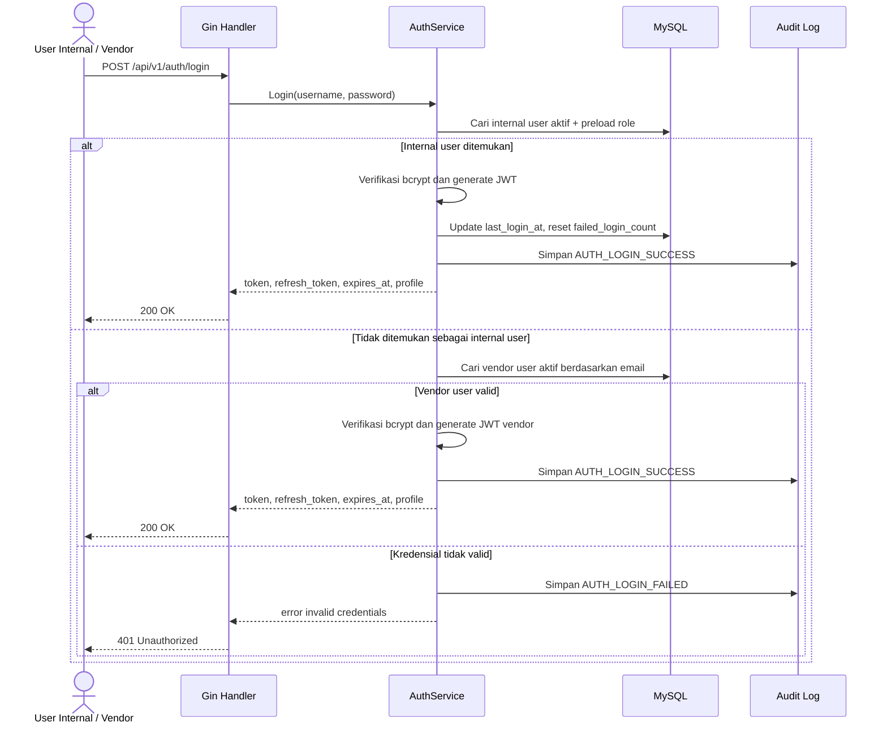
```mermaid
sequenceDiagram
    actor User as User Internal / Vendor
    participant Handler as Gin Handler
    participant Auth as AuthService
    participant DB as MySQL
    participant Audit as Audit Log

    User->>Handler: POST /api/v1/auth/login
    Handler->>Auth: Login(username, password)
    Auth->>DB: Cari internal user aktif + preload role
    alt Internal user ditemukan
        Auth->>Auth: Verifikasi bcrypt dan generate JWT
        Auth->>DB: Update last_login_at, reset failed_login_count
        Auth->>Audit: Simpan AUTH_LOGIN_SUCCESS
        Auth-->>Handler: token, refresh_token, expires_at, profile
        Handler-->>User: 200 OK
    else Tidak ditemukan sebagai internal user
        Auth->>DB: Cari vendor user aktif berdasarkan email
        alt Vendor user valid
            Auth->>Auth: Verifikasi bcrypt dan generate JWT vendor
            Auth->>Audit: Simpan AUTH_LOGIN_SUCCESS
            Auth-->>Handler: token, refresh_token, expires_at, profile
            Handler-->>User: 200 OK
        else Kredensial tidak valid
            Auth->>Audit: Simpan AUTH_LOGIN_FAILED
            Auth-->>Handler: error invalid credentials
            Handler-->>User: 401 Unauthorized
        end
    end
```

Catatan implementasi:

- Backend menggunakan JWT Bearer token, bukan sesi stateful di server.
- Middleware request context akan meneruskan atau membangkitkan `X-Trace-ID` untuk setiap request.
- Internal user dapat mengalami temporary lock setelah gagal login berulang.

## 2\. Submit Purchase Request (PR) dan Pembentukan Approval Task

**Status:** Implemented di backend Phase 1

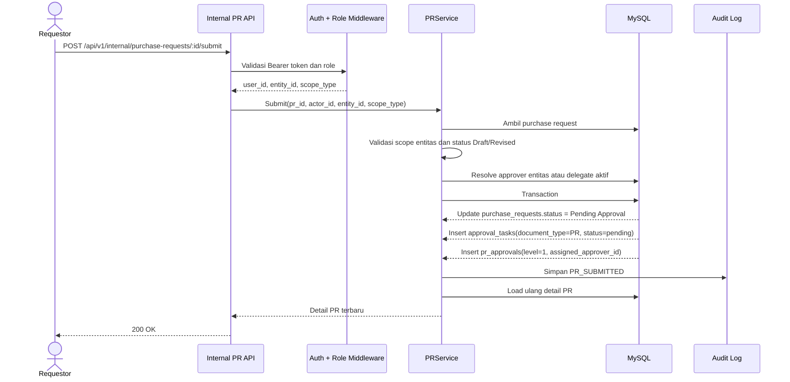
```mermaid
sequenceDiagram
    actor Requestor
    participant API as Internal PR API
    participant MW as Auth + Role Middleware
    participant PR as PRService
    participant DB as MySQL
    participant Audit as Audit Log

    Requestor->>API: POST /api/v1/internal/purchase-requests/:id/submit
    API->>MW: Validasi Bearer token dan role
    MW-->>API: user_id, entity_id, scope_type
    API->>PR: Submit(pr_id, actor_id, entity_id, scope_type)
    PR->>DB: Ambil purchase request
    PR->>PR: Validasi scope entitas dan status Draft/Revised
    PR->>DB: Resolve approver entitas atau delegate aktif
    PR->>DB: Transaction
    DB-->>PR: Update purchase_requests.status = Pending Approval
    DB-->>PR: Insert approval_tasks(document_type=PR, status=pending)
    DB-->>PR: Insert pr_approvals(level=1, assigned_approver_id)
    PR->>Audit: Simpan PR_SUBMITTED
    PR->>DB: Load ulang detail PR
    PR-->>API: Detail PR terbaru
    API-->>Requestor: 200 OK
```

Catatan implementasi:

- Endpoint create PR dan submit PR dipisahkan; create menyimpan `Draft`, sedangkan submit membuat task approval.
- Implementasi saat ini membuat approval level `1` untuk approver entitas, belum menjalankan dynamic approval matrix multi-level.

## 3\. Approve / Reject Approval Task untuk PR dan PO

**Status:** Implemented di backend Phase 1

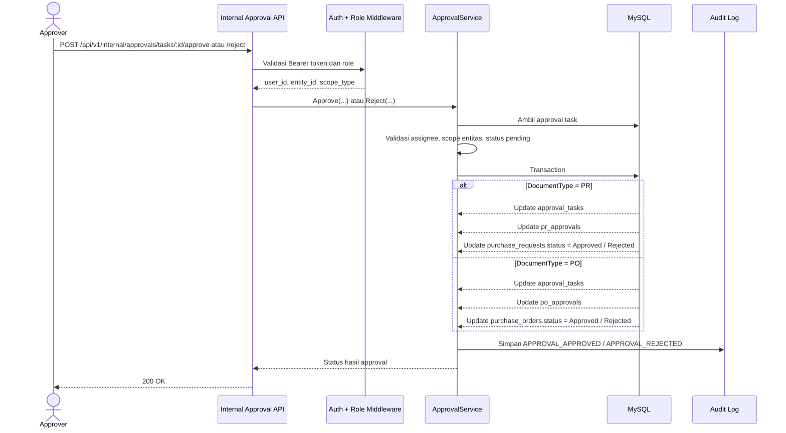
```mermaid
sequenceDiagram
    actor Approver
    participant API as Internal Approval API
    participant MW as Auth + Role Middleware
    participant Approval as ApprovalService
    participant DB as MySQL
    participant Audit as Audit Log

    Approver->>API: POST /api/v1/internal/approvals/tasks/:id/approve atau /reject
    API->>MW: Validasi Bearer token dan role
    MW-->>API: user_id, entity_id, scope_type
    API->>Approval: Approve(...) atau Reject(...)
    Approval->>DB: Ambil approval task
    Approval->>Approval: Validasi assignee, scope entitas, status pending
    Approval->>DB: Transaction
    alt DocumentType = PR
        DB-->>Approval: Update approval_tasks
        DB-->>Approval: Update pr_approvals
        DB-->>Approval: Update purchase_requests.status = Approved / Rejected
    else DocumentType = PO
        DB-->>Approval: Update approval_tasks
        DB-->>Approval: Update po_approvals
        DB-->>Approval: Update purchase_orders.status = Approved / Rejected
    end
    Approval->>Audit: Simpan APPROVAL_APPROVED / APPROVAL_REJECTED
    Approval-->>API: Status hasil approval
    API-->>Approver: 200 OK
```

Catatan implementasi:

- Approval task hanya bisa dijalankan oleh `assignee_id` yang aktif pada task tersebut.
- Delegate approver dicatat melalui `original_user_id` dan `on_behalf_of_user_id`.
- Approval final pada code saat ini terjadi di level pertama; chaining antar-level masih menjadi area pengembangan lanjutan.

## 4\. RFQ Internal dan Vendor Submit Quotation

**Status:** Implemented di backend Phase 1

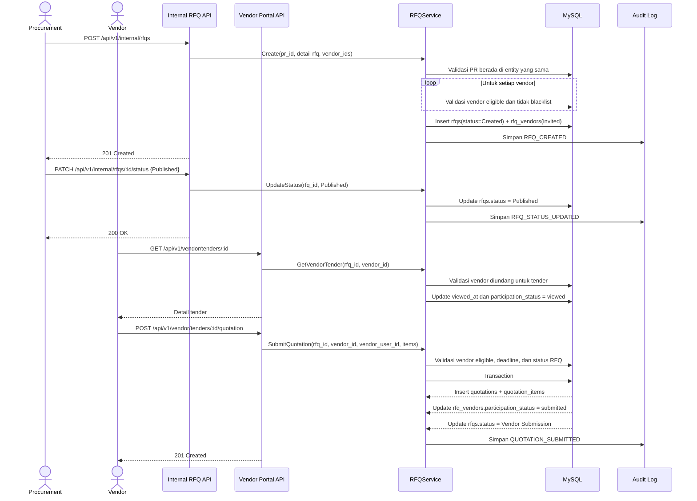
```mermaid
sequenceDiagram
    actor Procurement
    actor Vendor
    participant InternalAPI as Internal RFQ API
    participant VendorAPI as Vendor Portal API
    participant RFQ as RFQService
    participant DB as MySQL
    participant Audit as Audit Log

    Procurement->>InternalAPI: POST /api/v1/internal/rfqs
    InternalAPI->>RFQ: Create(pr_id, detail rfq, vendor_ids)
    RFQ->>DB: Validasi PR berada di entity yang sama
    loop Untuk setiap vendor
        RFQ->>DB: Validasi vendor eligible dan tidak blacklist
    end
    RFQ->>DB: Insert rfqs(status=Created) + rfq_vendors(invited)
    RFQ->>Audit: Simpan RFQ_CREATED
    InternalAPI-->>Procurement: 201 Created

    Procurement->>InternalAPI: PATCH /api/v1/internal/rfqs/:id/status {Published}
    InternalAPI->>RFQ: UpdateStatus(rfq_id, Published)
    RFQ->>DB: Update rfqs.status = Published
    RFQ->>Audit: Simpan RFQ_STATUS_UPDATED
    InternalAPI-->>Procurement: 200 OK

    Vendor->>VendorAPI: GET /api/v1/vendor/tenders/:id
    VendorAPI->>RFQ: GetVendorTender(rfq_id, vendor_id)
    RFQ->>DB: Validasi vendor diundang untuk tender
    RFQ->>DB: Update viewed_at dan participation_status = viewed
    VendorAPI-->>Vendor: Detail tender

    Vendor->>VendorAPI: POST /api/v1/vendor/tenders/:id/quotation
    VendorAPI->>RFQ: SubmitQuotation(rfq_id, vendor_id, vendor_user_id, items)
    RFQ->>DB: Validasi vendor eligible, deadline, dan status RFQ
    RFQ->>DB: Transaction
    DB-->>RFQ: Insert quotations + quotation_items
    DB-->>RFQ: Update rfq_vendors.participation_status = submitted
    DB-->>RFQ: Update rfqs.status = Vendor Submission
    RFQ->>Audit: Simpan QUOTATION_SUBMITTED
    VendorAPI-->>Vendor: 201 Created
```

Catatan implementasi:

- Publish tender pada code saat ini dilakukan melalui update status RFQ, bukan endpoint publish yang terpisah.
- Hanya vendor yang ada pada `rfq_vendors`, eligible, dan tidak blacklist yang dapat melihat serta submit quotation.

## 5\. Submit Purchase Order (PO) dan Vendor Confirmation

**Status:** Implemented di backend Phase 1

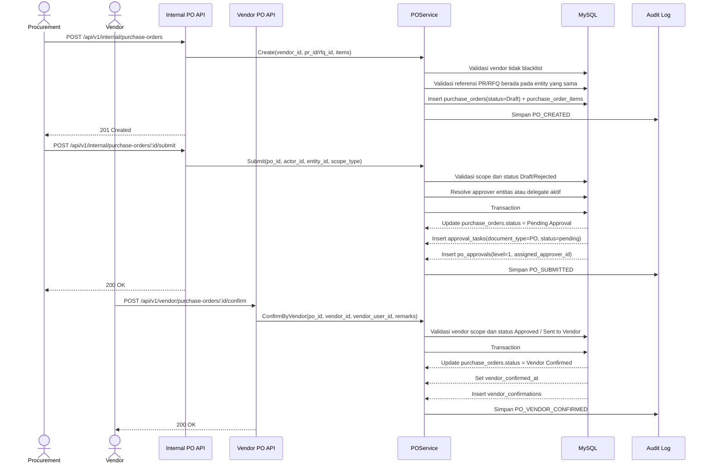
```mermaid
sequenceDiagram
    actor Procurement
    actor Vendor
    participant InternalAPI as Internal PO API
    participant VendorAPI as Vendor PO API
    participant PO as POService
    participant DB as MySQL
    participant Audit as Audit Log

    Procurement->>InternalAPI: POST /api/v1/internal/purchase-orders
    InternalAPI->>PO: Create(vendor_id, pr_id/rfq_id, items)
    PO->>DB: Validasi vendor tidak blacklist
    PO->>DB: Validasi referensi PR/RFQ berada pada entity yang sama
    PO->>DB: Insert purchase_orders(status=Draft) + purchase_order_items
    PO->>Audit: Simpan PO_CREATED
    InternalAPI-->>Procurement: 201 Created

    Procurement->>InternalAPI: POST /api/v1/internal/purchase-orders/:id/submit
    InternalAPI->>PO: Submit(po_id, actor_id, entity_id, scope_type)
    PO->>DB: Validasi scope dan status Draft/Rejected
    PO->>DB: Resolve approver entitas atau delegate aktif
    PO->>DB: Transaction
    DB-->>PO: Update purchase_orders.status = Pending Approval
    DB-->>PO: Insert approval_tasks(document_type=PO, status=pending)
    DB-->>PO: Insert po_approvals(level=1, assigned_approver_id)
    PO->>Audit: Simpan PO_SUBMITTED
    InternalAPI-->>Procurement: 200 OK

    Vendor->>VendorAPI: POST /api/v1/vendor/purchase-orders/:id/confirm
    VendorAPI->>PO: ConfirmByVendor(po_id, vendor_id, vendor_user_id, remarks)
    PO->>DB: Validasi vendor scope dan status Approved / Sent to Vendor
    PO->>DB: Transaction
    DB-->>PO: Update purchase_orders.status = Vendor Confirmed
    DB-->>PO: Set vendor_confirmed_at
    DB-->>PO: Insert vendor_confirmations
    PO->>Audit: Simpan PO_VENDOR_CONFIRMED
    VendorAPI-->>Vendor: 200 OK
```

Catatan implementasi:

- Setelah approval PO, status menjadi `Approved`; transisi ke `Sent to Vendor` saat ini dilakukan melalui endpoint update status generik jika dibutuhkan.
- Vendor hanya dapat mengkonfirmasi PO miliknya sendiri dan hanya pada status yang diizinkan oleh service.

## 6\. Ganti Password Internal User

**Status:** Implemented di backend Phase 1

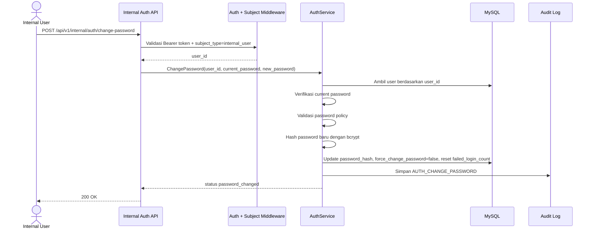
```mermaid
sequenceDiagram
    actor InternalUser as Internal User
    participant API as Internal Auth API
    participant MW as Auth + Subject Middleware
    participant Auth as AuthService
    participant DB as MySQL
    participant Audit as Audit Log

    InternalUser->>API: POST /api/v1/internal/auth/change-password
    API->>MW: Validasi Bearer token + subject_type=internal_user
    MW-->>API: user_id
    API->>Auth: ChangePassword(user_id, current_password, new_password)
    Auth->>DB: Ambil user berdasarkan user_id
    Auth->>Auth: Verifikasi current password
    Auth->>Auth: Validasi password policy
    Auth->>Auth: Hash password baru dengan bcrypt
    Auth->>DB: Update password_hash, force_change_password=false, reset failed_login_count
    Auth->>Audit: Simpan AUTH_CHANGE_PASSWORD
    Auth-->>API: status password_changed
    API-->>InternalUser: 200 OK
```

Catatan implementasi:

- Endpoint ini hanya tersedia untuk `internal_user`; vendor belum memiliki endpoint change password terpisah pada code saat ini.
- Password baru wajib lolos policy validasi yang dipakai service auth.

## 7\. Pengelolaan Entity oleh Super Admin

**Status:** Implemented di backend Phase 1

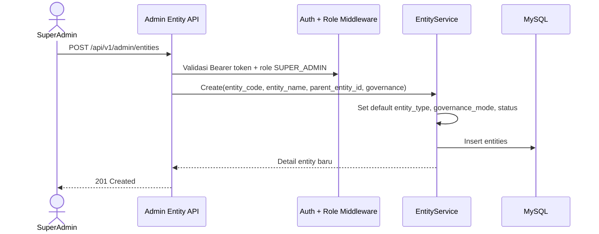
```mermaid
sequenceDiagram
    actor SuperAdmin
    participant API as Admin Entity API
    participant MW as Auth + Role Middleware
    participant Entity as EntityService
    participant DB as MySQL

    SuperAdmin->>API: POST /api/v1/admin/entities
    API->>MW: Validasi Bearer token + role SUPER_ADMIN
    API->>Entity: Create(entity_code, entity_name, parent_entity_id, governance)
    Entity->>Entity: Set default entity_type, governance_mode, status
    Entity->>DB: Insert entities
    Entity-->>API: Detail entity baru
    API-->>SuperAdmin: 201 Created
```

Catatan implementasi:

- Create entity hanya dibuka untuk `SUPER_ADMIN`.
- Pada implementasi saat ini create entity belum menulis audit log eksplisit di service.

## 8\. Pengelolaan User dan Reset Password oleh Admin

**Status:** Implemented di backend Phase 1

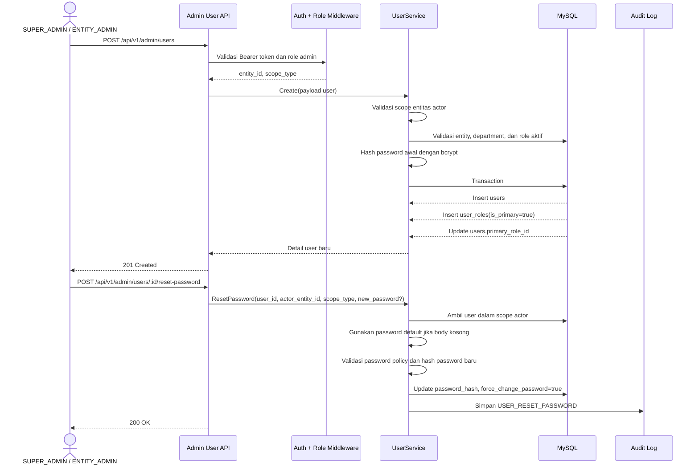
```mermaid
sequenceDiagram
    actor Admin as SUPER_ADMIN / ENTITY_ADMIN
    participant API as Admin User API
    participant MW as Auth + Role Middleware
    participant UserSvc as UserService
    participant DB as MySQL
    participant Audit as Audit Log

    Admin->>API: POST /api/v1/admin/users
    API->>MW: Validasi Bearer token dan role admin
    MW-->>API: entity_id, scope_type
    API->>UserSvc: Create(payload user)
    UserSvc->>UserSvc: Validasi scope entitas actor
    UserSvc->>DB: Validasi entity, department, dan role aktif
    UserSvc->>UserSvc: Hash password awal dengan bcrypt
    UserSvc->>DB: Transaction
    DB-->>UserSvc: Insert users
    DB-->>UserSvc: Insert user_roles(is_primary=true)
    DB-->>UserSvc: Update users.primary_role_id
    UserSvc-->>API: Detail user baru
    API-->>Admin: 201 Created

    Admin->>API: POST /api/v1/admin/users/:id/reset-password
    API->>UserSvc: ResetPassword(user_id, actor_entity_id, scope_type, new_password?)
    UserSvc->>DB: Ambil user dalam scope actor
    UserSvc->>UserSvc: Gunakan password default jika body kosong
    UserSvc->>UserSvc: Validasi password policy dan hash password baru
    UserSvc->>DB: Update password_hash, force_change_password=true
    UserSvc->>Audit: Simpan USER_RESET_PASSWORD
    API-->>Admin: 200 OK
```

Catatan implementasi:

- `ENTITY_ADMIN` hanya dapat membuat atau mereset user di entitasnya sendiri.
- Jika `new_password` tidak dikirim, service memakai default `Temp123!` lalu memaksa user mengganti password saat login berikutnya.

## 9\. Konfigurasi Delegate Approver

**Status:** Implemented di backend Phase 1

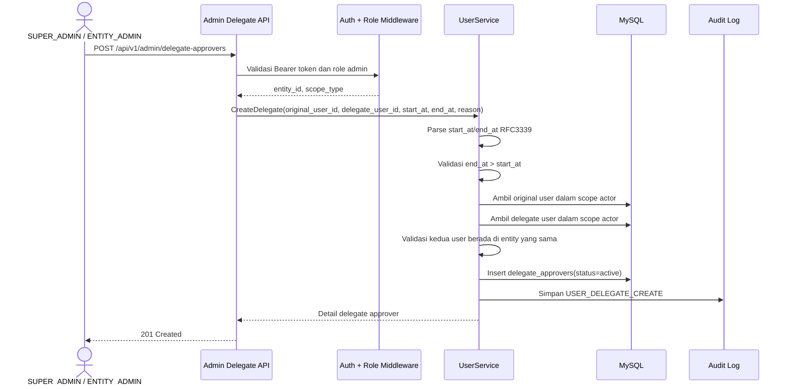
```mermaid
sequenceDiagram
    actor Admin as SUPER_ADMIN / ENTITY_ADMIN
    participant API as Admin Delegate API
    participant MW as Auth + Role Middleware
    participant UserSvc as UserService
    participant DB as MySQL
    participant Audit as Audit Log

    Admin->>API: POST /api/v1/admin/delegate-approvers
    API->>MW: Validasi Bearer token dan role admin
    MW-->>API: entity_id, scope_type
    API->>UserSvc: CreateDelegate(original_user_id, delegate_user_id, start_at, end_at, reason)
    UserSvc->>UserSvc: Parse start_at/end_at RFC3339
    UserSvc->>UserSvc: Validasi end_at > start_at
    UserSvc->>DB: Ambil original user dalam scope actor
    UserSvc->>DB: Ambil delegate user dalam scope actor
    UserSvc->>UserSvc: Validasi kedua user berada di entity yang sama
    UserSvc->>DB: Insert delegate_approvers(status=active)
    UserSvc->>Audit: Simpan USER_DELEGATE_CREATE
    UserSvc-->>API: Detail delegate approver
    API-->>Admin: 201 Created
```

Catatan implementasi:

- Delegate approver disimpan dengan periode aktif eksplisit `start_at` dan `end_at`.
- Penggunaan delegate pada alur submit PR/PO terjadi saat service approval/submit memanggil resolver approver entitas.

## 10\. Vendor Master dan Vendor Blacklist

**Status:** Implemented di backend Phase 1

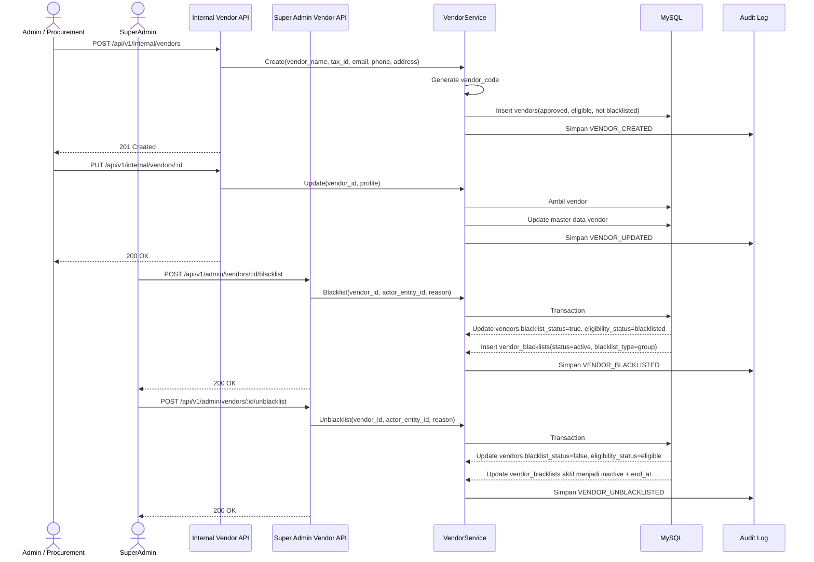
```mermaid
sequenceDiagram
    actor Procurement as Admin / Procurement
    actor SuperAdmin
    participant VendorAPI as Internal Vendor API
    participant SuperAPI as Super Admin Vendor API
    participant VendorSvc as VendorService
    participant DB as MySQL
    participant Audit as Audit Log

    Procurement->>VendorAPI: POST /api/v1/internal/vendors
    VendorAPI->>VendorSvc: Create(vendor_name, tax_id, email, phone, address)
    VendorSvc->>VendorSvc: Generate vendor_code
    VendorSvc->>DB: Insert vendors(approved, eligible, not blacklisted)
    VendorSvc->>Audit: Simpan VENDOR_CREATED
    VendorAPI-->>Procurement: 201 Created

    Procurement->>VendorAPI: PUT /api/v1/internal/vendors/:id
    VendorAPI->>VendorSvc: Update(vendor_id, profile)
    VendorSvc->>DB: Ambil vendor
    VendorSvc->>DB: Update master data vendor
    VendorSvc->>Audit: Simpan VENDOR_UPDATED
    VendorAPI-->>Procurement: 200 OK

    SuperAdmin->>SuperAPI: POST /api/v1/admin/vendors/:id/blacklist
    SuperAPI->>VendorSvc: Blacklist(vendor_id, actor_entity_id, reason)
    VendorSvc->>DB: Transaction
    DB-->>VendorSvc: Update vendors.blacklist_status=true, eligibility_status=blacklisted
    DB-->>VendorSvc: Insert vendor_blacklists(status=active, blacklist_type=group)
    VendorSvc->>Audit: Simpan VENDOR_BLACKLISTED
    SuperAPI-->>SuperAdmin: 200 OK

    SuperAdmin->>SuperAPI: POST /api/v1/admin/vendors/:id/unblacklist
    SuperAPI->>VendorSvc: Unblacklist(vendor_id, actor_entity_id, reason)
    VendorSvc->>DB: Transaction
    DB-->>VendorSvc: Update vendors.blacklist_status=false, eligibility_status=eligible
    DB-->>VendorSvc: Update vendor_blacklists aktif menjadi inactive + end_at
    VendorSvc->>Audit: Simpan VENDOR_UNBLACKLISTED
    SuperAPI-->>SuperAdmin: 200 OK
```

Catatan implementasi:

- Create dan update vendor tersedia untuk role procurement/admin internal, sedangkan blacklist dan unblacklist dibatasi ke `SUPER_ADMIN`.
- Blacklist vendor langsung mempengaruhi eligibility sehingga vendor tidak dapat dipakai pada RFQ/PO berikutnya.

# Sequence Diagram Target State FSD Lanjutan

Bagian ini melengkapi use case FSD yang belum seluruhnya tersedia pada backend Phase 1. Diagram di bawah bersifat target-state konseptual berdasarkan alur bisnis dokumen, sehingga dapat mencakup komponen seperti policy engine, notification service, budget service, dashboard analytics, dan approval multi-level.

## 11\. Logout dan Force Change Password Pasca Reset

**Status:** Planned / target-state FSD

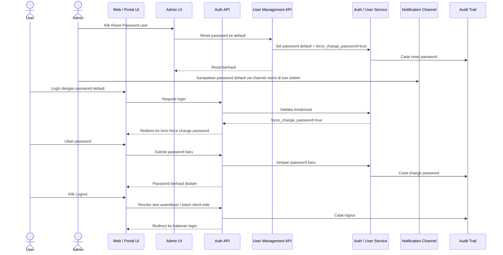
```mermaid
sequenceDiagram
    actor User
    actor Admin
    participant AuthUI as Web / Portal UI
    participant AdminUI as Admin UI
    participant AuthAPI as Auth API
    participant UserAPI as User Management API
    participant Auth as Auth / User Service
    participant Notify as Notification Channel
    participant Audit as Audit Trail

    Admin->>AdminUI: Klik Reset Password user
    AdminUI->>UserAPI: Reset password ke default
    UserAPI->>Auth: Set password default + force_change_password=true
    Auth->>Audit: Catat reset password
    UserAPI-->>AdminUI: Reset berhasil
    Admin->>Notify: Sampaikan password default via channel resmi di luar sistem

    User->>AuthUI: Login dengan password default
    AuthUI->>AuthAPI: Request login
    AuthAPI->>Auth: Validasi kredensial
    Auth-->>AuthAPI: force_change_password=true
    AuthAPI-->>AuthUI: Redirect ke form force change password
    User->>AuthUI: Ubah password
    AuthUI->>AuthAPI: Submit password baru
    AuthAPI->>Auth: Simpan password baru
    Auth->>Audit: Catat change password
    AuthAPI-->>AuthUI: Password berhasil diubah

    User->>AuthUI: Klik Logout
    AuthUI->>AuthAPI: Revoke sesi autentikasi / token client-side
    AuthAPI->>Audit: Catat logout
    AuthAPI-->>AuthUI: Redirect ke halaman login
```

## 12\. Create PR, Budget Validation, dan Submit ke Approval Workflow

**Status:** Planned / target-state FSD

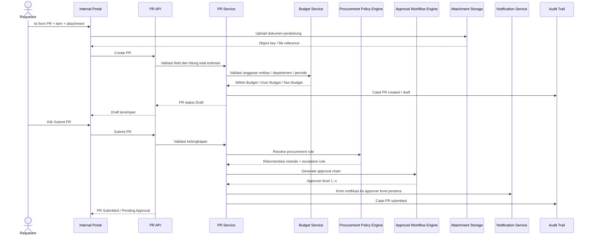
```mermaid
sequenceDiagram
    actor Requestor
    participant UI as Internal Portal
    participant PRA as PR API
    participant PR as PR Service
    participant Budget as Budget Service
    participant Policy as Procurement Policy Engine
    participant Workflow as Approval Workflow Engine
    participant Storage as Attachment Storage
    participant Notify as Notification Service
    participant Audit as Audit Trail

    Requestor->>UI: Isi form PR + item + attachment
    UI->>Storage: Upload dokumen pendukung
    Storage-->>UI: Object key / file reference
    UI->>PRA: Create PR
    PRA->>PR: Validasi field dan hitung total estimasi
    PR->>Budget: Validasi anggaran entitas / departemen / periode
    Budget-->>PR: Within Budget / Over Budget / Non Budget
    PR->>Audit: Catat PR created / draft
    PR-->>PRA: PR status Draft
    PRA-->>UI: Draft tersimpan

    Requestor->>UI: Klik Submit PR
    UI->>PRA: Submit PR
    PRA->>PR: Validasi kelengkapan
    PR->>Policy: Resolve procurement rule
    Policy-->>PR: Rekomendasi metode + escalation rule
    PR->>Workflow: Generate approval chain
    Workflow-->>PR: Approver level 1..n
    PR->>Notify: Kirim notifikasi ke approver level pertama
    PR->>Audit: Catat PR submitted
    PRA-->>UI: PR Submitted / Pending Approval
```

## 13\. Revisi dan Resubmit PR serta Cancel / Void Dokumen

**Status:** Planned / target-state FSD

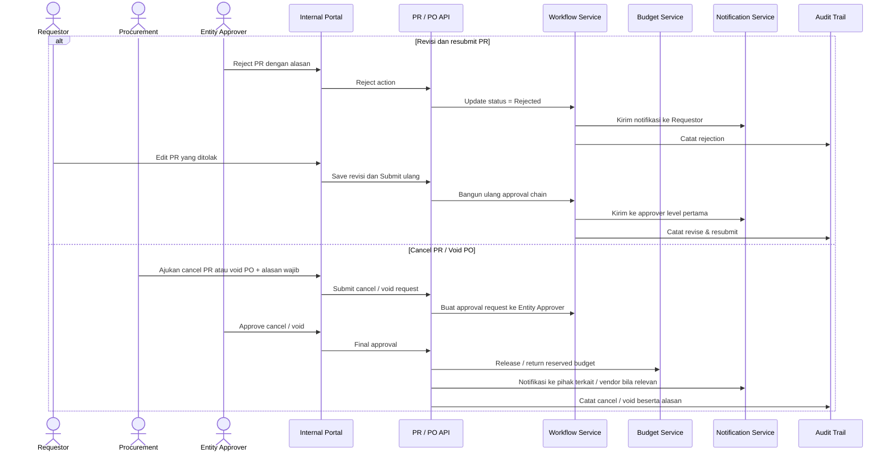
```mermaid
sequenceDiagram
    actor Requestor
    actor Procurement
    actor Approver as Entity Approver
    participant UI as Internal Portal
    participant DocAPI as PR / PO API
    participant Workflow as Workflow Service
    participant Budget as Budget Service
    participant Notify as Notification Service
    participant Audit as Audit Trail

    alt Revisi dan resubmit PR
        Approver->>UI: Reject PR dengan alasan
        UI->>DocAPI: Reject action
        DocAPI->>Workflow: Update status = Rejected
        Workflow->>Notify: Kirim notifikasi ke Requestor
        Workflow->>Audit: Catat rejection
        Requestor->>UI: Edit PR yang ditolak
        UI->>DocAPI: Save revisi dan Submit ulang
        DocAPI->>Workflow: Bangun ulang approval chain
        Workflow->>Notify: Kirim ke approver level pertama
        Workflow->>Audit: Catat revise & resubmit
    else Cancel PR / Void PO
        Procurement->>UI: Ajukan cancel PR atau void PO + alasan wajib
        UI->>DocAPI: Submit cancel / void request
        DocAPI->>Workflow: Buat approval request ke Entity Approver
        Approver->>UI: Approve cancel / void
        UI->>DocAPI: Final approval
        DocAPI->>Budget: Release / return reserved budget
        DocAPI->>Notify: Notifikasi ke pihak terkait / vendor bila relevan
        DocAPI->>Audit: Catat cancel / void beserta alasan
    end
```

## 14\. Penentuan Metode Pengadaan dan Publikasi RFQ

**Status:** Planned / target-state FSD

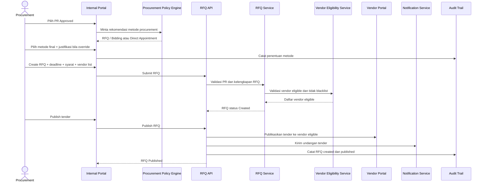
```mermaid
sequenceDiagram
    actor Procurement
    participant UI as Internal Portal
    participant Policy as Procurement Policy Engine
    participant RFQAPI as RFQ API
    participant RFQ as RFQ Service
    participant Vendor as Vendor Eligibility Service
    participant Portal as Vendor Portal
    participant Notify as Notification Service
    participant Audit as Audit Trail

    Procurement->>UI: Pilih PR Approved
    UI->>Policy: Minta rekomendasi metode procurement
    Policy-->>UI: RFQ / Bidding atau Direct Appointment
    Procurement->>UI: Pilih metode final + justifikasi bila override
    UI->>Audit: Catat penentuan metode

    Procurement->>UI: Create RFQ + deadline + syarat + vendor list
    UI->>RFQAPI: Submit RFQ
    RFQAPI->>RFQ: Validasi PR dan kelengkapan RFQ
    RFQ->>Vendor: Validasi vendor eligible dan tidak blacklist
    Vendor-->>RFQ: Daftar vendor eligible
    RFQ-->>RFQAPI: RFQ status Created
    Procurement->>UI: Publish tender
    UI->>RFQAPI: Publish RFQ
    RFQAPI->>Portal: Publikasikan tender ke vendor eligible
    RFQAPI->>Notify: Kirim undangan tender
    RFQAPI->>Audit: Catat RFQ created dan published
    RFQAPI-->>UI: RFQ Published
```

## 15\. Penutupan Bidding, Evaluasi Vendor, BAFO, dan Vendor Selection

**Status:** Planned / target-state FSD

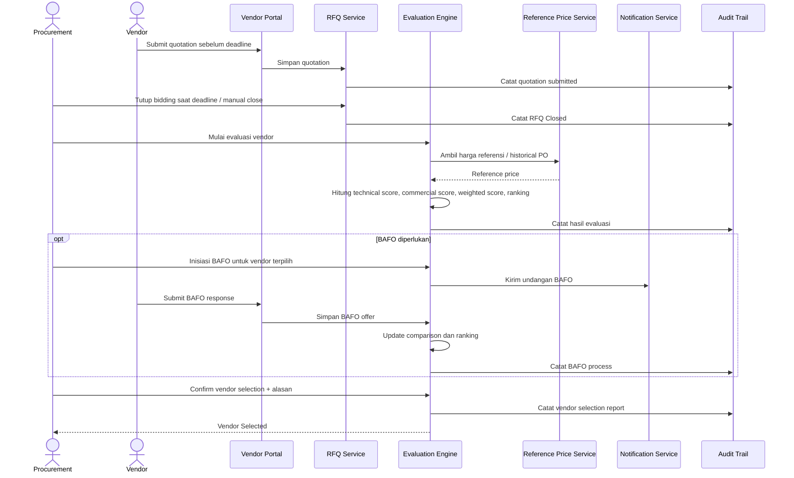
```mermaid
sequenceDiagram
    actor Procurement
    actor Vendor
    participant Portal as Vendor Portal
    participant RFQ as RFQ Service
    participant Eval as Evaluation Engine
    participant RefPrice as Reference Price Service
    participant Notify as Notification Service
    participant Audit as Audit Trail

    Vendor->>Portal: Submit quotation sebelum deadline
    Portal->>RFQ: Simpan quotation
    RFQ->>Audit: Catat quotation submitted

    Procurement->>RFQ: Tutup bidding saat deadline / manual close
    RFQ->>Audit: Catat RFQ Closed
    Procurement->>Eval: Mulai evaluasi vendor
    Eval->>RefPrice: Ambil harga referensi / historical PO
    RefPrice-->>Eval: Reference price
    Eval->>Eval: Hitung technical score, commercial score, weighted score, ranking
    Eval->>Audit: Catat hasil evaluasi

    opt BAFO diperlukan
        Procurement->>Eval: Inisiasi BAFO untuk vendor terpilih
        Eval->>Notify: Kirim undangan BAFO
        Vendor->>Portal: Submit BAFO response
        Portal->>Eval: Simpan BAFO offer
        Eval->>Eval: Update comparison dan ranking
        Eval->>Audit: Catat BAFO process
    end

    Procurement->>Eval: Confirm vendor selection + alasan
    Eval->>Audit: Catat vendor selection report
    Eval-->>Procurement: Vendor Selected
```

## 16\. Direct Appointment

**Status:** Planned / target-state FSD

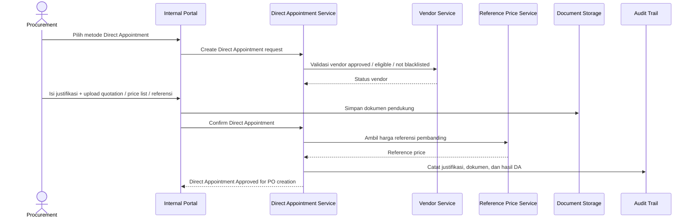
```mermaid
sequenceDiagram
    actor Procurement
    participant UI as Internal Portal
    participant DA as Direct Appointment Service
    participant Vendor as Vendor Service
    participant RefPrice as Reference Price Service
    participant Storage as Document Storage
    participant Audit as Audit Trail

    Procurement->>UI: Pilih metode Direct Appointment
    UI->>DA: Create Direct Appointment request
    DA->>Vendor: Validasi vendor approved / eligible / not blacklisted
    Vendor-->>DA: Status vendor
    Procurement->>UI: Isi justifikasi + upload quotation / price list / referensi
    UI->>Storage: Simpan dokumen pendukung
    UI->>DA: Confirm Direct Appointment
    DA->>RefPrice: Ambil harga referensi pembanding
    RefPrice-->>DA: Reference price
    DA->>Audit: Catat justifikasi, dokumen, dan hasil DA
    DA-->>UI: Direct Appointment Approved for PO creation
```

## 17\. Reference Price dan Budget Management

**Status:** Planned / target-state FSD

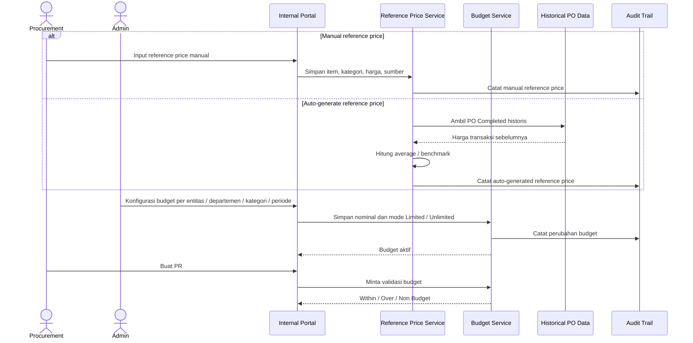
```mermaid
sequenceDiagram
    actor Procurement
    actor Admin
    participant UI as Internal Portal
    participant RefPrice as Reference Price Service
    participant Budget as Budget Service
    participant POHist as Historical PO Data
    participant Audit as Audit Trail

    alt Manual reference price
        Procurement->>UI: Input reference price manual
        UI->>RefPrice: Simpan item, kategori, harga, sumber
        RefPrice->>Audit: Catat manual reference price
    else Auto-generate reference price
        RefPrice->>POHist: Ambil PO Completed historis
        POHist-->>RefPrice: Harga transaksi sebelumnya
        RefPrice->>RefPrice: Hitung average / benchmark
        RefPrice->>Audit: Catat auto-generated reference price
    end

    Admin->>UI: Konfigurasi budget per entitas / departemen / kategori / periode
    UI->>Budget: Simpan nominal dan mode Limited / Unlimited
    Budget->>Audit: Catat perubahan budget
    Budget-->>UI: Budget aktif

    Procurement->>UI: Buat PR
    UI->>Budget: Minta validasi budget
    Budget-->>UI: Within / Over / Non Budget
```

## 18\. Dynamic Procurement Policy dan Dynamic Approval Workflow

**Status:** Planned / target-state FSD

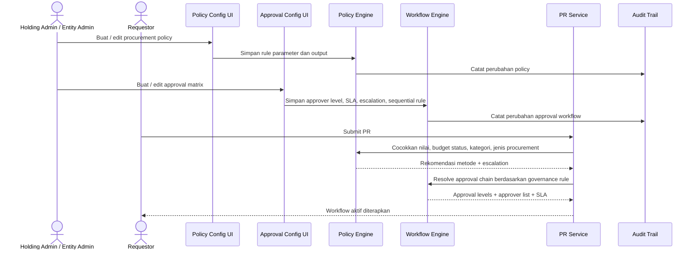
```mermaid
sequenceDiagram
    actor Admin as Holding Admin / Entity Admin
    actor Requestor
    participant PolicyUI as Policy Config UI
    participant WorkflowUI as Approval Config UI
    participant Policy as Policy Engine
    participant Workflow as Workflow Engine
    participant PRA as PR Service
    participant Audit as Audit Trail

    Admin->>PolicyUI: Buat / edit procurement policy
    PolicyUI->>Policy: Simpan rule parameter dan output
    Policy->>Audit: Catat perubahan policy

    Admin->>WorkflowUI: Buat / edit approval matrix
    WorkflowUI->>Workflow: Simpan approver level, SLA, escalation, sequential rule
    Workflow->>Audit: Catat perubahan approval workflow

    Requestor->>PRA: Submit PR
    PRA->>Policy: Cocokkan nilai, budget status, kategori, jenis procurement
    Policy-->>PRA: Rekomendasi metode + escalation
    PRA->>Workflow: Resolve approval chain berdasarkan governance rule
    Workflow-->>PRA: Approval levels + approver list + SLA
    PRA-->>Requestor: Workflow aktif diterapkan
```

## 19\. Dashboard Monitoring dan Audit Trail

**Status:** Planned / target-state FSD

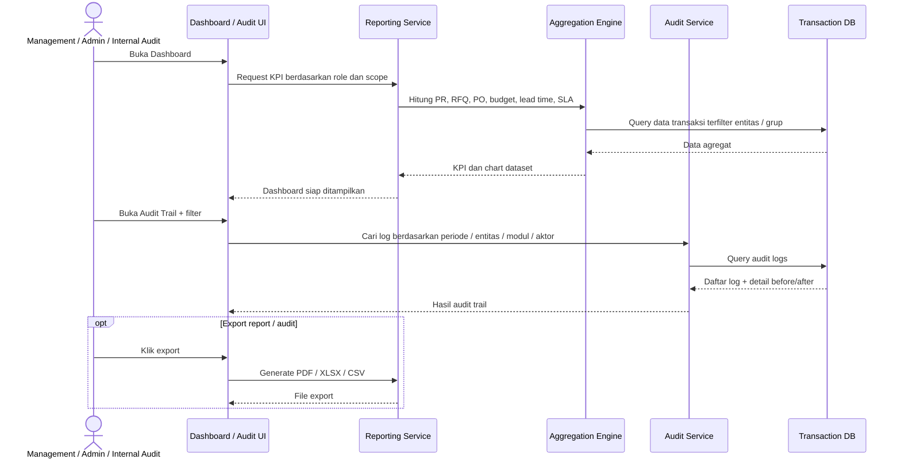
```mermaid
sequenceDiagram
    actor User as Management / Admin / Internal Audit
    participant UI as Dashboard / Audit UI
    participant Report as Reporting Service
    participant Analytics as Aggregation Engine
    participant AuditSvc as Audit Service
    participant DB as Transaction DB

    User->>UI: Buka Dashboard
    UI->>Report: Request KPI berdasarkan role dan scope
    Report->>Analytics: Hitung PR, RFQ, PO, budget, lead time, SLA
    Analytics->>DB: Query data transaksi terfilter entitas / grup
    DB-->>Analytics: Data agregat
    Analytics-->>Report: KPI dan chart dataset
    Report-->>UI: Dashboard siap ditampilkan

    User->>UI: Buka Audit Trail + filter
    UI->>AuditSvc: Cari log berdasarkan periode / entitas / modul / aktor
    AuditSvc->>DB: Query audit logs
    DB-->>AuditSvc: Daftar log + detail before/after
    AuditSvc-->>UI: Hasil audit trail

    opt Export report / audit
        User->>UI: Klik export
        UI->>Report: Generate PDF / XLSX / CSV
        Report-->>UI: File export
    end
```

# Sequence Diagram Lanjutan

Bagian ini menambahkan alur pendukung yang penting untuk kebutuhan UAT, audit, dan operasional dokumen, khususnya notifikasi, reminder SLA, dan proses print/export.

## 20\. Notification, Reminder SLA, dan Escalation

**Status:** Planned / target-state FSD

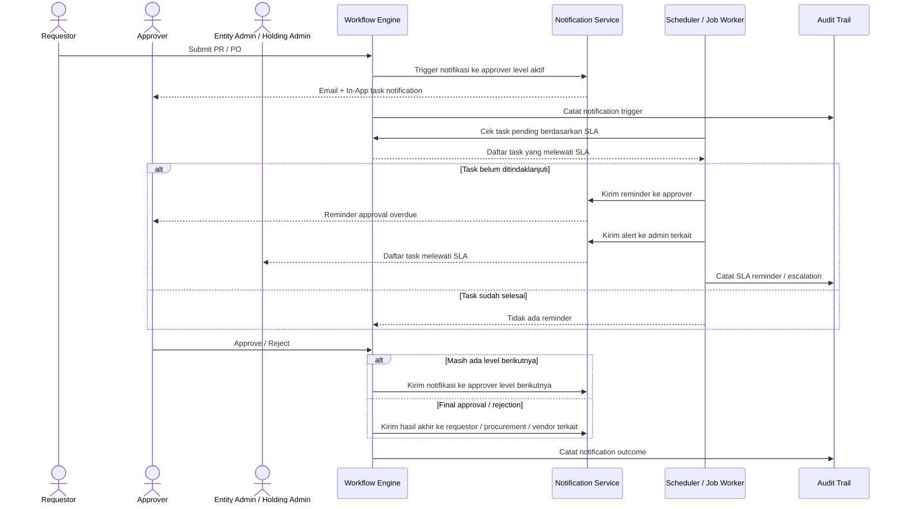
```mermaid
sequenceDiagram
    actor Requestor
    actor Approver
    actor Admin as Entity Admin / Holding Admin
    participant Workflow as Workflow Engine
    participant Notify as Notification Service
    participant Queue as Scheduler / Job Worker
    participant Audit as Audit Trail

    Requestor->>Workflow: Submit PR / PO
    Workflow->>Notify: Trigger notifikasi ke approver level aktif
    Notify-->>Approver: Email + In-App task notification
    Workflow->>Audit: Catat notification trigger

    Queue->>Workflow: Cek task pending berdasarkan SLA
    Workflow-->>Queue: Daftar task yang melewati SLA
    alt Task belum ditindaklanjuti
        Queue->>Notify: Kirim reminder ke approver
        Notify-->>Approver: Reminder approval overdue
        Queue->>Notify: Kirim alert ke admin terkait
        Notify-->>Admin: Daftar task melewati SLA
        Queue->>Audit: Catat SLA reminder / escalation
    else Task sudah selesai
        Queue-->>Workflow: Tidak ada reminder
    end

    Approver->>Workflow: Approve / Reject
    alt Masih ada level berikutnya
        Workflow->>Notify: Kirim notifikasi ke approver level berikutnya
    else Final approval / rejection
        Workflow->>Notify: Kirim hasil akhir ke requestor / procurement / vendor terkait
    end
    Workflow->>Audit: Catat notification outcome
```

## 21\. Print, Export, dan Report Generation

**Status:** Planned / target-state FSD

```mermaid
sequenceDiagram
    actor User as Procurement / Management / Audit
    participant UI as Portal UI
    participant ReportAPI as Report / Export API
    participant Report as Reporting Service
    participant Template as PDF / XLSX Renderer
    participant Storage as File Storage
    participant Audit as Audit Trail

    User->>UI: Pilih dokumen / laporan dan filter export
    UI->>ReportAPI: Request print / export
    ReportAPI->>Report: Validasi hak akses dan parameter filter
    Report->>Report: Ambil dataset PR / RFQ / PO / dashboard / audit
    Report->>Template: Render PDF / XLSX / CSV
    Template-->>Report: File hasil generate
    Report->>Storage: Simpan file sementara / arsip
    Storage-->>Report: File URL / object key
    Report->>Audit: Catat aktivitas print/export
    ReportAPI-->>UI: Link download / streaming file
    UI-->>User: File siap diunduh
```

# State Diagram Lifecycle

Bagian ini melengkapi sequence diagram dengan visual status lifecycle dokumen utama. State diagram mengikuti definisi lifecycle pada FSD, sehingga berguna untuk UAT, review bisnis, dan alignment antar tim.

## 22\. State Diagram Purchase Request (PR)

**Status:** Target-state lifecycle FSD

```mermaid
stateDiagram-v2
    [*] --> Draft
    Draft --> Submitted: Submit
    Submitted --> PendingApproval: Create Approval Task
    PendingApproval --> Approved: Approve Final
    PendingApproval --> Rejected: Reject
    Rejected --> Revised: Revise
    Revised --> Submitted: Resubmit
    Approved --> Cancelled: Cancel Approved PR
    Cancelled --> [*]
    Approved --> [*]
```

## 23\. State Diagram RFQ / Bidding

**Status:** Target-state lifecycle FSD

```mermaid
stateDiagram-v2
    [*] --> Created
    Created --> Published: Publish Tender
    Published --> VendorSubmission: Vendor Submit Quotation
    VendorSubmission --> Closed: Close Bidding
    Closed --> Reopened: Reopen Bidding
    Reopened --> VendorSubmission: Resume Submission
    Closed --> Evaluation: Start Evaluation
    Evaluation --> BAFO: Initiate BAFO
    Evaluation --> VendorSelected: Confirm Vendor Selection
    BAFO --> VendorSelected: Final Selection
    Published --> Cancelled: Cancel RFQ
    VendorSelected --> [*]
    Cancelled --> [*]
```

## 24\. State Diagram Purchase Order (PO)

**Status:** Target-state lifecycle FSD

```mermaid
stateDiagram-v2
    [*] --> Draft
    Draft --> PendingApproval: Submit PO
    PendingApproval --> Approved: Approve Final
    PendingApproval --> Rejected: Reject
    Rejected --> Draft: Revise PO
    Approved --> SentToVendor: Send to Vendor
    SentToVendor --> VendorConfirmed: Vendor Confirm
    VendorConfirmed --> Completed: Procurement Complete
    Approved --> Voided: Void Approved PO
    SentToVendor --> Voided: Void Before Vendor Confirmed
    Voided --> [*]
    Completed --> [*]
```

# Field-Level Validation Rules

Berikut spesifikasi validasi per field untuk form-form utama dalam sistem. Setiap field memiliki aturan tipe data, format, dan apakah wajib diisi.

**Form: Create Purchase Request**

| **Field**               | **Tipe** | **Wajib**  | **Format / Validasi**      | **Max**    | **Keterangan**               |
| ----------------------- | -------- | ---------- | -------------------------- | ---------- | ---------------------------- |
| **Judul PR**            | String   | Ya         | Alfanumerik + spasi        | 200        | Deskripsi singkat kebutuhan  |
| ---                     | ---      | ---        | ---                        | ---        | ---                          |
| **Deskripsi Kebutuhan** | Text     | Ya         | Free text                  | 2000       | Detail kebutuhan pengadaan   |
| ---                     | ---      | ---        | ---                        | ---        | ---                          |
| **Kategori Pengadaan**  | Enum     | Ya         | Barang / Jasa              | \-         | Dropdown selection           |
| ---                     | ---      | ---        | ---                        | ---        | ---                          |
| **Kategori**            | Enum     | Ya         | Rutin / Non Rutin          | \-         | Dropdown selection           |
| ---                     | ---      | ---        | ---                        | ---        | ---                          |
| **Estimasi Nilai**      | Decimal  | Ya         | Angka positif, format IDR  | 15 digit   | Auto-calculated dari item    |
| ---                     | ---      | ---        | ---                        | ---        | ---                          |
| **Tanggal Kebutuhan**   | Date     | Ya         | DD/MM/YYYY, >= hari ini    | \-         | Tidak boleh tanggal lampau   |
| ---                     | ---      | ---        | ---                        | ---        | ---                          |
| **Departemen**          | Enum     | Ya         | Sesuai master data entitas | \-         | Auto-filled dari profil user |
| ---                     | ---      | ---        | ---                        | ---        | ---                          |
| **Dokumen Pendukung**   | File     | Ya (min 1) | PDF, DOCX, XLSX, JPG, PNG  | 10 MB/file | Maks 10 file per PR          |
| ---                     | ---      | ---        | ---                        | ---        | ---                          |

**Form: Detail Item Pengadaan**

| **Field**               | **Tipe** | **Wajib** | **Format / Validasi** | **Max**  | **Keterangan**             |
| ----------------------- | -------- | --------- | --------------------- | -------- | -------------------------- |
| **Nama Barang/Jasa**    | String   | Ya        | Alfanumerik           | 200      |                            |
| ---                     | ---      | ---       | ---                   | ---      | ---                        |
| **Jumlah**              | Integer  | Ya        | Angka positif > 0     | 10 digit |                            |
| ---                     | ---      | ---       | ---                   | ---      | ---                        |
| **Satuan**              | String   | Ya        | Sesuai master data    | 50       | cth: pcs, unit, lot, paket |
| ---                     | ---      | ---       | ---                   | ---      | ---                        |
| **Estimasi Harga/Unit** | Decimal  | Ya        | Angka positif, IDR    | 15 digit |                            |
| ---                     | ---      | ---       | ---                   | ---      | ---                        |
| **Spesifikasi**         | Text     | Tidak     | Free text             | 1000     | Detail spesifikasi teknis  |
| ---                     | ---      | ---       | ---                   | ---      | ---                        |

**Form: Vendor Quotation (Vendor Portal)**

| **Field**             | **Tipe** | **Wajib** | **Format / Validasi**  | **Max**    | **Keterangan**               |
| --------------------- | -------- | --------- | ---------------------- | ---------- | ---------------------------- |
| **Harga per Item**    | Decimal  | Ya        | Angka positif, IDR     | 15 digit   | Harus isi semua item         |
| ---                   | ---      | ---       | ---                    | ---        | ---                          |
| **Total Harga**       | Decimal  | Auto      | Auto-calculated        | \-         | Readonly, dihitung sistem    |
| ---                   | ---      | ---       | ---                    | ---        | ---                          |
| **Terms of Payment**  | String   | Ya        | Free text              | 500        | cth: 30 hari setelah invoice |
| ---                   | ---      | ---       | ---                    | ---        | ---                          |
| **Delivery Terms**    | String   | Ya        | Free text              | 500        | cth: Franco gudang           |
| ---                   | ---      | ---       | ---                    | ---        | ---                          |
| **Masa Berlaku**      | Date     | Ya        | DD/MM/YYYY, > deadline | \-         |                              |
| ---                   | ---      | ---       | ---                    | ---        | ---                          |
| **Dokumen Pendukung** | File     | Tidak     | PDF, DOCX, JPG, PNG    | 10 MB/file | Maks 5 file                  |
| ---                   | ---      | ---       | ---                    | ---        | ---                          |

**Form: Purchase Order**

| **Field**            | **Tipe** | **Wajib** | **Format / Validasi**    | **Max** | **Keterangan**                                |
| -------------------- | -------- | --------- | ------------------------ | ------- | --------------------------------------------- |
| **Nomor PO**         | String   | Auto      | Auto-generated           | \-      | Format: PO-\[KODE_ENTITAS\]-\[YYYY\]-\[NNNN\] |
| ---                  | ---      | ---       | ---                      | ---     | ---                                           |
| **Tanggal PO**       | Date     | Auto      | DD/MM/YYYY               | \-      | Auto-filled tanggal hari ini                  |
| ---                  | ---      | ---       | ---                      | ---     | ---                                           |
| **Tanggal Delivery** | Date     | Ya        | DD/MM/YYYY, > tanggal PO | \-      |                                               |
| ---                  | ---      | ---       | ---                      | ---     | ---                                           |
| **Terms of Payment** | String   | Ya        | Free text                | 500     | Auto-filled dari quotation, bisa diedit       |
| ---                  | ---      | ---       | ---                      | ---     | ---                                           |
| **Delivery Address** | String   | Ya        | Free text                | 500     |                                               |
| ---                  | ---      | ---       | ---                      | ---     | ---                                           |
| **Catatan**          | Text     | Tidak     | Free text                | 1000    | Catatan tambahan untuk vendor                 |
| ---                  | ---      | ---       | ---                      | ---     | ---                                           |

**Aturan Attachment Global**

| **Parameter**                 | **Nilai**                                                           |
| ----------------------------- | ------------------------------------------------------------------- |
| Format file yang diizinkan    | PDF, DOCX, XLSX, JPG, JPEG, PNG                                     |
| ---                           | ---                                                                 |
| Maksimal ukuran per file      | 10 MB                                                               |
| ---                           | ---                                                                 |
| Maksimal jumlah file per form | 10 file (kecuali Vendor Quotation: 5 file)                          |
| ---                           | ---                                                                 |
| Attachment setelah submit     | Tidak dapat dihapus setelah di-submit (immutable untuk audit trail) |
| ---                           | ---                                                                 |

**Format Auto-Numbering**

| **Dokumen**      | **Format**                             | **Contoh**         |
| ---------------- | -------------------------------------- | ------------------ |
| Purchase Request | PR-\[KODE_ENTITAS\]-\[YYYY\]-\[NNNN\]  | PR-VICO-2026-0001  |
| ---              | ---                                    | ---                |
| RFQ              | RFQ-\[KODE_ENTITAS\]-\[YYYY\]-\[NNNN\] | RFQ-VINS-2026-0001 |
| ---              | ---                                    | ---                |
| Purchase Order   | PO-\[KODE_ENTITAS\]-\[YYYY\]-\[NNNN\]  | PO-BVIC-2026-0001  |
| ---              | ---                                    | ---                |

# Notification Rules

Sistem mengirimkan notifikasi melalui dua channel: Email dan In-App Notification. Berikut daftar event yang memicu notifikasi:

| **Event**                          | **Penerima**                                   | **Channel**    | **Konten Utama**                                                 |
| ---------------------------------- | ---------------------------------------------- | -------------- | ---------------------------------------------------------------- |
| PR Submitted                       | Approver level 1                               | Email + In-App | Nomor PR, judul, nilai estimasi, requestor, link ke detail PR    |
| ---                                | ---                                            | ---            | ---                                                              |
| PR Approved (per level)            | Approver berikutnya / Procurement (jika final) | Email + In-App | Nomor PR, judul, status approval, approver sebelumnya            |
| ---                                | ---                                            | ---            | ---                                                              |
| PR Rejected                        | Requestor                                      | Email + In-App | Nomor PR, judul, alasan penolakan, approver yang menolak         |
| ---                                | ---                                            | ---            | ---                                                              |
| PR Cancelled                       | Requestor + Approver terkait                   | Email + In-App | Nomor PR, alasan pembatalan                                      |
| ---                                | ---                                            | ---            | ---                                                              |
| SLA Reminder (approval)            | Approver yang belum approve                    | Email + In-App | Nomor PR/PO, judul, sudah berapa hari pending, link ke approval  |
| ---                                | ---                                            | ---            | ---                                                              |
| SLA Reminder (ke admin)            | Entity Admin                                   | In-App         | Daftar PR/PO yang melewati SLA di entitasnya                     |
| ---                                | ---                                            | ---            | ---                                                              |
| Tender Published                   | Vendor eligible                                | Email + In-App | Judul tender, deskripsi singkat, deadline, link ke Vendor Portal |
| ---                                | ---                                            | ---            | ---                                                              |
| Bidding Deadline Approaching (H-1) | Vendor yang belum submit                       | Email          | Judul tender, deadline besok, link ke Vendor Portal              |
| ---                                | ---                                            | ---            | ---                                                              |
| Bidding Closed                     | Vendor yang berpartisipasi                     | Email + In-App | Judul tender, status bidding ditutup                             |
| ---                                | ---                                            | ---            | ---                                                              |
| BAFO Invitation                    | Vendor terpilih                                | Email + In-App | Judul tender, undangan BAFO, deadline BAFO                       |
| ---                                | ---                                            | ---            | ---                                                              |
| PO Submitted for Approval          | Approver PO                                    | Email + In-App | Nomor PO, vendor, nilai, link ke detail                          |
| ---                                | ---                                            | ---            | ---                                                              |
| PO Approved & Sent                 | Vendor + Procurement                           | Email + In-App | Nomor PO, detail PO, link konfirmasi (vendor)                    |
| ---                                | ---                                            | ---            | ---                                                              |
| PO Rejected                        | Procurement                                    | Email + In-App | Nomor PO, alasan penolakan                                       |
| ---                                | ---                                            | ---            | ---                                                              |
| PO Voided                          | Vendor + Procurement                           | Email + In-App | Nomor PO, alasan void                                            |
| ---                                | ---                                            | ---            | ---                                                              |
| Vendor Confirmed PO                | Procurement                                    | Email + In-App | Nomor PO, timestamp konfirmasi                                   |
| ---                                | ---                                            | ---            | ---                                                              |
| Password Changed                   | User yang bersangkutan                         | Email          | Notifikasi bahwa password telah diubah (security alert)          |
| ---                                | ---                                            | ---            | ---                                                              |
| Password Reset by Admin            | User yang direset                              | Email          | Notifikasi bahwa password telah direset, instruksi login         |
| ---                                | ---                                            | ---            | ---                                                              |
| Vendor Blacklisted                 | Vendor + Procurement                           | Email + In-App | Nama vendor, status blacklist                                    |
| ---                                | ---                                            | ---            | ---                                                              |
| Delegate Approver Active           | Approver asli + Delegate                       | Email + In-App | Periode delegasi, approver asli, delegate                        |
| ---                                | ---                                            | ---            | ---                                                              |

# Error Handling & Edge Cases

Berikut spesifikasi penanganan error dan edge case dalam sistem:

| **Skenario**                                           | **Penanganan Sistem**                                                                                                                                                                                                                                                                                                                                                          |
| ------------------------------------------------------ | ------------------------------------------------------------------------------------------------------------------------------------------------------------------------------------------------------------------------------------------------------------------------------------------------------------------------------------------------------------------------------ |
| Approver resign / mutasi / cuti panjang                | Admin menunjuk Delegate Approver melalui User Management dengan periode tertentu (tanggal mulai-selesai). Selama delegasi aktif, approval masuk ke delegate. Approver asli tidak bisa approve. Di audit trail tercatat sebagai approval oleh delegate atas nama approver asli. Jika tidak ada delegate ditunjuk, PR/PO tetap pending dan SLA reminder terus berjalan ke admin. |
| ---                                                    | ---                                                                                                                                                                                                                                                                                                                                                                            |
| Concurrent editing (dua user edit data yang sama)      | Sistem menggunakan optimistic locking. Saat user menyimpan perubahan, sistem memeriksa apakah data telah berubah sejak terakhir dibaca. Jika sudah berubah, sistem menampilkan peringatan: 'Data telah diperbarui oleh user lain. Silakan refresh dan coba kembali.' Data yang lebih dulu disimpan yang berlaku.                                                               |
| ---                                                    | ---                                                                                                                                                                                                                                                                                                                                                                            |
| Vendor submit quotation setelah deadline               | Quotation yang disubmit setelah deadline (berdasarkan server timestamp) otomatis DITOLAK oleh sistem. Tidak ada pengecualian. Vendor melihat pesan: 'Batas waktu bidding telah berakhir.' Vendor yang terlambat tidak diikutkan dalam evaluasi.                                                                                                                                |
| ---                                                    | ---                                                                                                                                                                                                                                                                                                                                                                            |
| Vendor di-blacklist saat sedang mengikuti tender aktif | Quotation yang sudah disubmit sebelum blacklist tetap berlaku untuk tender tersebut. Vendor tidak dapat mengikuti tender BARU setelah di-blacklist.                                                                                                                                                                                                                            |
| ---                                                    | ---                                                                                                                                                                                                                                                                                                                                                                            |
| PR/PO perlu dibatalkan setelah approval                | Procurement mengajukan Cancel/Void dengan alasan wajib. Memerlukan approval dari Entity Approver. PO yang sudah Vendor Confirmed tidak bisa di-void melalui sistem (proses manual di luar sistem). Budget yang ter-alokasi dikembalikan setelah cancel/void disetujui.                                                                                                         |
| ---                                                    | ---                                                                                                                                                                                                                                                                                                                                                                            |
| Session timeout saat mengisi form                      | Sistem menyimpan draft otomatis (auto-save) setiap 30 detik untuk form PR. Saat user login kembali, draft terakhir dapat dilanjutkan.                                                                                                                                                                                                                                          |
| ---                                                    | ---                                                                                                                                                                                                                                                                                                                                                                            |
| Entitas dinonaktifkan saat ada transaksi aktif         | Sistem menampilkan peringatan kepada Holding Admin jika entitas memiliki PR/RFQ/PO aktif. Admin harus menyelesaikan atau membatalkan transaksi aktif sebelum menonaktifkan entitas.                                                                                                                                                                                            |
| ---                                                    | ---                                                                                                                                                                                                                                                                                                                                                                            |
| Upload file melebihi batas ukuran                      | Sistem menampilkan pesan error: 'Ukuran file melebihi batas maksimum (10 MB).' File tidak di-upload. User diminta memilih file yang lebih kecil.                                                                                                                                                                                                                               |
| ---                                                    | ---                                                                                                                                                                                                                                                                                                                                                                            |
| Email notifikasi gagal terkirim                        | Sistem mencatat kegagalan pengiriman email dalam log. In-app notification tetap berjalan. Sistem melakukan retry pengiriman email hingga 3 kali. Jika tetap gagal, admin mendapat notifikasi in-app.                                                                                                                                                                           |
| ---                                                    | ---                                                                                                                                                                                                                                                                                                                                                                            |
| Conflict SoD saat assign role                          | Sistem menampilkan peringatan: 'Kombinasi role ini berpotensi conflict of interest.' Admin harus mengkonfirmasi atau memilih role lain. Konfirmasi SoD override tercatat dalam audit trail.                                                                                                                                                                                    |
| ---                                                    | ---                                                                                                                                                                                                                                                                                                                                                                            |

# Search, Filter, Sort, dan Pagination

Seluruh halaman daftar dalam sistem mendukung fitur pencarian, filter, sorting, dan pagination untuk memudahkan user menemukan data.

**Spesifikasi Umum**

| **Fitur**      | **Spesifikasi**                                                                                                                                                                   |
| -------------- | --------------------------------------------------------------------------------------------------------------------------------------------------------------------------------- |
| **Search**     | Pencarian berdasarkan keyword pada field utama (nomor dokumen, judul, nama). Pencarian bersifat case-insensitive dan mendukung partial match.                                     |
| ---            | ---                                                                                                                                                                               |
| **Filter**     | Filter berdasarkan: Status, Entitas (untuk Holding Admin), Departemen, Periode (tanggal dari-sampai), Kategori Pengadaan, Rentang Nilai. Filter dapat dikombinasikan (AND logic). |
| ---            | ---                                                                                                                                                                               |
| **Sort**       | Sorting ascending/descending pada kolom: tanggal, nomor dokumen, nilai, status. Default: tanggal terbaru terlebih dahulu (descending).                                            |
| ---            | ---                                                                                                                                                                               |
| **Pagination** | Default 10 item per halaman. Opsi: 10, 25, 50, 100 item per halaman. Navigasi: First, Previous, Next, Last, dan input nomor halaman.                                              |
| ---            | ---                                                                                                                                                                               |

**Spesifikasi per Halaman**

| **Halaman**                   | **Search By**              | **Filter By**                                         | **Sort By**                      |
| ----------------------------- | -------------------------- | ----------------------------------------------------- | -------------------------------- |
| Daftar PR                     | Nomor PR, Judul, Requestor | Status, Entitas, Departemen, Periode, Kategori, Nilai | Tanggal, Nomor PR, Nilai, Status |
| ---                           | ---                        | ---                                                   | ---                              |
| Daftar RFQ                    | Nomor RFQ, Judul           | Status, Entitas, Periode, Metode                      | Tanggal, Nomor RFQ, Deadline     |
| ---                           | ---                        | ---                                                   | ---                              |
| Daftar PO                     | Nomor PO, Vendor, Judul    | Status, Entitas, Periode, Vendor, Nilai               | Tanggal, Nomor PO, Nilai, Status |
| ---                           | ---                        | ---                                                   | ---                              |
| Daftar User                   | Nama, Email                | Role, Entitas, Status (aktif/nonaktif)                | Nama, Email, Tanggal dibuat      |
| ---                           | ---                        | ---                                                   | ---                              |
| Daftar Vendor                 | Nama Vendor, ID            | Status (approved/blacklist), Kategori                 | Nama, Status, Tanggal            |
| ---                           | ---                        | ---                                                   | ---                              |
| Daftar Tender (Vendor Portal) | Judul Tender               | Status (open/closed), Kategori, Periode               | Deadline, Tanggal publish        |
| ---                           | ---                        | ---                                                   | ---                              |
| Audit Trail                   | User, Nomor Dokumen        | Periode, Entitas, Modul, Jenis Aktivitas              | Timestamp, User, Module          |
| ---                           | ---                        | ---                                                   | ---                              |
| Reference Price               | Nama Item, Kategori        | Sumber (manual/auto), Periode update                  | Tanggal update, Nama item, Harga |
| ---                           | ---                        | ---                                                   | ---                              |

# Print / Export Specification

Sistem mendukung pencetakan dan ekspor dokumen untuk kebutuhan operasional dan audit:

| **Dokumen**              | **Format** | **Konten**                                                                                                | **Akses**                                 |
| ------------------------ | ---------- | --------------------------------------------------------------------------------------------------------- | ----------------------------------------- |
| Purchase Order           | PDF        | Header perusahaan, nomor PO, tanggal, vendor, item, harga, terms, tanda tangan digital approver           | Procurement, Approver                     |
| ---                      | ---        | ---                                                                                                       | ---                                       |
| Dokumen RFQ              | PDF        | Header perusahaan, nomor RFQ, spesifikasi, syarat teknis & komersial, deadline                            | Procurement                               |
| ---                      | ---        | ---                                                                                                       | ---                                       |
| Vendor Evaluation Report | PDF / XLSX | Summary evaluasi: prequalification, technical score, commercial score, weighted ranking, alasan pemilihan | Procurement, Management, Internal Audit   |
| ---                      | ---        | ---                                                                                                       | ---                                       |
| Vendor Comparison Report | PDF / XLSX | Perbandingan harga dan terms antar vendor, Reference Price comparison                                     | Procurement, Management, Internal Audit   |
| ---                      | ---        | ---                                                                                                       | ---                                       |
| Dashboard Report         | PDF / XLSX | Rekap pengadaan per periode, status PR/RFQ/PO, budget usage, proporsi metode                              | Management, Holding Admin, Internal Audit |
| ---                      | ---        | ---                                                                                                       | ---                                       |
| Audit Trail Export       | XLSX / CSV | Log aktivitas sesuai filter yang dipilih                                                                  | Internal Audit, Holding Admin             |
| ---                      | ---        | ---                                                                                                       | ---                                       |
| PR Detail                | PDF        | Detail PR lengkap: informasi pengadaan, item, approval history, dokumen pendukung                         | Requestor, Approver, Procurement          |
| ---                      | ---        | ---                                                                                                       | ---                                       |

# Lampiran

## Lampiran A: Dynamic Approval Matrix

Matriks Approval ini menjadi dasar konfigurasi workflow sistem. Workflow dapat dikonfigurasi tanpa perubahan kode program.

_Penerapan aktual pada masing-masing entitas dapat berbeda sesuai governance setting Holding Admin._

| **Kondisi Pengadaan (Parameter)**  | **Workflow Approval**                                      |
| ---------------------------------- | ---------------------------------------------------------- |
| <= Rp 50.000.000 dan Within Budget | Entity Approver (Head of Division)                         |
| ---                                | ---                                                        |
| \> Rp 50.000.000 - Rp 250.000.000  | Head of Division -> Direktur Terkait                       |
| ---                                | ---                                                        |
| \> Rp 250.000.000 - Rp 500.000.000 | Direktur -> Direktur Utama                                 |
| ---                                | ---                                                        |
| \> Rp 500.000.000                  | Escalation ke Holding Approver (Dirut Holding + Komisaris) |
| ---                                | ---                                                        |
| Pengadaan Over Budget              | Approval khusus Finance (CFO) sebelum ke level management  |
| ---                                | ---                                                        |
| Pengadaan Non Budget               | Approval khusus Finance dan escalation ke Direksi          |
| ---                                | ---                                                        |

**Ketentuan Tambahan:**

- Approval tidak dapat dilewati (mandatory sequential)
- Approval dilakukan berurutan sesuai level
- SLA maksimum 2 hari kerja per level (reminder only, tidak auto-escalate)
- Sistem mengirim reminder otomatis jika melewati SLA
- Penolakan wajib disertai alasan tertulis
- Delegate approver dapat ditunjuk oleh Admin dengan periode tertentu

## Lampiran B: Risk and Fraud Control Matrix (RCM)

Matriks pengendalian risiko fraud dan kepatuhan:

| **No** | **Risiko**                  | **Control Objective**             | **Control Activity**                                             | **Type**   | **PIC**                 |
| ------ | --------------------------- | --------------------------------- | ---------------------------------------------------------------- | ---------- | ----------------------- |
| 1      | PR tidak valid              | Kebutuhan sah dan terdokumentasi  | Approval berjenjang sesuai workflow                              | Preventive | Entity/Holding Approver |
| ---    | ---                         | ---                               | ---                                                              | ---        | ---                     |
| 2      | Vendor favorit              | Transparansi pemilihan vendor     | Min vendor bidding; weighted scoring; mandatory justification DA | Preventive | Procurement             |
| ---    | ---                         | ---                               | ---                                                              | ---        | ---                     |
| 3      | Manipulasi harga            | Integritas data harga             | Lock data setelah approval; Reference Price / eCatalog           | Preventive | System                  |
| ---    | ---                         | ---                               | ---                                                              | ---        | ---                     |
| 4      | Approval bypass             | Kepatuhan workflow                | Mandatory system approval; dynamic workflow                      | Preventive | System                  |
| ---    | ---                         | ---                               | ---                                                              | ---        | ---                     |
| 5      | Keterlambatan approval      | SLA approval                      | Reminder otomatis                                                | Detective  | System                  |
| ---    | ---                         | ---                               | ---                                                              | ---        | ---                     |
| 6      | Perubahan tanpa log         | Auditability                      | Audit trail permanen                                             | Preventive | System                  |
| ---    | ---                         | ---                               | ---                                                              | ---        | ---                     |
| 7      | Vendor collusion            | Harga wajar dan evaluasi objektif | Comparison report; technical & commercial evaluation             | Detective  | Procurement             |
| ---    | ---                         | ---                               | ---                                                              | ---        | ---                     |
| 8      | Pengadaan melebihi anggaran | Kepatuhan anggaran                | Validasi Budget Module; Over Budget Escalation                   | Preventive | System/Entity Admin     |
| ---    | ---                         | ---                               | ---                                                              | ---        | ---                     |
| 9      | Vendor blacklist            | Kepatuhan kebijakan vendor        | Blacklist Check otomatis saat Prequalification                   | Preventive | System                  |
| ---    | ---                         | ---                               | ---                                                              | ---        | ---                     |
| 10     | Conflict of interest        | Segregation of Duties             | SoD check saat role assignment; delegate approval tracking       | Preventive | System/Admin            |
| ---    | ---                         | ---                               | ---                                                              | ---        | ---                     |

## Lampiran C: Role Access Matrix

_Keterangan: R/W = Read/Write/Modify, R = Read/View Only, - = No Access_

_Catatan: Peran Finance tidak ditampilkan sebagai kolom terpisah pada matriks ini karena keterlibatannya bersifat conditional, yaitu sebagai approver tambahan untuk pengadaan Over Budget atau Non Budget sesuai governance yang berlaku._

| **Capability**         | **Hold. Admin** | **Ent. Admin** | **Requestor** | **Ent. Appr.** | **Hold. Appr.** | **Procure.** | **Mgmt** | **Audit** | **Vendor** |
| ---------------------- | --------------- | -------------- | ------------- | -------------- | --------------- | ------------ | -------- | --------- | ---------- |
| **Create PR**          | \-              | \-             | R/W           | \-             | \-              | \-           | \-       | \-        | \-         |
| ---                    | ---             | ---            | ---           | ---            | ---             | ---          | ---      | ---       | ---        |
| **Revise/Resubmit PR** | \-              | \-             | R/W           | \-             | \-              | \-           | \-       | \-        | \-         |
| ---                    | ---             | ---            | ---           | ---            | ---             | ---          | ---      | ---       | ---        |
| **Cancel/Void PR**     | \-              | \-             | \-            | \-             | \-              | R/W          | \-       | \-        | \-         |
| ---                    | ---             | ---            | ---           | ---            | ---             | ---          | ---      | ---       | ---        |
| **Approve PR**         | \-              | \-             | \-            | R/W            | R/W             | \-           | \-       | \-        | \-         |
| ---                    | ---             | ---            | ---           | ---            | ---             | ---          | ---      | ---       | ---        |
| **Select Method**      | \-              | \-             | \-            | \-             | \-              | R/W          | \-       | \-        | \-         |
| ---                    | ---             | ---            | ---           | ---            | ---             | ---          | ---      | ---       | ---        |
| **Create/Manage RFQ**  | \-              | \-             | \-            | \-             | \-              | R/W          | \-       | \-        | \-         |
| ---                    | ---             | ---            | ---           | ---            | ---             | ---          | ---      | ---       | ---        |
| **Vendor Evaluation**  | \-              | \-             | \-            | \-             | \-              | R/W          | \-       | \-        | \-         |
| ---                    | ---             | ---            | ---           | ---            | ---             | ---          | ---      | ---       | ---        |
| **Create PO**          | \-              | \-             | \-            | \-             | \-              | R/W          | \-       | \-        | \-         |
| ---                    | ---             | ---            | ---           | ---            | ---             | ---          | ---      | ---       | ---        |
| **Void PO**            | \-              | \-             | \-            | \-             | \-              | R/W          | \-       | \-        | \-         |
| ---                    | ---             | ---            | ---           | ---            | ---             | ---          | ---      | ---       | ---        |
| **Approve PO**         | \-              | \-             | \-            | R/W            | R/W             | \-           | \-       | \-        | \-         |
| ---                    | ---             | ---            | ---           | ---            | ---             | ---          | ---      | ---       | ---        |
| **Manage Entity**      | R/W             | \-             | \-            | \-             | \-              | \-           | \-       | \-        | \-         |
| ---                    | ---             | ---            | ---           | ---            | ---             | ---          | ---      | ---       | ---        |
| **Manage User**        | R/W             | R/W            | \-            | \-             | \-              | \-           | \-       | \-        | \-         |
| ---                    | ---             | ---            | ---           | ---            | ---             | ---          | ---      | ---       | ---        |
| **Assign Role**        | R/W             | R/W            | \-            | \-             | \-              | \-           | \-       | \-        | \-         |
| ---                    | ---             | ---            | ---           | ---            | ---             | ---          | ---      | ---       | ---        |
| **Set Governance**     | R/W             | R/W            | \-            | \-             | \-              | \-           | \-       | \-        | \-         |
| ---                    | ---             | ---            | ---           | ---            | ---             | ---          | ---      | ---       | ---        |
| **Set Approval WF**    | R/W             | R/W            | \-            | \-             | \-              | \-           | \-       | \-        | \-         |
| ---                    | ---             | ---            | ---           | ---            | ---             | ---          | ---      | ---       | ---        |
| **Set Budget**         | R/W             | R/W            | \-            | \-             | \-              | \-           | \-       | \-        | \-         |
| ---                    | ---             | ---            | ---           | ---            | ---             | ---          | ---      | ---       | ---        |
| **Delegate Approver**  | R/W             | R/W            | \-            | \-             | \-              | \-           | \-       | \-        | \-         |
| ---                    | ---             | ---            | ---           | ---            | ---             | ---          | ---      | ---       | ---        |
| **Reset Password**     | R/W             | R/W            | \-            | \-             | \-              | \-           | \-       | \-        | \-         |
| ---                    | ---             | ---            | ---           | ---            | ---             | ---          | ---      | ---       | ---        |
| **Vendor Blacklist**   | R/W             | \-             | \-            | \-             | \-              | \-           | \-       | \-        | \-         |
| ---                    | ---             | ---            | ---           | ---            | ---             | ---          | ---      | ---       | ---        |
| **Reference Price**    | \-              | \-             | \-            | \-             | \-              | R/W          | \-       | \-        | \-         |
| ---                    | ---             | ---            | ---           | ---            | ---             | ---          | ---      | ---       | ---        |
| **View Cross-Entity**  | R               | \-             | \-            | \-             | \-              | \-           | R        | R         | \-         |
| ---                    | ---             | ---            | ---           | ---            | ---             | ---          | ---      | ---       | ---        |
| **View Dashboard**     | R               | \-             | \-            | \-             | \-              | \-           | R        | R         | \-         |
| ---                    | ---             | ---            | ---           | ---            | ---             | ---          | ---      | ---       | ---        |
| **View Audit Trail**   | R               | R              | \-            | \-             | \-              | \-           | R        | R         | \-         |
| ---                    | ---             | ---            | ---           | ---            | ---             | ---          | ---      | ---       | ---        |
| **Participate Tender** | \-              | \-             | \-            | \-             | \-              | \-           | \-       | \-        | R/W        |
| ---                    | ---             | ---            | ---           | ---            | ---             | ---          | ---      | ---       | ---        |
| **Submit Quotation**   | \-              | \-             | \-            | \-             | \-              | \-           | \-       | \-        | R/W        |
| ---                    | ---             | ---            | ---           | ---            | ---             | ---          | ---      | ---       | ---        |
| **Confirm PO**         | \-              | \-             | \-            | \-             | \-              | \-           | \-       | \-        | R/W        |
| ---                    | ---             | ---            | ---           | ---            | ---             | ---          | ---      | ---       | ---        |
| **Print/Export**       | R               | R              | R             | R              | R               | R            | R        | R         | R          |
| ---                    | ---             | ---            | ---           | ---            | ---             | ---          | ---      | ---       | ---        |

## Lampiran D: Prinsip Governance Sistem

**Audit Trail**

Semua aktivitas tercatat permanen. Tidak boleh ada proses tanpa log. Log tidak dapat dihapus atau dimodifikasi.

**Transparency**

Proses evaluasi vendor harus jelas dan dapat ditelusuri. Setiap keputusan pemilihan vendor terdokumentasi.

**Segregation of Duties (SoD)**

Role tidak boleh overlap berisiko conflict of interest. Requestor tidak boleh approve PR-nya sendiri.

**Compliance Driven**

Sistem dirancang untuk kebutuhan audit dan regulator (konteks OJK). Sesuai prinsip GCG.

**Dynamic & Configurable**

Tidak boleh ada hardcoded workflow. Semua rule configurable. Scalable untuk seluruh grup.

**Data Isolation**

User entitas hanya melihat data entitasnya. Holding Admin melihat lintas entitas. Akses dikontrol melalui RBAC.
