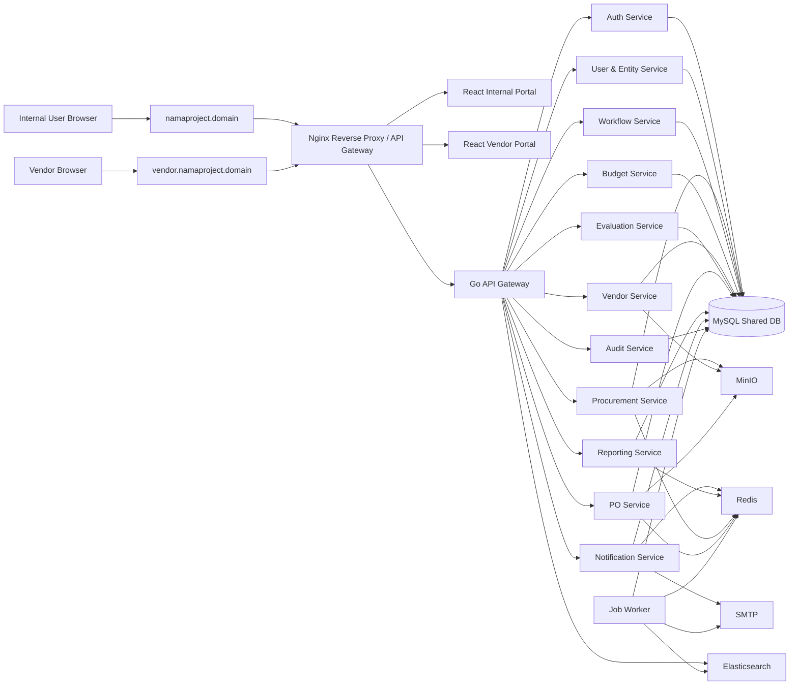
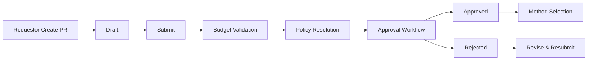
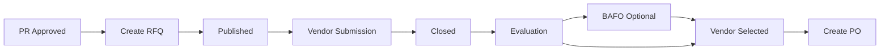
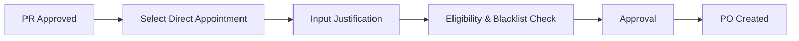
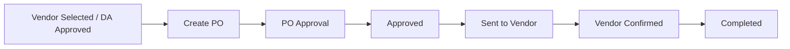

# Aplikasi E-Procurement

Technical Specification Document (TSD)

**PT. Victoria Investama, Tbk (VICO)**

Ver 1.2.0

---

# Document Information

## 1. Ringkasan Revisi

| Version | Tanggal Terbit | Deskripsi | Author(s) |
| :---- | :---- | :---- | :---- |
| 1.0.0 | 29/03/2026 | Initial Technical Specification Document E-Procurement | Divisi IT |
| 1.1.0 | 29/03/2026 | Penegasan final technical decision project: tetap menggunakan backend modular microservice; penyesuaian alignment terhadap FSD final dan konfirmasi user terbaru tanpa mengurangi konten teknis sebelumnya | Divisi IT |
| 1.2.0 | 04/04/2026 | Penambahan decision log, deployment topology, migration & rollout strategy, runbook minimum, retention policy, DR guideline, testing strategy, dan target NFR minimum | Divisi IT |

## 2. Daftar Distribusi

| Perusahaan | Personil / Kelompok | Komentar |
| :---- | :---- | :---- |
| PT. Victoria Investama, Tbk | Direksi | Review |
| PT. Victoria Investama, Tbk | Divisi IT | Development Reference |
| PT. Victoria Investama, Tbk | Internal Audit | Control & Compliance Review |
| Victoria Financial Group | Project Stakeholder | Implementation Reference |

## 3. Prosedur Pembaharuan

Pemilik dokumen ini adalah PT. Victoria Investama, Tbk. Project Manager / PIC IT bertanggung jawab atas pemeliharaan dokumen ini. Setiap perubahan terhadap kebutuhan teknis, arsitektur, integrasi, model data, atau deployment wajib melalui proses change request, review teknis, dan persetujuan manajemen sesuai standar pengembangan sistem perusahaan.

## 4. Referensi Dokumen

| No | Dokumen | Keterangan |
| :---- | :---- | :---- |
| 1 | BRD Pengembangan Sistem E-Procurement | Acuan kebutuhan bisnis |
| 2 | FSD E-Procurement | Acuan kebutuhan fungsional, use case, lifecycle, dan aturan validasi |
| 3 | Dokumen API Contract | Dokumen terpisah, versi mengikuti implementasi backend |
| 4 | ERD E-Procurement | Dokumen terpisah / lampiran teknis |
| 5 | Deployment & Operational Runbook | Dokumen operasional terpisah |

---

# Introduction

## 1. Tujuan

Technical Specification Document (TSD) E-Procurement merupakan dokumen yang menjelaskan rancangan teknis sistem E-Procurement dari sudut pandang implementasi aplikasi, arsitektur sistem, integrasi, keamanan, data, deployment, logging, monitoring, dan kontrol teknis lainnya.

Dokumen ini bertujuan untuk:

1. Menjadi acuan utama tim development dalam membangun aplikasi E-Procurement sesuai BRD dan FSD.
2. Menjabarkan arsitektur teknis untuk web internal, vendor portal, backend modular microservice, database, dan supporting services.
3. Menjadi acuan penyusunan API, ERD, pipeline deployment, observability, dan kontrol keamanan.
4. Menjadi referensi QA, DevOps, Internal Audit, dan stakeholder manajemen dalam memahami bagaimana sistem dibangun secara teknis.
5. Menjadi dasar implementasi yang audit-ready, scalable, dan selaras dengan kebutuhan multi-entity procurement governance.

## 1.1 Catatan Konsistensi Dokumen

Untuk menjaga konsistensi antar dokumen:

1. BRD menjadi acuan target kebutuhan bisnis dan governance proses procurement.
2. FSD menjadi acuan kebutuhan fungsional, use case, lifecycle, validasi, dan aturan operasional sistem.
3. TSD menjadi acuan rancangan teknis final, termasuk model autentikasi, arsitektur backend, kontrol keamanan, integrasi, dan deployment.
4. Jika FSD memuat lampiran alignment implementasi Phase 1 backend saat ini, bagian tersebut diperlakukan sebagai konteks implementasi berjalan dan bukan pengganti keputusan arsitektur final yang didokumentasikan pada TSD.

## 1.2 Prinsip Terminologi Teknis

Untuk menjaga konsistensi istilah teknis dengan BRD dan FSD:

1. Istilah bisnis yang dipakai secara baku tetap mengikuti BRD/FSD, yaitu **Within Budget**, **Over Budget**, **Non Budget**, **Direct Appointment**, dan **Reference Price / eCatalog**.
2. Istilah _session_ pada konteks implementasi TSD diperlakukan sebagai **sesi autentikasi logis** yang direalisasikan melalui access token, refresh token, timeout inaktivitas, dan mekanisme revoke.
3. Penamaan modul atau service pada TSD boleh lebih teknis, tetapi tidak boleh mengubah makna bisnis dari proses yang dijelaskan pada BRD/FSD.
4. Jika terdapat perbedaan antara status implementasi berjalan dan rancangan target-state, keputusan arsitektur final tetap mengacu pada TSD, sementara detail kondisi implementasi berjalan dicatat sebagai konteks alignment.

## 1.3 Decision Log Ringkas

| Keputusan Teknis | Keputusan Final | Alasan Ringkas |
| :---- | :---- | :---- |
| Arsitektur frontend | Satu repository, dua portal | Menjaga reuse komponen dan konsistensi UX/security policy |
| Arsitektur backend | Go modular microservice | Memisahkan domain utama sambil tetap menjaga skalabilitas modul |
| Strategi database | Shared MySQL database + `entity_id` isolation | Sederhana untuk fase awal, tetap mendukung governance multi-entitas |
| Strategi autentikasi | JWT access token + refresh token | Cocok untuk portal internal dan vendor yang terpisah |
| File storage | MinIO | Memisahkan attachment dari database transaksional |
| Queue | Redis-backed queue dengan BullMQ-compatible path | Mengakomodasi requirement user sambil tetap membuka jalur alternatif Go-native |
| Observability | MySQL audit log + Elasticsearch technical log | Memisahkan kebutuhan audit bisnis dan troubleshooting teknis |

## 2. Ruang Lingkup Teknis Service

| No | Service / Komponen | Deskripsi |
| :---- | :---- | :---- |
| 1 | Internal Web Portal | Portal React untuk seluruh user internal Victoria Group (Holding Admin, Entity Admin, Requestor, Entity Approver, Holding Approver, Procurement, Finance, Management, Internal Audit) dengan menu berbasis role |
| 2 | Vendor Portal | Portal React untuk vendor melalui subdomain terpisah, namun berada dalam satu project / repository frontend yang sama |
| 3 | API Gateway / Reverse Proxy Layer | Layer pintu masuk trafik dari internet/intranet ke frontend dan backend, termasuk HTTPS termination dan routing |
| 4 | Backend Services | Kumpulan service modular berbasis Go untuk auth, user, entity, PR, RFQ, evaluation, PO, budget, reporting, notification, dan audit |
| 5 | Object Storage Service | Penyimpanan file attachment procurement menggunakan MinIO |
| 6 | Queue / Job Processing Service | Pemrosesan asynchronous untuk email, reminder SLA, export, aggregation, dan background jobs |
| 7 | Logging & Observability | Logging ke database dan Elasticsearch untuk kebutuhan audit teknis dan troubleshooting |
| 8 | Reporting & Dashboard | Penyediaan dashboard operasional dan laporan PDF/XLSX |

## 3. Akronim, Singkatan, Istilah, dan Definisi

| Istilah | Penjelasan |
| :---- | :---- |
| PR | Purchase Request |
| RFQ | Request for Quotation |
| PO | Purchase Order |
| BAFO | Best and Final Offer |
| DA | Direct Appointment / Penunjukan Langsung |
| SLA | Service Level Agreement |
| SoD | Segregation of Duties |
| RBAC | Role-Based Access Control |
| API Gateway | Titik masuk API terpusat untuk routing request ke service backend |
| Reverse Proxy | Komponen di depan aplikasi (misalnya Nginx) yang menerima request dari client lalu meneruskan ke service yang tepat |
| Object Storage | Penyimpanan file berbasis object, pada sistem ini menggunakan MinIO |
| Audit Trail | Catatan permanen aktivitas sistem yang tidak boleh dimodifikasi secara sembarangan |
| Data Isolation | Pemisahan akses data berdasarkan entitas dan role |
| Multi-Entity | Arsitektur yang melayani banyak entitas dalam satu platform dengan kontrol isolasi data |
| Refresh Token | Token untuk memperoleh access token baru tanpa login ulang |
| WAF | Web Application Firewall, opsional jika diaktifkan di edge layer |

## 4. Asumsi Dasar Teknis

1. Frontend menggunakan React.
2. Portal internal dan vendor berada dalam **satu project / repository frontend**, tetapi dipisahkan pada hostname/subdomain dan application shell.
3. Backend menggunakan Go dengan pendekatan modular microservice.
4. Database menggunakan MySQL shared database dengan satu schema untuk satu aplikasi.
5. Seluruh tabel transaksional utama membawa `entity_id` untuk mendukung data isolation.
6. File attachment tidak disimpan dalam database, melainkan di MinIO.
7. Logging teknis disimpan ke Elasticsearch dan logging bisnis / audit juga dicatat di database.
8. Asynchronous processing menggunakan Redis-backed queue.
9. Environment on-premise minimal terdiri dari staging dan production.
10. ERP integration belum diimplementasikan pada fase ini dan hanya dicatat sebagai future placeholder.
11. Dokumen ini mengikuti **keputusan teknis final project** yang telah dikonfirmasi user. Apabila pada draft FSD sebelumnya sempat terdapat wording arsitektur monolith pada fase awal, wording tersebut **tidak digunakan** sebagai constraint arsitektur pada TSD final ini.

---

# Gambaran Umum Solusi

## 1. Ringkasan Solusi

Sistem E-Procurement dibangun sebagai **Group Procurement Platform** untuk Victoria Financial Group yang mendukung proses end-to-end dari Purchase Request hingga Vendor Confirmation, dengan governance multi-entitas, approval dinamis, kontrol budget, vendor portal, dashboard monitoring, dan audit trail permanen.

Secara teknis, sistem dibangun dengan prinsip:

> **Catatan alignment:** dokumen ini mempertahankan desain teknis yang sebelumnya sudah benar dan hanya menambahkan penegasan keputusan terbaru dari user, tanpa mengurangi cakupan teknis yang sudah ada.

- **Satu platform multi-entitas**
- **Dua portal UI** dalam satu codebase frontend
- **Backend modular microservice**
- **Shared database dengan data isolation berbasis `entity_id`**
- **Role-based and entity-based access control**
- **Asynchronous processing untuk notifikasi dan background jobs**
- **Object storage untuk file**
- **Permanent audit trail**
- **Operational dashboard dan export report**

## 2. Prinsip Arsitektur

1. **Security first** untuk portal eksternal dan data procurement.
2. **Configurable governance**: workflow dan policy disimpan pada konfigurasi, bukan hardcoded.
3. **Auditability**: setiap perubahan data kritikal dan perubahan status wajib terekam.
4. **Separation of concern**: portal internal, portal vendor, API gateway, service backend, storage, queue, dan logging dipisahkan secara jelas.
5. **Scalable by module**: service dapat diskalakan berdasarkan beban modul masing-masing.
6. **Group-level visibility, entity-level restriction**: holding dapat melihat lintas entitas, user biasa hanya data entitasnya.
7. **Low coupling on data access**: walaupun database shared, akses tabel tetap mengikuti ownership modul.

---

# Solution Architecture

## 1. High-Level Architecture



## 2. Pola Portal Frontend

### 2.1 Internal Portal

- Domain: `https://namaproject.domain`
- User: seluruh user internal Victoria Group
- Menu dan halaman ditentukan oleh role:
  - Holding Admin
  - Entity Admin
  - Requestor
  - Entity Approver
  - Holding Approver
  - Procurement
  - Finance
  - Management
  - Internal Audit

### 2.2 Vendor Portal

- Domain: `https://vendor.namaproject.domain`
- User: vendor eksternal
- Scope akses:
  - login vendor
  - melihat tender eligible
  - melihat requirement tender
  - submit quotation
  - upload dokumen
  - melihat status partisipasi
  - konfirmasi PO

### 2.3 Implementasi Frontend yang Direkomendasikan

Karena user menginginkan **satu project frontend yang sama**, pendekatan yang direkomendasikan adalah:

- **Satu repository frontend**
- **Shared component library / shared hooks / shared API client**
- **Dua application shell / dua route group utama**
- **Runtime separation berdasarkan hostname**
- **Build artifact dapat dipisah dua bundle** agar boundary lebih aman

Contoh struktur:

```text
frontend/
  apps/
    internal-portal/
    vendor-portal/
  shared/
    components/
    hooks/
    services/
    utils/
    auth/
    types/
```

> Catatan: Secara keamanan, satu repository frontend **lebih aman** jika tetap menghasilkan **dua app shell / dua build target**, dibanding satu bundle tunggal yang hanya dibedakan menu.

## 3. Reverse Proxy / API Gateway Layer

Reverse proxy yang dimaksud adalah komponen seperti **Nginx** yang berada di depan aplikasi untuk:

1. menerima request dari browser
2. menangani HTTPS termination
3. merutekan request ke frontend atau backend yang sesuai
4. membedakan hostname internal portal dan vendor portal
5. menambahkan security headers, rate limit, dan optional WAF rule
6. menyembunyikan service internal agar tidak terekspos langsung ke publik

### 3.1 Routing Domain yang Direkomendasikan

| Hostname | Fungsi |
| :---- | :---- |
| `namaproject.domain` | Internal portal UI |
| `vendor.namaproject.domain` | Vendor portal UI |
| `api.namaproject.domain` | API gateway utama |
| `api.namaproject.domain/api/internal/*` | Namespace API internal |
| `api.namaproject.domain/api/vendor/*` | Namespace API vendor |

### 3.2 Tanggung Jawab Nginx

- TLS / SSL termination
- Hostname routing
- Static asset serving untuk React build
- Reverse proxy ke Go API Gateway
- CORS policy
- Basic rate limiting
- Request size limit untuk upload dokumen
- Security headers
- Optional IP restriction untuk route admin tertentu
- Optional WAF integration untuk vendor-facing domain

## 4. Backend Architecture

## 4.1 Prinsip

Backend mengikuti pola **modular microservice**, tetapi pada fase ini menggunakan **shared database**. Dengan demikian, ini adalah pendekatan **logical microservice with shared data layer**.

> **Keputusan teknis final:** arsitektur backend pada project ini tetap menggunakan pendekatan modular microservice sesuai konfirmasi user. TSD ini sengaja mempertahankan keputusan tersebut. Jika pada draft FSD sebelumnya pernah ada kalimat yang menyebut “monolith pada fase awal”, maka kalimat tersebut dianggap **draft wording** dan **bukan acuan arsitektur final** untuk implementasi teknis.

Konsekuensi teknis:
- service dipisah berdasarkan domain bisnis
- API dipisah berdasarkan service ownership
- database tetap satu schema
- tiap service **hanya boleh** menulis tabel yang menjadi ownership domain-nya
- akses antar modul **direkomendasikan melalui API/service call atau event**, bukan cross-update tabel secara bebas

## 4.2 Daftar Service

| Service | Tanggung Jawab |
| :---- | :---- |
| API Gateway | Entry point API, auth middleware, routing request, rate limiting sederhana |
| Auth Service | Login, logout, refresh token, password policy, force change password |
| User & Entity Service | User management, role assignment, entity management, delegate approver |
| Procurement Service | Purchase Request, method selection, RFQ, Direct Appointment |
| Workflow Service | Dynamic approval workflow, approval matrix resolution, escalation |
| Budget Service | Budget master, budget validation, budget reservation/release |
| Vendor Service | Vendor master, eligibility, blacklist, vendor portal profile |
| Evaluation Service | Vendor comparison, technical/commercial evaluation, weighted scoring, BAFO |
| Purchase Order Service | PO creation, PO approval, PO send, vendor confirmation, void |
| Reporting Service | Dashboard operasional, report generation, aggregation |
| Notification Service | In-app notification, email dispatch orchestration |
| Audit Service | Audit trail, business event recording, security event logging |

## 4.3 Service Boundary Map

| Modul FSD/BRD | Service Owner Utama |
| :---- | :---- |
| Login / Logout / Ganti Password / Reset Password | Auth Service |
| Entity Management | User & Entity Service |
| User Management / Delegate Approver | User & Entity Service |
| Budget Management | Budget Service |
| Dynamic Procurement Policy | Workflow Service |
| Dynamic Approval Workflow | Workflow Service |
| Purchase Request | Procurement Service |
| RFQ & Bidding | Procurement Service |
| Vendor Portal Participation | Vendor Service + Procurement Service |
| Vendor Evaluation / BAFO / Selection | Evaluation Service |
| Direct Appointment | Procurement Service + Evaluation Service |
| Purchase Order | Purchase Order Service |
| Vendor Confirmation | Purchase Order Service + Vendor Service |
| Dashboard & Reporting | Reporting Service |
| Notification | Notification Service |
| Audit Trail | Audit Service |

## 5. Supporting Services

| Komponen | Fungsi |
| :---- | :---- |
| MySQL | Database utama transaksi dan master data |
| Redis | Backend queue / cache / distributed lock sesuai kebutuhan |
| Queue Worker | Background job processing |
| MinIO | Penyimpanan file attachment |
| SMTP | Pengiriman email |
| Elasticsearch | Penyimpanan log teknis dan pencarian log |
| Optional Kibana / Grafana | Visualisasi log dan metrik operasional |

---

# Access Requirement

## 1. Matriks Akses Per Role

| Role | Entity Scope | Akses Modul Utama |
| :---- | :---- | :---- |
| Holding Admin | Semua entitas | Entity Management, User Management, Governance, Vendor Blacklist, Monitoring grup |
| Entity Admin | Entitas sendiri | User Management entitas, budget entitas, delegate approver, monitoring entitas |
| Requestor | Entitas sendiri | Create/Edit/Submit/Revise PR, lihat status PR |
| Entity Approver | Entitas sendiri | Approve/Reject PR & PO sesuai policy |
| Holding Approver | Lintas entitas sesuai policy | Approval level holding |
| Procurement | Entitas sendiri / group sesuai rule | RFQ, bidding, vendor comparison, BAFO, Direct Appointment, PO |
| Finance | Entitas / group sesuai rule | Approval Over Budget / Non Budget, monitoring budget |
| Management | Entitas / group sesuai rule | Dashboard, report, monitoring |
| Internal Audit | Lintas entitas read-only | Audit trail, report, monitoring proses |
| Vendor | Record vendor sendiri | Tender participation, submit quotation, confirm PO |

## 2. Aturan Akses Data

1. Semua user internal memiliki `entity_id` default.
2. Holding Admin dan Internal Audit dapat memiliki akses lintas entitas.
3. Vendor **tidak memiliki akses** ke data internal approval, budget, scoring, atau vendor lain.
4. Endpoint vendor dan endpoint internal dipisahkan secara tegas.
5. Setiap query list transaksi wajib difilter minimal dengan:
   - `entity_id`
   - role scope
   - ownership jika relevan
6. Semua operasi write wajib mencatat `created_by`, `updated_by`, dan context actor.
7. Akses terhadap dokumen di MinIO wajib menggunakan signed URL dan authorization check.

---

# Authentication, Authorization, and Session Design

## 1. Authentication Model

Sistem menggunakan:

- **JWT Access Token**
- **Refresh Token**
- **Session timeout**
- **Force change password** untuk password default / hasil reset admin

_Catatan: istilah "session" pada TSD ini merujuk pada sesi autentikasi logis pengguna yang direalisasikan melalui kombinasi access token, refresh token, timeout inaktivitas, dan mekanisme revoke._

### 1.1 Token Strategy

| Item | Deskripsi |
| :---- | :---- |
| Access Token | JWT untuk akses API, durasi singkat |
| Refresh Token | Token untuk refresh access token |
| Token Scope | Internal user dan vendor dibedakan oleh `subject_type`, `role`, dan `portal_type` |
| Storage | HttpOnly secure cookie atau secure token storage sesuai keputusan frontend security policy |
| Revocation | Logout, reset password, force revoke sesi autentikasi, account deactivation |

### 1.2 Claim JWT yang Direkomendasikan

| Claim | Keterangan |
| :---- | :---- |
| `sub` | user_id / vendor_user_id |
| `subject_type` | `internal_user` / `vendor_user` |
| `entity_id` | entitas utama user internal |
| `entity_scope` | daftar entitas yang boleh diakses jika lintas entitas |
| `role_codes` | role aktif user |
| `portal_type` | `internal` / `vendor` |
| `session_id` | identitas sesi autentikasi aktif |
| `iat` / `exp` | issued at / expired at |

## 2. Authorization Model

Sistem menggabungkan:

1. **RBAC**
2. **Entity-based access control**
3. **Record ownership restriction**
4. **Policy-based approval resolution**

## 3. Password Policy

- minimal 8 karakter
- wajib huruf besar
- wajib huruf kecil
- wajib angka
- wajib karakter spesial
- tidak boleh sama dengan 3 password terakhir
- reset password oleh admin menghasilkan flag `force_change_password = true`

## 4. Session Management

- sesi autentikasi otomatis timeout setelah 30 menit inaktivitas
- refresh token memiliki masa hidup lebih panjang daripada access token
- logout menghapus token client-side dan melakukan revoke server-side
- brute force protection: lock sementara setelah 5 kali gagal berturut-turut
- semua login berhasil dan gagal dicatat ke audit trail

## 5. Delegation

- Delegate Approver dikelola oleh admin
- Delegate berlaku berdasarkan periode mulai dan akhir
- Delegate hanya aktif jika approver asli tidak tersedia / sesuai konfigurasi
- Seluruh approval oleh delegate dicatat dengan format:
  - `acted_by = delegate_user_id`
  - `on_behalf_of = original_approver_id`

---

# Technical Workflow Design

## 1. Purchase Request Flow



### 1.1 Komponen Teknis yang Terlibat

- Procurement Service
- Budget Service
- Workflow Service
- Notification Service
- Audit Service
- MinIO for attachments

### 1.2 Validasi Teknis Utama

- minimal 1 item
- minimal 1 dokumen pendukung
- nilai total dihitung otomatis
- status budget ditentukan otomatis
- submit tidak diperbolehkan jika mandatory field kosong
- policy engine menentukan jalur approval saat submit

## 2. Penentuan Metode Pengadaan

- dilakukan setelah PR approved
- sistem membaca policy recommendation
- Procurement dapat override rekomendasi dengan justifikasi
- hasil akhir:
  - RFQ/Bidding
  - Direct Appointment

## 3. RFQ / Bidding Flow



### 3.1 Kontrol Teknis

- hanya vendor eligible yang dapat melihat tender
- vendor blacklist otomatis ditolak
- minimum vendor policy disimpan pada konfigurasi
- reopen bidding hanya boleh sebelum vendor selection final
- semua dokumen quotation masuk ke MinIO

## 4. Vendor Evaluation & BAFO

- technical evaluation
- commercial evaluation
- weighted scoring
- ranking
- summary reason
- BAFO round jika diperlukan

### 4.1 Aturan Teknis

- scoring template disimpan di database
- evaluator yang diizinkan ditentukan role
- score final dapat disimpan per evaluator dan/atau final consolidated score
- alasan pemilihan vendor wajib tersimpan
- perubahan evaluasi setelah finalization memerlukan audit log eksplisit

## 5. Direct Appointment Flow



### 5.1 Kontrol Teknis

- justifikasi wajib
- vendor tetap harus lolos blacklist check
- Reference Price / eCatalog dapat dilampirkan
- quotation / price list / kontrak sebelumnya dapat diunggah

## 6. Purchase Order Flow



### 6.1 Aturan Teknis

- nomor PO auto-generated
- PO approval mengikuti policy / governance
- PO void tidak boleh jika sudah vendor confirmed
- void mengembalikan budget reserved jika masih relevan
- vendor confirmation wajib mencatat timestamp dan actor

## 7. Approval Engine Clarification

1. approval bersifat sequential by level
2. level berikutnya tidak dapat bertindak sebelum level sebelumnya selesai
3. jika 1 level memiliki beberapa approver dengan AND logic, semua approver level tersebut wajib setuju
4. reject menghentikan alur dan mengembalikan dokumen ke requestor/procurement sesuai objek
5. SLA reminder hanya reminder, **tanpa auto-approve dan tanpa auto-skip**
6. jalur approval dibentuk sistem dari policy table dan approval matrix table

---

# Data Architecture

## 1. Strategi Data Multi-Entity

1. Menggunakan **satu database shared**.
2. Menggunakan **satu schema untuk satu aplikasi**.
3. Setiap objek transaksi membawa `entity_id`.
4. `entity_code` disimpan pada master entity.
5. Isolasi data dilakukan di level aplikasi dan query.
6. Role user dan entity user disimpan sebagai atribut user-role relation.
7. Holding scope disimpan dalam role/access policy, bukan memisah database.

## 2. Prinsip Desain Data

- seluruh tabel transaksi memiliki primary key unik
- foreign key digunakan pada relasi utama
- field audit standar tersedia:
  - `created_at`
  - `created_by`
  - `updated_at`
  - `updated_by`
- soft delete digunakan hanya untuk data yang perlu arsip, bukan transaksi approval final
- attachment metadata disimpan di database, file fisik di MinIO
- status menggunakan enum atau reference table yang konsisten
- indeks wajib pada foreign key, status, nomor dokumen, dan kolom pencarian utama

## 3. Konvensi ID

Direkomendasikan menggunakan **UUID** untuk objek lintas service agar aman terhadap ekspansi arsitektur. Secara fisik dapat direalisasikan sebagai:

- `CHAR(36)` untuk kemudahan debugging
- atau `BINARY(16)` untuk efisiensi storage

Keputusan final fisik dapat ditetapkan pada ERD dan implementasi migration.

## 4. Tabel Utama dan Field Inti

## 4.1 Master Table

### `entities`

| Field | Keterangan |
| :---- | :---- |
| `id` | Primary key entity |
| `entity_code` | Kode entitas, unik |
| `entity_name` | Nama entitas |
| `parent_entity_id` | Relasi ke holding / parent |
| `entity_type` | Holding / subsidiary |
| `status` | Active / Inactive |
| `approval_model_code` | Referensi default model approval |
| `governance_mode` | entity_only / holding_required / conditional |
| `created_at` / `updated_at` | Audit timestamp |

### `roles`

| Field | Keterangan |
| :---- | :---- |
| `id` | Primary key role |
| `role_code` | Kode role, unik |
| `role_name` | Nama role |
| `portal_type` | internal / vendor |
| `is_active` | Status aktif |
| `description` | Deskripsi role |

### `users`

| Field | Keterangan |
| :---- | :---- |
| `id` | Primary key user |
| `entity_id` | Entitas utama user |
| `full_name` | Nama user |
| `email` | Email login |
| `username` | Username jika dipisahkan dari email |
| `password_hash` | Password terenkripsi |
| `status` | Active / Inactive / Locked |
| `force_change_password` | Flag wajib ganti password |
| `last_login_at` | Login terakhir |
| `failed_login_count` | Counter brute force |
| `locked_until` | Timestamp lock sementara |
| `created_at` / `updated_at` | Audit timestamp |

### `user_roles`

| Field | Keterangan |
| :---- | :---- |
| `id` | Primary key relation |
| `user_id` | Relasi ke user |
| `role_id` | Relasi ke role |
| `entity_id` | Scope entitas role |
| `scope_type` | own_entity / cross_entity / holding |
| `is_primary` | Role utama |
| `status` | Active / Inactive |

### `delegate_approvers`

| Field | Keterangan |
| :---- | :---- |
| `id` | Primary key |
| `entity_id` | Entitas terkait |
| `original_user_id` | Approver asli |
| `delegate_user_id` | User delegate |
| `start_at` | Mulai delegasi |
| `end_at` | Akhir delegasi |
| `reason` | Alasan delegasi |
| `status` | Active / Expired / Cancelled |

### `vendors`

| Field | Keterangan |
| :---- | :---- |
| `id` | Primary key vendor |
| `vendor_code` | Kode vendor |
| `vendor_name` | Nama vendor |
| `tax_id` | NPWP / identitas vendor |
| `email` | Email utama vendor |
| `phone` | Nomor kontak |
| `address` | Alamat |
| `approved_status` | approved / pending / inactive |
| `blacklist_status` | true / false |
| `eligibility_status` | eligible / ineligible |
| `created_at` / `updated_at` | Audit timestamp |

### `vendor_users`

| Field | Keterangan |
| :---- | :---- |
| `id` | Primary key vendor user |
| `vendor_id` | Relasi ke vendor |
| `full_name` | Nama PIC vendor |
| `email` | Email login |
| `password_hash` | Password terenkripsi |
| `status` | Active / Inactive |
| `last_login_at` | Login terakhir |
| `force_change_password` | Flag |
| `created_at` / `updated_at` | Audit timestamp |

### `vendor_blacklists`

| Field | Keterangan |
| :---- | :---- |
| `id` | Primary key |
| `vendor_id` | Relasi ke vendor |
| `entity_id` | Scope blacklist, jika spesifik entitas |
| `blacklist_type` | group / entity |
| `reason` | Alasan blacklist |
| `start_at` | Tanggal mulai |
| `end_at` | Tanggal akhir, nullable |
| `status` | Active / Revoked |
| `created_by` | User yang melakukan flag |

### `reference_prices`

| Field | Keterangan |
| :---- | :---- |
| `id` | Primary key |
| `entity_id` | Entitas pemilik data |
| `item_name` | Nama item |
| `item_category` | Kategori item |
| `uom` | Satuan |
| `reference_price` | Harga referensi |
| `source_type` | manual / historical_po |
| `source_reference` | Referensi sumber |
| `effective_date` | Tanggal berlaku |
| `status` | Active / Inactive |

### `budgets`

| Field | Keterangan |
| :---- | :---- |
| `id` | Primary key |
| `entity_id` | Entitas |
| `fiscal_year` | Tahun fiskal |
| `department_code` | Departemen |
| `procurement_category` | Kategori pengadaan |
| `budget_mode` | limited / unlimited |
| `allocated_amount` | Nilai budget dialokasikan |
| `reserved_amount` | Nilai yang sedang teralokasi |
| `used_amount` | Nilai yang sudah terpakai |
| `status` | Active / Closed |

### `procurement_policy_rules`

| Field | Keterangan |
| :---- | :---- |
| `id` | Primary key |
| `entity_id` | Entitas, nullable jika global holding |
| `policy_code` | Kode kebijakan |
| `goods_or_services` | barang / jasa |
| `routine_type` | rutin / non-rutin |
| `budget_status` | within_budget / over_budget / non_budget |
| `min_amount` | Batas bawah nominal |
| `max_amount` | Batas atas nominal |
| `recommended_method` | bidding / direct_appointment |
| `approval_model_id` | Relasi ke model approval |
| `status` | Active / Inactive |

### `approval_models`

| Field | Keterangan |
| :---- | :---- |
| `id` | Primary key |
| `entity_id` | Entitas atau global |
| `model_code` | Kode model |
| `model_name` | Nama model |
| `object_type` | PR / PO / DA |
| `status` | Active / Inactive |
| `description` | Keterangan |

### `approval_matrixes`

| Field | Keterangan |
| :---- | :---- |
| `id` | Primary key |
| `approval_model_id` | Relasi ke approval model |
| `level_no` | Nomor level |
| `approver_role_code` | Role approver |
| `approver_scope` | entity / holding / finance |
| `logic_type` | single / and |
| `sla_days` | SLA hari kerja |
| `is_mandatory` | Mandatory / optional |
| `status` | Active / Inactive |

## 4.2 Transaction Table

### `purchase_requests`

| Field | Keterangan |
| :---- | :---- |
| `id` | Primary key PR |
| `entity_id` | Entitas pemilik PR |
| `pr_number` | Nomor PR unik |
| `requestor_id` | User pembuat |
| `department_code` | Departemen |
| `title` | Judul PR |
| `description` | Deskripsi kebutuhan |
| `procurement_type` | barang / jasa |
| `routine_type` | rutin / non-rutin |
| `estimated_amount` | Total estimasi |
| `budget_status` | within_budget / over_budget / non_budget |
| `need_date` | Tanggal kebutuhan |
| `procurement_method` | bidding / direct_appointment / null |
| `status` | Draft / Submitted / Pending Approval / Approved / Rejected / Revised / Cancelled |

### `purchase_request_items`

| Field | Keterangan |
| :---- | :---- |
| `id` | Primary key item |
| `pr_id` | Relasi ke PR |
| `entity_id` | Entitas |
| `item_name` | Nama barang/jasa |
| `specification` | Spesifikasi |
| `qty` | Jumlah |
| `uom` | Satuan |
| `estimated_unit_price` | Harga estimasi/unit |
| `estimated_total_price` | Total estimasi |
| `reference_price_id` | Referensi harga jika ada |

### `pr_attachments`

| Field | Keterangan |
| :---- | :---- |
| `id` | Primary key |
| `pr_id` | Relasi ke PR |
| `entity_id` | Entitas |
| `file_name_original` | Nama asli |
| `file_name_stored` | Nama di object storage |
| `bucket_name` | Bucket MinIO |
| `object_key` | Path / key object |
| `mime_type` | Tipe file |
| `file_size` | Ukuran file |
| `uploaded_by` | User uploader |

### `pr_approvals`

| Field | Keterangan |
| :---- | :---- |
| `id` | Primary key |
| `pr_id` | Relasi ke PR |
| `entity_id` | Entitas |
| `approval_level` | Level approval |
| `assigned_approver_id` | Approver utama |
| `acted_by_user_id` | User yang bertindak |
| `on_behalf_of_user_id` | Jika delegate |
| `action` | approve / reject / note |
| `remarks` | Catatan |
| `acted_at` | Waktu aksi |
| `status_after_action` | Status setelah aksi |

### `rfqs`

| Field | Keterangan |
| :---- | :---- |
| `id` | Primary key RFQ |
| `entity_id` | Entitas |
| `pr_id` | Relasi ke PR |
| `rfq_number` | Nomor RFQ |
| `title` | Judul RFQ |
| `technical_requirement` | Syarat teknis |
| `commercial_requirement` | Syarat komersial |
| `minimum_vendor_count` | Kuorum vendor minimum |
| `publish_at` | Waktu publish |
| `deadline_at` | Deadline bidding |
| `status` | Created / Published / Vendor Submission / Closed / Reopened / Evaluation / BAFO / Vendor Selected / Cancelled |

### `rfq_vendors`

| Field | Keterangan |
| :---- | :---- |
| `id` | Primary key |
| `rfq_id` | Relasi ke RFQ |
| `vendor_id` | Relasi ke vendor |
| `invitation_type` | restricted / open-eligible |
| `eligibility_status` | eligible / not_eligible |
| `invited_at` | Waktu undang |
| `viewed_at` | Vendor lihat tender |
| `participation_status` | invited / submitted / not_submitted / disqualified |

### `quotations`

| Field | Keterangan |
| :---- | :---- |
| `id` | Primary key quotation |
| `rfq_id` | Relasi ke RFQ |
| `vendor_id` | Vendor pengaju |
| `entity_id` | Entitas |
| `quotation_number` | Nomor quotation jika ada |
| `quotation_total` | Nilai total |
| `payment_terms` | Term of payment |
| `delivery_terms` | Delivery terms |
| `valid_until` | Masa berlaku quotation |
| `submitted_at` | Waktu submit |
| `status` | Draft / Submitted / Revised / Withdrawn / Accepted for Evaluation |

### `quotation_items`

| Field | Keterangan |
| :---- | :---- |
| `id` | Primary key |
| `quotation_id` | Relasi ke quotation |
| `pr_item_id` | Relasi ke item PR |
| `unit_price` | Harga unit vendor |
| `qty` | Jumlah |
| `total_price` | Total item |
| `note` | Catatan vendor |

### `quotation_attachments`

| Field | Keterangan |
| :---- | :---- |
| `id` | Primary key |
| `quotation_id` | Relasi ke quotation |
| `vendor_id` | Relasi vendor |
| `file_name_original` | Nama file |
| `object_key` | Lokasi file di MinIO |
| `mime_type` | Tipe file |
| `file_size` | Ukuran |
| `uploaded_at` | Waktu upload |

### `vendor_evaluations`

| Field | Keterangan |
| :---- | :---- |
| `id` | Primary key |
| `rfq_id` | Relasi RFQ |
| `vendor_id` | Vendor |
| `technical_score` | Nilai teknis |
| `commercial_score` | Nilai komersial |
| `weighted_score` | Nilai total berbobot |
| `ranking_no` | Ranking |
| `evaluation_summary` | Ringkasan evaluasi |
| `evaluated_by` | Evaluator |
| `evaluated_at` | Waktu evaluasi |

### `bafo_rounds`

| Field | Keterangan |
| :---- | :---- |
| `id` | Primary key |
| `rfq_id` | Relasi RFQ |
| `round_no` | Nomor round |
| `deadline_at` | Deadline BAFO |
| `status` | Open / Closed |
| `created_by` | Procurement |
| `created_at` | Waktu buat |

### `vendor_selections`

| Field | Keterangan |
| :---- | :---- |
| `id` | Primary key |
| `rfq_id` | Relasi RFQ |
| `selected_vendor_id` | Vendor terpilih |
| `selection_method` | bidding / da |
| `selection_reason` | Alasan pemilihan |
| `final_price` | Harga final |
| `selected_by` | User pemilih |
| `selected_at` | Waktu pilih |

### `direct_appointments`

| Field | Keterangan |
| :---- | :---- |
| `id` | Primary key |
| `entity_id` | Entitas |
| `pr_id` | Relasi ke PR |
| `vendor_id` | Vendor yang ditunjuk |
| `justification` | Justifikasi DA |
| `reference_document_note` | Referensi dokumen pendukung |
| `estimated_value` | Nilai acuan |
| `status` | Created / Pending Approval / Approved / PO Created / Cancelled |
| `created_by` | Procurement |
| `created_at` | Waktu buat |

### `direct_appointment_attachments`

| Field | Keterangan |
| :---- | :---- |
| `id` | Primary key |
| `da_id` | Relasi ke Direct Appointment |
| `object_key` | Lokasi file |
| `file_name_original` | Nama file asli |
| `mime_type` | Tipe file |
| `file_size` | Ukuran |
| `uploaded_by` | Uploader |

### `purchase_orders`

| Field | Keterangan |
| :---- | :---- |
| `id` | Primary key PO |
| `entity_id` | Entitas |
| `po_number` | Nomor PO unik |
| `pr_id` | Relasi ke PR |
| `rfq_id` | Relasi RFQ, nullable |
| `da_id` | Relasi DA, nullable |
| `vendor_id` | Vendor |
| `currency_code` | IDR |
| `total_amount` | Nilai total PO |
| `status` | Draft / Pending Approval / Approved / Rejected / Sent to Vendor / Vendor Confirmed / Completed / Voided |
| `sent_at` | Waktu kirim vendor |
| `vendor_confirmed_at` | Waktu konfirmasi vendor |

### `purchase_order_items`

| Field | Keterangan |
| :---- | :---- |
| `id` | Primary key item |
| `po_id` | Relasi ke PO |
| `pr_item_id` | Relasi item asal |
| `item_name` | Nama item |
| `specification` | Spesifikasi |
| `qty` | Jumlah |
| `uom` | Satuan |
| `unit_price` | Harga unit |
| `total_price` | Total |

### `po_attachments`

| Field | Keterangan |
| :---- | :---- |
| `id` | Primary key |
| `po_id` | Relasi PO |
| `file_name_original` | Nama file |
| `object_key` | Lokasi object |
| `mime_type` | Tipe file |
| `file_size` | Ukuran |
| `uploaded_by` | Uploader |

### `po_approvals`

| Field | Keterangan |
| :---- | :---- |
| `id` | Primary key |
| `po_id` | Relasi ke PO |
| `approval_level` | Level approval |
| `assigned_approver_id` | Approver utama |
| `acted_by_user_id` | Actor |
| `on_behalf_of_user_id` | Delegate jika ada |
| `action` | approve / reject |
| `remarks` | Catatan |
| `acted_at` | Timestamp |
| `status_after_action` | Status sesudah aksi |

### `vendor_confirmations`

| Field | Keterangan |
| :---- | :---- |
| `id` | Primary key |
| `po_id` | Relasi ke PO |
| `vendor_id` | Vendor |
| `confirmed_by_vendor_user_id` | User vendor yang konfirmasi |
| `confirmation_status` | confirmed / declined |
| `remarks` | Catatan |
| `confirmed_at` | Waktu konfirmasi |

### `notifications`

| Field | Keterangan |
| :---- | :---- |
| `id` | Primary key |
| `channel_type` | email / in_app |
| `recipient_type` | internal_user / vendor_user |
| `recipient_id` | Penerima |
| `entity_id` | Entitas terkait |
| `event_code` | Kode event |
| `subject` | Subject / title |
| `body` | Konten |
| `status` | queued / sent / failed / read |
| `sent_at` | Waktu kirim |
| `error_message` | Error jika gagal |

### `audit_logs`

| Field | Keterangan |
| :---- | :---- |
| `id` | Primary key |
| `entity_id` | Entitas terkait |
| `module_code` | Modul |
| `object_type` | PR / RFQ / PO / USER / BUDGET / dll |
| `object_id` | ID objek |
| `event_code` | Kode event |
| `actor_type` | internal_user / vendor_user / system |
| `actor_id` | Pelaku |
| `action` | create / update / approve / reject / login / export / dll |
| `data_before` | Snapshot sebelum |
| `data_after` | Snapshot sesudah |
| `ip_address` | IP |
| `user_agent` | User agent |
| `created_at` | Timestamp |

### `app_logs`

| Field | Keterangan |
| :---- | :---- |
| `id` | Primary key |
| `service_name` | Nama service |
| `level` | info / warn / error |
| `trace_id` | Correlation ID |
| `message` | Pesan log |
| `payload` | Structured payload |
| `created_at` | Timestamp |
| `shipped_to_elastic` | Flag pengiriman |

## 5. Relasi Kunci

1. `purchase_requests` -> parent proses procurement
2. `rfqs` -> terkait ke `purchase_requests`
3. `quotations` -> terkait ke `rfqs` dan `vendors`
4. `vendor_evaluations` -> terkait ke `quotations` / `rfqs`
5. `vendor_selections` -> hasil evaluasi
6. `purchase_orders` -> berasal dari `vendor_selections` atau `direct_appointments`
7. `audit_logs` -> mencatat seluruh perubahan status objek di atas

## 6. Indexing Strategy

Indeks minimum yang direkomendasikan:

- unique index pada `entity_code`, `role_code`, `pr_number`, `rfq_number`, `po_number`
- index pada `entity_id`, `status`, `created_at`, `requestor_id`, `vendor_id`
- composite index untuk query operasional:
  - `(entity_id, status, created_at)`
  - `(entity_id, department_code, fiscal_year)`
  - `(rfq_id, vendor_id)`
  - `(object_type, object_id, created_at)` pada audit log

---

# API & Integration Design

## 1. API Design Principle

- RESTful API
- versioned endpoint: `/api/v1/...`
- JSON request/response
- standard error structure
- auth via bearer token / secure cookie strategy
- correlation ID per request
- idempotency untuk endpoint sensitif tertentu jika diperlukan

## 2. Namespace API

| Namespace | Fungsi |
| :---- | :---- |
| `/api/v1/auth/*` | login, logout, refresh, change password |
| `/api/v1/internal/*` | API internal portal |
| `/api/v1/vendor/*` | API vendor portal |
| `/api/v1/files/*` | signed upload/download |
| `/api/v1/reports/*` | export dan reporting |
| `/api/v1/admin/*` | konfigurasi teknis admin jika diperlukan |

## 3. Standard Response

```json
{
  "success": true,
  "message": "OK",
  "data": {},
  "meta": {
    "trace_id": "..."
  }
}
```

## 4. Standard Error Response

```json
{
  "success": false,
  "message": "Validation failed",
  "error_code": "VALIDATION_ERROR",
  "errors": [
    {
      "field": "estimated_amount",
      "message": "must be greater than zero"
    }
  ],
  "meta": {
    "trace_id": "..."
  }
}
```

## 5. Integrasi Eksternal

### 5.1 SMTP / Email

| Item | Deskripsi |
| :---- | :---- |
| Transport | SMTP |
| Fungsi | notifikasi approval, tender, BAFO, PO, password alert |
| Mode | asynchronous via queue |
| Retry | retry bertingkat untuk kegagalan email |
| Audit | status pengiriman disimpan di `notifications` |

### 5.2 MinIO

| Item | Deskripsi |
| :---- | :---- |
| Fungsi | attachment PR, RFQ, quotation, DA, PO |
| Access | private bucket |
| Upload | via signed upload / service upload |
| Download | via signed URL + authorization check |
| Naming | object key berbasis UUID / path per module |

### 5.3 Elasticsearch

| Item | Deskripsi |
| :---- | :---- |
| Fungsi | log teknis dan pencarian error |
| Source | service logs, worker logs, gateway logs |
| Structured Log | JSON log dengan `trace_id`, `service_name`, `level` |
| Retention | sesuai kebijakan infrastruktur |

## 6. Vendor Portal Separation

Walaupun vendor portal dan internal portal berada pada project frontend yang sama dan backend yang sama secara logical platform, pemisahan berikut wajib diterapkan:

1. hostname terpisah
2. route group terpisah
3. endpoint namespace terpisah
4. role / subject type terpisah
5. authorization middleware terpisah
6. data projection terpisah
7. audit log dengan actor type terpisah
8. optional WAF / stricter rate limiting pada portal vendor

---

# Queue & Background Job Design

## 1. Use Case Queue

Queue dipakai untuk:

- email notification
- SLA reminder
- dashboard aggregation batch
- report export PDF/XLSX
- file virus scan / validation pipeline jika kelak ditambahkan
- retry task yang tidak perlu synchronous response
- asynchronous audit enrichment jika dibutuhkan

## 2. Queue Design

| Job Type | Trigger | Worker Output |
| :---- | :---- | :---- |
| `send_email` | event notifikasi | email terkirim / gagal |
| `sla_reminder` | scheduler | reminder approval |
| `generate_report_pdf` | user export | file PDF di MinIO |
| `generate_report_xlsx` | user export | file XLSX di MinIO |
| `aggregate_dashboard_daily` | cron harian | summary table refresh |
| `recalculate_reference_price` | selesai PO | update Reference Price historis |

## 3. Catatan Teknologi Queue

User meminta penggunaan **BullMQ** dengan Redis yang sudah tersedia. Namun secara teknis:

- **BullMQ adalah library Node.js**
- backend utama proyek ini adalah **Go**

Dengan demikian, terdapat dua opsi implementasi:

### Opsi A — Mengikuti Requirement Saat Ini
- service utama tetap Go
- disediakan **job worker terpisah berbasis Node.js** khusus queue BullMQ
- worker Node.js menangani email, reminder, export, aggregation, dan job asynchronous lain

### Opsi B — Pure Go Stack
- queue worker diganti ke teknologi native Go berbasis Redis, misalnya Asynq / Redis Streams

**Keputusan TSD ini:**  
Dokumen ini tetap mengakomodasi **Redis-backed queue** dan **BullMQ-compatible worker path**, dengan catatan bahwa BullMQ memerlukan worker Node.js terpisah. Jika di kemudian hari diinginkan stack yang lebih konsisten, queue layer dapat diganti ke pendekatan pure Go.

## 4. Scheduler

Scheduler minimal:

- SLA reminder approval
- H-1 deadline bidding reminder
- daily dashboard aggregation
- cleanup refresh token/sesi autentikasi lama
- expire delegation period
- optional refresh Reference Price dari historical PO

---

# Notification Design

## 1. Channel

- Email
- In-App Notification

## 2. Event Notification Utama

| Event | Penerima | Channel |
| :---- | :---- | :---- |
| PR Submitted | Approver level pertama | Email + In-App |
| PR Approved per level | Next approver / Procurement | Email + In-App |
| PR Rejected | Requestor | Email + In-App |
| PR Cancelled | Requestor + approver terkait | Email + In-App |
| SLA Reminder | Approver pending | Email + In-App |
| Tender Published | Vendor eligible | Email + In-App |
| Deadline Bidding H-1 | Vendor belum submit | Email |
| BAFO Invitation | Vendor shortlisted | Email + In-App |
| PO Submitted | Approver PO | Email + In-App |
| PO Approved & Sent | Vendor + Procurement | Email + In-App |
| PO Rejected | Procurement | Email + In-App |
| PO Voided | Vendor + Procurement | Email + In-App |
| Vendor Confirmed PO | Procurement | Email + In-App |
| Password Changed | User terkait | Email |
| Password Reset by Admin | User terkait | Email |
| Vendor Blacklisted | Vendor + Procurement | Email + In-App |
| Delegate Approver Active | Approver asli + delegate | Email + In-App |

## 3. Notification Processing Rule

1. Notifikasi tidak dikirim langsung di request utama jika bisa diproses asynchronous.
2. Event dibuat ke queue setelah transaksi utama committed.
3. Status pengiriman dicatat per notification record.
4. Retry dilakukan untuk kegagalan email dengan limit tertentu.
5. Template notifikasi dipisahkan dari business logic.

---

# Logging, Audit Trail, and Monitoring

## 1. Jenis Log

| Jenis Log | Lokasi | Tujuan |
| :---- | :---- | :---- |
| Application Log | Elasticsearch + optional file/stdout | debugging teknis |
| Business Audit Log | MySQL | audit aktivitas bisnis |
| Security Log | MySQL + Elasticsearch | login, logout, reset password, revoke sesi autentikasi |
| Job Log | MySQL + Elasticsearch | status queue/worker |
| Export Log | MySQL | siapa ekspor apa, kapan |

## 2. Audit Trail Principle

1. Audit trail bersifat append-only secara logical.
2. Record audit tidak boleh diubah oleh user aplikasi biasa.
3. Event kritikal minimal menyimpan:
   - object type
   - object id
   - actor
   - action
   - before
   - after
   - timestamp
   - IP
   - user agent
4. Approval dan rejection wajib menyimpan remarks.
5. Delegate action wajib menyimpan actor asli dan approver asli.

## 3. Event yang Wajib Di-log

- login berhasil / gagal
- logout
- reset password
- change password
- create / update / submit / revise PR
- approval / reject PR
- create / publish / close / reopen RFQ
- submit quotation
- scoring vendor
- BAFO invitation and response
- vendor selection
- create / approve / reject / send / void PO
- vendor confirmation
- budget create / update / release / reserve
- policy change
- approval matrix change
- user role change
- entity governance change
- export report
- blacklist / unblacklist vendor

## 4. Monitoring Minimum

- CPU / memory usage per service
- DB connection pool
- API response time
- error rate
- queue backlog
- SMTP failure count
- MinIO upload/download error
- Elasticsearch ingestion status
- scheduled job success/failure
- dashboard aggregation lag

## 5. Traceability

Seluruh service direkomendasikan menghasilkan `trace_id` / `correlation_id` per request untuk memudahkan pelacakan antar gateway, API, worker, dan log storage.

---

# Security & Internal Control Design

## 1. Security Objective

- menjaga kerahasiaan dokumen procurement
- mencegah akses lintas entitas tanpa otorisasi
- mencegah konflik peran yang berisiko
- memastikan approval tidak bisa dimanipulasi
- menjaga keamanan vendor-facing portal

## 2. Kontrol Utama

### 2.1 RBAC + Entity Scope

Semua endpoint harus memeriksa:
- role
- portal type
- entity scope
- object ownership / visibility

### 2.2 SoD Enforcement

Aturan minimum:

1. Requestor tidak boleh meng-approve PR miliknya sendiri.
2. Procurement tidak boleh melakukan approval jika policy melarang overlap peran.
3. Holding Admin dan Internal Audit hanya read access pada fungsi tertentu jika tidak menjadi approver operasional.
4. Perubahan role yang melanggar SoD harus dapat ditandai untuk review.

### 2.3 File Security

- file type whitelist
- file size limit
- object storage private
- signed URL expiration
- scan pipeline opsional untuk malware
- filename sanitization

### 2.4 API Security

- HTTPS only
- rate limiting
- JWT validation
- refresh token rotation recommended
- request body size limit
- input validation
- audit log pada endpoint sensitif
- vendor API namespace diproteksi lebih ketat

### 2.5 Data Security

- password hash menggunakan algoritma yang aman
- data in transit via TLS
- backup database terenkripsi sesuai kebijakan infra
- field sensitif dapat dienkripsi jika diperlukan kebijakan tambahan

### 2.6 Approval Integrity

- jalur approval ditentukan sistem
- user tidak dapat memilih approver manual kecuali delegate yang dikonfigurasi admin
- tidak ada auto-approve
- reject menghentikan workflow
- action approval memerlukan actor yang valid dan sesi autentikasi aktif

---

# Reporting & Dashboard Technical Design

## 1. Jenis Dashboard

### 1.1 Operasional (Real-Time / Near Real-Time)
- daftar PR pending
- daftar approval pending
- RFQ aktif
- quotation masuk
- PO pending approval
- PO sent / confirmed
- Over Budget tracker

### 1.2 Management Dashboard
- nilai pengadaan per entitas
- proporsi bidding vs Direct Appointment
- lead time rata-rata
- SLA compliance
- budget utilization
- vendor participation rate
- cost saving vs Reference Price

## 2. Mode Data Retrieval

| Tipe Data | Mode |
| :---- | :---- |
| Dashboard operasional | real-time query |
| Dashboard agregasi KPI | batch aggregation + summary table diperbolehkan |
| Report PDF/XLSX | asynchronous export via queue |

## 3. Report Minimum

| Report | Output |
| :---- | :---- |
| Purchase Request Summary | PDF, XLSX |
| RFQ & Tender Participation | XLSX |
| Budget Utilization | PDF, XLSX |
| Procurement Lead Time | XLSX |
| Vendor Evaluation Summary | PDF, XLSX |
| Audit Trail Extract | XLSX / CSV |

## 4. Summary Table yang Direkomendasikan

| Table | Tujuan |
| :---- | :---- |
| `dashboard_procurement_daily` | agregasi harian per entitas |
| `dashboard_budget_daily` | serapan budget harian |
| `dashboard_vendor_performance` | statistik partisipasi vendor |
| `kpi_procurement_summary` | SLA, lead time, cost saving |

---

# Infrastructure & Environment

## 1. Runtime Environment

| Environment | Lokasi | Keterangan |
| :---- | :---- | :---- |
| Local Dev | Developer machine | Pengembangan harian |
| Staging | On-premise VICO | Hasil promotion dari branch/dev, untuk SIT/UAT/internal testing |
| Production | On-premise VICO | Environment produksi |

## 2. Development Flow

| Branch / Stage | Keterangan |
| :---- | :---- |
| `dev` | Pengembangan aktif, belum stabil |
| `staging` | Hasil merge/promotion dari `dev` untuk testing di server staging |
| `main` / `prod` | Release stabil ke production |

> Penamaan branch final dapat mengikuti standar repository yang berlaku. Yang penting adalah alur promotion: **dev -> staging -> production**.

## 3. Deployment Approach

- on-premise deployment
- direkomendasikan containerized deployment
- static frontend disajikan via Nginx
- backend services berjalan sebagai container / service terpisah
- MinIO, Redis, MySQL, dan Elasticsearch berjalan sebagai service pendukung
- deployment production dilakukan dari artefak yang telah lolos staging

## 4. Kebutuhan Server Minimum (Estimasi Awal)

> Estimasi berikut adalah baseline awal dan **wajib divalidasi melalui load test** sebelum final sizing production.

| Komponen | CPU | RAM | Storage | Keterangan |
| :---- | :---- | :---- | :---- | :---- |
| Nginx + Frontend Internal/Vendor | 2 vCPU | 4 GB | 20 GB | static serving + reverse proxy |
| API Gateway | 2 vCPU | 4 GB | 20 GB | routing API |
| Core Backend Services | 4-8 vCPU | 8-16 GB | 40 GB | bergantung volume transaksi |
| Queue Worker | 2 vCPU | 4 GB | 20 GB | email/export/aggregation |
| MySQL | 8 vCPU | 16 GB | SSD 200 GB+ | database utama |
| Redis | 2 vCPU | 4 GB | 20 GB | queue backend / cache |
| MinIO | 4 vCPU | 8 GB | sesuai attachment | object storage |
| Elasticsearch | 8 vCPU | 16 GB | SSD 200 GB+ | log indexing |

## 5. Software and Services Requirement

| Requirement | Software / Service | Keterangan |
| :---- | :---- | :---- |
| Reverse Proxy / Gateway | Nginx | domain routing, TLS, proxy |
| Frontend Runtime | React build output | internal & vendor portal |
| Backend Runtime | Go services | modular service |
| Queue Backend | Redis | backend queue |
| Queue Worker | Node.js worker (jika BullMQ dipakai) / alternatif Go worker | job processing |
| RDMS | MySQL | database utama |
| File Storage | MinIO | object storage attachment |
| Log Storage | Elasticsearch | log teknis |
| Email Service | SMTP | notifikasi email |
| API Documentation | Swagger / OpenAPI | dokumentasi API |

## 6. Backup & Recovery

| Komponen | Kebijakan Minimum |
| :---- | :---- |
| MySQL | full backup harian + binlog/incremental sesuai kebijakan infra |
| MinIO | backup object penting sesuai klasifikasi |
| Redis | snapshot/append-only sesuai kebutuhan queue durability |
| Elasticsearch | retention dan snapshot sesuai kapasitas |
| Config/Secrets | backup aman dan terbatas |

---

# Deployment, Migration, and Operability

## 1. Deployment Topology Minimum

| Layer / Komponen | Penempatan Minimum | Catatan |
| :---- | :---- | :---- |
| Nginx / Reverse Proxy | Edge / DMZ atau layer ingress internal | TLS termination, routing domain, basic hardening |
| Frontend Internal Portal | Server aplikasi internal | Hanya diekspos sesuai domain internal |
| Frontend Vendor Portal | Server aplikasi eksternal/DMZ sesuai kebijakan | Dipisahkan pada hostname/subdomain vendor |
| API Gateway | App layer | Menjadi pintu masuk seluruh trafik API |
| Backend Services | App layer internal | Dapat dipisah per service/container sesuai kapasitas |
| MySQL | Data layer | Tidak diekspos ke publik |
| Redis | Data / integration layer | Hanya dapat diakses aplikasi dan worker |
| MinIO | Storage layer | Akses melalui service atau signed URL |
| Elasticsearch | Logging/monitoring layer | Tidak dibuka ke end user |
| Scheduler / Queue Worker | Background processing layer | Menjalankan reminder, export, aggregation, retry job |

## 2. Migration & Rollout Strategy

1. Siapkan master data minimum: entity, role, user admin, vendor, kategori, dan konfigurasi dasar.
2. Deploy schema migration secara versioned dan idempotent.
3. Seed data governance awal untuk budget, approval model, dan procurement policy.
4. Lakukan smoke test teknis di staging sebelum SIT/UAT dimulai.
5. Jalankan UAT berbasis skenario prioritas tinggi dari FSD.
6. Freeze perubahan konfigurasi kritikal menjelang production cutover.
7. Lakukan go-live bertahap per entitas bila diperlukan untuk menurunkan risiko.
8. Siapkan rollback plan untuk deployment aplikasi, namun perubahan data produksi harus mengikuti prosedur restore yang terkontrol.

## 3. Operasional Runbook Minimum

| Domain Operasional | Aktivitas Minimum | Frekuensi / Trigger | Owner |
| :---- | :---- | :---- | :---- |
| Health check service | Cek status API gateway, service utama, Redis, MySQL, MinIO | Harian / incident | IT Operations |
| Queue monitoring | Pantau failed job, retry queue, backlog export/email | Harian | IT Operations |
| Backup verification | Pastikan backup berjalan dan file dapat diakses | Harian / mingguan | Infra / DBA |
| Audit log review | Sampling event bisnis kritikal | Mingguan | Internal Audit / IT |
| Capacity review | Pantau growth DB, object storage, Elasticsearch | Bulanan | Infra / DBA |
| Secret / credential review | Rotasi sesuai kebijakan keamanan | Berkala / insiden | IT Security |
| Release verification | Smoke test pasca deploy | Setiap deployment | Dev + QA + Ops |

## 4. Data Retention & Archival Policy

| Jenis Data | Retention Minimum | Tindakan Setelah Retention |
| :---- | :---- | :---- |
| Audit trail bisnis | Mengikuti kebijakan audit/perusahaan; direkomendasikan multi-tahun | Archive terkontrol, tetap searchable bila diwajibkan |
| Technical app logs | Sesuai kapasitas dan kebutuhan troubleshooting; direkomendasikan 30-180 hari online | Rotate / archive snapshot |
| Notification log | Direkomendasikan 6-12 bulan online | Archive atau purge terkontrol |
| Exported report file | Direkomendasikan 30-90 hari bila dapat diregenerasi | Purge terkontrol |
| Attachment procurement | Mengikuti kebijakan dokumen procurement | Archive ke storage tier sesuai kebijakan perusahaan |
| Refresh token / session data | Pendek sesuai lifecycle keamanan | Expire dan cleanup otomatis |

## 5. Business Continuity & Disaster Recovery

| Area | Target / Prinsip Minimum |
| :---- | :---- |
| RPO | Ditentukan bersama infra dan manajemen; target awal menyesuaikan backup harian + incremental capability |
| RTO | Ditentukan menurut criticality layanan; target awal harus cukup untuk memulihkan operasi procurement inti |
| Recovery drill | Wajib dilakukan berkala di staging / environment terkontrol |
| Restore priority | MySQL, konfigurasi, MinIO attachment kritikal, lalu service aplikasi |
| Manual fallback | Jika sistem unavailable, prosedur approval manual sementara harus terdokumentasi oleh bisnis |
| Post-incident review | Setiap gangguan mayor menghasilkan RCA dan action item |

---

# Development & Coding Guideline

## 1. Frontend Guideline

- satu repository frontend
- shared component dan shared API client
- vendor portal dan internal portal dipisah di app shell / route group
- role-based menu untuk internal portal
- hostname-based portal detection
- form validation konsisten dengan FSD
- audit-sensitive action wajib ada confirmation dialog

## 2. Backend Guideline

- service per domain
- package/module dipisah jelas
- jangan hardcode workflow approval
- jangan hardcode procurement policy
- gunakan migration untuk schema change
- structured logging wajib
- audit event publish wajib untuk event bisnis penting
- error response standard

## 3. Repository Structure yang Direkomendasikan

### Frontend

```text
frontend/
  apps/
    internal-portal/
    vendor-portal/
  shared/
    api/
    auth/
    components/
    hooks/
    layouts/
    types/
    utils/
```

### Backend

```text
backend/
  cmd/
    api-gateway/
    auth-service/
    user-entity-service/
    procurement-service/
    workflow-service/
    budget-service/
    vendor-service/
    evaluation-service/
    po-service/
    reporting-service/
    notification-service/
    audit-service/
  internal/
    common/
    config/
    middleware/
    pkg/
  migrations/
  docs/
```

---

# Testing Strategy

## 1. Test Pyramid dan Scope

| Jenis Test | Fokus | Minimum Coverage Area |
| :---- | :---- | :---- |
| Unit Test | Business rule dan helper/domain logic | budget validation, approval resolution, policy evaluation, status transition |
| Integration Test | Boundary dengan DB, queue, storage, auth | repository/service utama, transaction flow, signed URL/upload metadata |
| API / Contract Test | Stabilitas request-response | auth, PR, approval, RFQ, quotation, PO, export |
| E2E / SIT | User journey kritikal | login, submit PR, approve, RFQ publish, quotation submit, PO confirm |
| UAT | Kriteria penerimaan bisnis | mengikuti FSD UAT scenario prioritas tinggi |

## 2. Environment dan Test Data Strategy

- Staging harus merepresentasikan topology produksi secara minimal.
- Seed data untuk UAT harus mencakup minimal dua entitas, beberapa role approver, vendor eligible, vendor blacklist, dan skenario budget berbeda.
- Data uji harus dipisahkan dari data produksi dan tidak boleh menggunakan kredensial nyata.
- Test asynchronous flow menggunakan queue worker aktif atau stub yang setara.

## 3. Quality Gate Sebelum Release

- migration berhasil dijalankan pada environment target
- smoke test seluruh service utama lulus
- integration/API test untuk fitur yang berubah lulus
- tidak ada failed job kritikal yang tertinggal dari release candidate
- audit log untuk event kritikal tervalidasi
- sign-off QA/UAT untuk scope release tersedia

---

# Error Handling & Resilience

## 1. Prinsip

- validasi dilakukan di frontend dan backend
- backend adalah source of truth untuk validasi final
- error teknis tidak boleh membocorkan detail sensitif
- semua error kritikal dicatat ke log storage
- kegagalan asynchronous job tidak boleh merusak transaksi utama jika transaction commit sudah selesai

## 2. Skenario Minimum yang Harus Ditangani

| Skenario | Penanganan |
| :---- | :---- |
| Login gagal | return error generik tanpa membocorkan field salah |
| Akun nonaktif | tolak login |
| PR submit tanpa dokumen wajib | validation error |
| Budget exhausted | flag Over Budget / block sesuai governance |
| Approver tidak tersedia | delegate jika aktif, atau pending sampai admin intervensi |
| RFQ tanpa vendor eligible | warning / block publish |
| PO di-void setelah vendor confirmed | tolak via sistem |
| Upload file tidak valid | tolak upload |
| SMTP gagal | retry via queue |
| MinIO unavailable | fail upload dan rollback metadata yang relevan |
| Queue worker down | transaksi utama tetap commit; job tertunda |
| Concurrent edit | optimistic locking / version check |
| DB down | service unavailable + error log |

## 3. Timeout & Retry

- SMTP: retry dengan backoff
- signed URL generation: retry terbatas
- Elasticsearch shipping: asynchronous, tidak memblok transaksi utama
- export report: asynchronous only
- API gateway timeout dan upstream timeout harus didefinisikan

---

# Performance & Scalability

## 1. Target Umum

- respons list/dashboard operasional tetap cepat untuk penggunaan harian
- upload attachment tidak membebani database
- report berat tidak dijalankan sinkron di request user
- service yang beban tinggi dapat diskalakan independen

## 1.1 Target NFR Minimum

| Area | Target Minimum Awal |
| :---- | :---- |
| Login / refresh token | respons normal < 3 detik pada beban operasional wajar |
| List PR / RFQ / PO | respons normal < 3 detik dengan pagination aktif |
| Dashboard operasional | respons normal < 5 detik untuk query near real-time |
| Export report | diproses asynchronous; user mendapat notifikasi saat file siap |
| Upload attachment | tervalidasi dan metadata tersimpan tanpa membebani DB blob |
| Availability target | disepakati bersama infrastruktur; minimal mengikuti SLA aplikasi internal perusahaan |

## 2. Strategi

1. query list menggunakan pagination
2. filter dan sort dilakukan di server
3. dashboard KPI berat menggunakan summary table / batch aggregation
4. attachment di object storage
5. notification dan export diproses via queue
6. indeks database untuk pencarian utama
7. traceable logging agar bottleneck cepat ditemukan

---

# Concerns, Risks, and Open Issues

## 1. Concerns Teknis

1. **Microservice + shared database** mengurangi independensi murni antar service. Ini masih acceptable pada fase awal, tetapi harus dijaga dengan ownership table dan boundary API yang disiplin.
2. **BullMQ pada backend Go** membutuhkan worker Node.js terpisah. Jika tim ingin pure Go stack, queue technology perlu disesuaikan.
3. **Satu project frontend untuk dua portal** harus tetap dipisah secara build/runtime boundary agar vendor tidak membawa artefak internal yang tidak perlu.
4. **Vendor portal eksternal** menambah permukaan serangan. Hardening di gateway/WAF/rate limit harus diprioritaskan.
5. **Audit trail permanen** akan menambah volume data. Retention dan strategi archive perlu dipersiapkan.
6. **Shared database** menuntut kontrol query yang ketat agar tidak terjadi kebocoran data antar entitas.

## 2. Out of Scope Teknis Fase Ini

- payment processing
- direct banking integration
- full ERP integration
- full vendor onboarding system
- delivery receiving workflow
- invoice verification and payment workflow
- long-term contract management

## 3. Future Enhancement Placeholder

- SSO / AD integration
- MFA
- ERP integration
- mobile approval
- vendor performance scoring historis
- automated malware scanning
- BI / DWH integration

---

# Document Tracking

| Area | Status | Keterangan |
| :---- | :---- | :---- |
| Frontend Architecture | Defined | React dual-portal in one project |
| Backend Architecture | Defined | Go modular microservice |
| Data Strategy | Defined | Shared MySQL DB with `entity_id` |
| Queue Strategy | Defined with note | Redis-backed; BullMQ requires Node.js worker |
| Storage Strategy | Defined | MinIO for attachments |
| Logging Strategy | Defined | MySQL business audit + Elasticsearch technical log |
| Deployment Operability | Defined | Topology minimum, runbook, retention, dan DR baseline ditetapkan |
| Testing Strategy | Defined | Unit, integration, API, SIT/UAT gate tersedia |
| Environment | Defined | Staging and Production on-premise |
| ERP Integration | Placeholder | Future phase, out of scope |

---

# Sign-Off

| Name | Role | Approval | Date |
| :---- | :---- | :---- | :---- |
|  | Prepared By - Divisi IT |  |  |
|  | Reviewed By - Project Stakeholder |  |  |
|  | Reviewed By - Internal Audit |  |  |
|  | Approved By - Direksi / Management |  |  |
